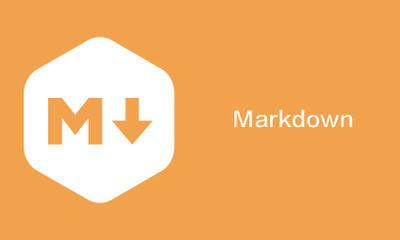

# 第一章 Markdown简介

## 本章提要

在这一章中，我们将会对`Markdown`做一个概念性的简单介绍。具体来说，我们会讨论`Markdown`是什么、它有什么优势和劣势以及它所倡导的写作理念。需要说明的是。本章是为对`markdown`一无所知的朋友准备的。如果你自认为已经对`Markdown`有所了解，或者不想纠缠于技术概念，想快点进入“如何使用`Markdown`”的议题，也可以选择跳过本章内容，直接从下一章开始阅读。但是，如果你想更完整地了解我对这门技术的观点，还请你稍微花点耐心读一下这一章的内容，毕竟正如一千个人的心中有一千个哈莫雷特，对于同一门技术，每个人的理解也都略有不同。

## 1.1 Markdown是什么？

`Markdown`是约翰·格鲁伯（John Gruber）与亚伦·斯沃茨（Aaron Swartz）于2004年共同开发的一门轻量级标记语言（Lightweight Markup Language，简称LML）。也就是说：首先，`Markdown`是一种标记语言，可以用任意的文本编辑器来进行输入和修改，并以纯文本的格式保存在计算机中。其次，这是一种“轻量级”的语言，这意味着相对于`RTF`、`HTML`、`TeX`这些格式更丰富的标记语言来说，`Markdown`的格式更为简单易用，也更接近于自然语言。这让它更适合用来写作和分享。格鲁伯们开发这门语言的目的就是为了鼓励人们先使用一种易读易用的纯文本格式来编辑并存储文档，然后再根据实际需要将文档转换成`(X)HTML`、`docx`和`PDF`等格式。`Markdown`在设计上非常重视可读性。换句话说，`Markdown`的设计目标之一是要让人类能直接从字面上对其进行阅读，不需要太多精力学习一些格式化指令标记（譬如`RTF`与`HTML`）。

事实上，`Markdown`最初的实现只不过是格鲁伯参考现行电子邮件的标记格式和一些早期的标记语言（譬如`Setext`、`Texile`等），编写出的一个可将用`Markdown`语法编写的文档转换成有效的、结构良好的`(X)HTML`格式的`Perl`脚本程序：`Markdown.pl`。该脚本既可以单独使用，也可以被用作`Blosxom`这类博客系统的插件，或者`BBEdit`这类编辑器的文本过滤器。但随着时间的推移，`Markdown`已经被许多人用`Perl`或其他编程语言重新实现，市面上陆续出现了许多不同版本的`Markdown`实现。同时，人们也在`Markdown`基本语法的基础上开发出了许多额外的功能，例如表格、脚注、列表以及代码块等。这其中有些功能已经偏离了这门语言最初的实现，带来了语法规范上的含糊不清，这些问题促使`Markdown`的标准化问题被提上了议程。当然，值得一提的是，作为`Markdown`的创立者，格鲁伯并不赞成完全标准化，他认为：“不同的网站（和人们）有不同的需求。没有一种语法可以让所有人满意。”

以我写这本书时所查到的资料，`Markdown`标准化的最新进展是，2016年3月发布的RFC 7763和RFC 7764这两份文件。其中，RFC 7763从原始变体引入了MIME类型`text/markdown`。而RFC 7764则讨论并注册了`MultiMarkdown`、`GitHub Flavored Markdown(GFM)`、`Pandoc`、`CommonMark`和`Markdown`等不同的实现版本。

## 1.2 Markdown的优势与劣势

如今，`Markdown`的使用者早已不只是写程序文档的程序员，它在国际上已经受到越来越多编辑和写作者的青睐。用`Markdown`来写作和编辑文章在网络时代有着超乎想象的优势。下面，我们就来具体讨论一下这些优势：

- **语法易读易学**：这是`Markdown`最显而易见的优势。由于它的语法简洁明了、简单易学、可读性强，让人们不需要花费很多时间在语言本身的学习和使用上，从而可以更专注于阅读和写作，这将带来很大的效率提升。

- **文本格式存取**：在我个人看来，*能以纯文本格式来处理并存储文档*是`Markdown`最大的优势。我们后续介绍的大部分优势都与这一特性有着或多或少的联系。简而言之，`Markdown`的纯文本特性给它带来了极强大的兼容性，我们可以用任何文本编辑器来处理`Markdown`文档，不用担心不同编辑软件之间的横向兼容问题（譬如微软的Word和苹果的Pages之间的兼容），以及这些软件自身升级所带来的纵向兼容问题（譬如旧版`Word`就打不开新版`word`的默认格式`docx`）。另外，如果你使用的操作系统是`Linux/Unix`或`MacOS`的话，还有大量针对文本的系统工具可以用（譬如`diff`、`sed`等），这些工具都会给档的存取、搜索与传输带来极大的方便。

- **便于格式转换**：由于`Markdown`是以纯文本的形式存储在计算机中的，这也赋予了它很强的可编程性，人们可以轻松地为其编写各种格式转换工具。经过了许多人的共同努力，到目前为止，我们已经可以轻松地将其转换成`(X)HTML`、`PDF`、`epub`、`mobi`、`docx`等格式了。关于这方面的内容，我们将会在第四章中详细讨论。

- **利于网络协作**：有过远程办公经验的人都知道，我们在网络协作过程中首先会遇到的通常是平台相关性问题，譬如你用的是`Windows`上的`Word`。我用的是`MacOS`上的`Pages`，他用的是`Ubuntu`上的`WPS`，经常会彼此打不开对方的文件，或者打开了对方的文件，却由于各自操作系统上支持的中英文字体不同而导致排版惨不忍睹，甚至完全乱码。这一切都会由于上面提到的`Markdown`的纯文本特性而得到解决。再来就是网络协作中遇到的另一个问题，那就是协作成员可能会同时对同一份文件做出不同的修改，这就需要用到版本控制。市面上似乎所有的版本控制系统，无论是`CVS`、`SVN`还是`Git`，优先支持的都是纯文本格式的文档，我们完全可以像管理程序项目一样对`Markdown`文档进行各种版本操作。关于这方面的内容，我们将会在第五章中进行更为详细的讨论。

- **支持自由开源**：`Markdown`本身就是个开源项目，任何人都可以对其实现进行修改、重构、扩展。有人用它写程序项目的文档，有人用它构建博客平台（譬如`hexo`等），有人用它制作电子书（譬如`gitbook`等）。总而言之，在使用了`Markdown`之后，我们可以将程序设计领域中的开源思想完全应用于写作领域，实现在互联网范围内的同行审阅、分享与讨论，以改善作品质量、促进整体进步。

当然，任何人、事、物都会在展现其优势的同时呈现出一些劣势。而且优势和劣势通常都来自于同一个特性，是优势还是劣势完全看这个特性所发挥的面向。下面我们就来看看`Markdown`具有那些劣势，或者说它不适合被用来做哪些事：

- **国内使用尚不普及**：虽然这些年`Markdown`在国内收到了越来越多的重视，但在一些关键领域，比如出版社还是会要求你提供的是`Word`版本的稿件，哪怕是一些出版计算机书籍的出版也是如此，这就说明这种写作方式的普及远未达到理想的程度。
  
- **不适合用来做排版**：`Markdown`的语法设计是为了让人们专注于写作内容，所以并不适合用来做复杂的排版，比如各种印刷字体的设置、复杂的表格、图片的文字环绕等。这些需要我们去学习一些专用于排版的工具，譬如`LaTeX`，用它们搭配`Markdown`使用。

- **周边工具学习成本较高**：`Markdown`的周边工具非常多，譬如用于格式转换的`pandoc`、用于排版设计的`LaTeX`、用于发布`HTML`格式电子书的`gitbook`、用于构建博客的框架`hexo`等。每一项工具都可以被视为一门独立的技术，如果全都要掌握，面面俱到，那么学习成本将是非常高昂的。所以，我们要根据自己的需要有选择地进行学习。

所以说，所有的机制、框架和工具最终都要落实到具体的使用上，而“如何使用”基本上是使用者根据使用场景所做的判断。一件工具是发挥它的优势，还是呈现出它的劣势，就全凭使用者如何做出判断了。

## 1.3 基于markdown的基本写作理念

## 本章小结
