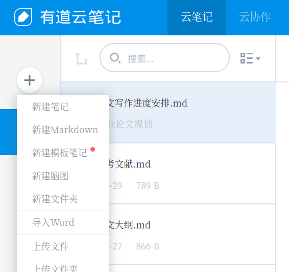
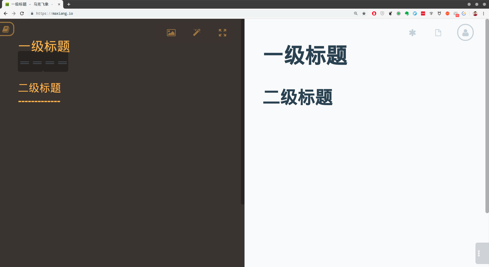
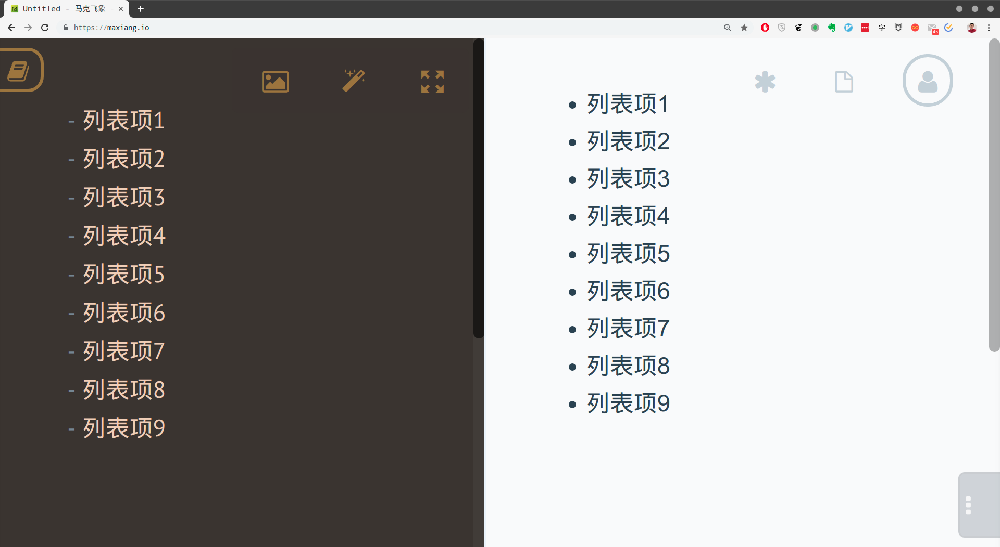
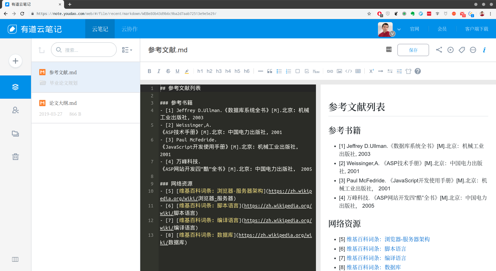
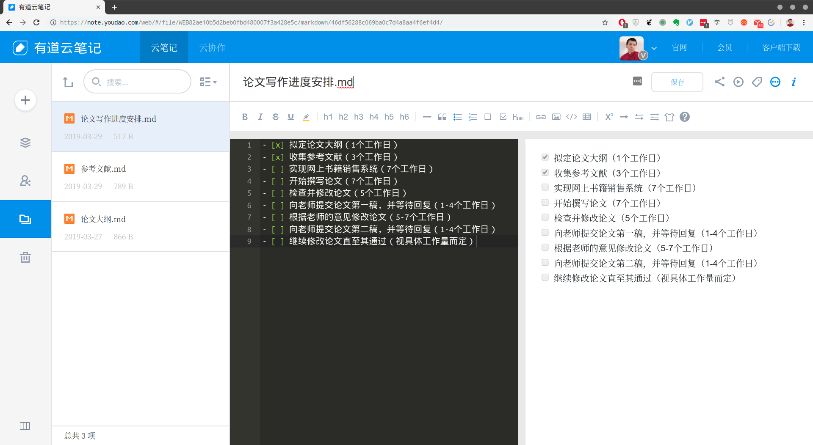

# 第2章 写作的前期准备

## 本章提要

在接下来的几章中，我将以自己当年撰写大学毕业论文的过程为导引，逐步深入地介绍`Markdown`的标记语法与使用技巧。本章将介绍的是写作的一些前期准备工作。首先，我会介绍几款值得一试的`Markdown`编辑器。然后就进入基本语法的教学，我们将会学习如何通过标题标记来拟定论文大纲、通过列表标记来表列论文的参考资料、通过设定待办事项来安排写作的进度。当然，这里需要特别说明的是，用来做例子的是我2006年时的大学毕业论文，这篇论文无论在内容的新鲜度还是在技术的深度上都是不值一提的。使用它完全是因为配合教学`Markdown`的需要，充当一个应用场景，所以我也不会完全显示论文的全部内容。

## 2.1 选择编辑器

所谓“工欲善其事必先利其器”，毕竟`Markdown`只是一门用于写作的标记语言，它本身是无需安装任何软件来支持的，任何一款文本编辑器都可以用来编写`Markdown`文档。但是，如果我们想要用它来创作论文这样的工程级项目的话，为写作效率和体验着想，还是应该要为自己选择一款能称心如意的编辑器。但这说起来容易，做起来却没有那么简单。由于`Markdown`一门开放性的语言，开源社区为它开发了五花八门的扩展功能，有些得到了某种程度的标准化，有些则完全没有被标准化，这导致支持`Markdown`的编辑器虽然很多，并且在基本用法上大同小异，但在扩展支持上就很不一致了，有些不支持`LaTeX`数学公式，有些不支持`Mermaid`做图库，我们只能根据自己所做的项目来选择这些编辑器。所以，接下来我会分三个应用场景来介绍几款`Markdown`编辑器。

### 2.1.1 笔记类编辑器

在做笔记的时候，我们需要的是随时可以创建、编辑、搜索、整理自己的笔记。在这种情况下，我们只需要编辑器支持最基本的`Markdown`语法，不需要它支持太多扩展，但应该要支持多种平台（MacOS、Windows、Android、iOS），多种设备（PC、平板、手机），多种访问方式（Web浏览器、客户端、API），然后还应该要能进行云端同步，并且提供强大的分类管理和搜索功能。在这里，我会为大家介绍两款笔记类软件：

- **有道云笔记**[^1]：这是一款国内知名的中文笔记类软件，同样支持所有的主流平台，并且可以使用Web浏览器来访问。更重要的是，它支持所有的访问方式，无论是Web方式还是客户端方式，都支持`Markdown`编辑。

  在有道云笔记中创建`Markdown`笔记更简单，只需像下图一样找到新建文档的按钮，然后在其中选择「新建 Markdown 笔记」即可：

  

- **马克飞象**[^2]是一款专为印象笔记（英文版名为Evernote，这一款国际知名的笔记类软件）量身定做的`Markdown`编辑器，支持印象笔记的笔记本和标签管理，使我们可以轻松管理笔记。它支持高亮代码块、*LaTeX* 公式、流程图，本地图片以及附件上传，甚至截图粘贴等工作学习中时常会用到的功能。同时这也是一款跨平台的编辑器，提供有PC桌面客户端以及离线Chrome App，也支持我们用Web方式进行访问。下面是它的Web界面：
  
  

### 2.1.2 本地文件编辑器

在如今这个时代，当我们需要在本地计算机上对文件进行编辑时，往往就需要编辑器具有完善的编辑功能，就`Markdown`来说，用来编辑本地文件的编辑器如果只支持基本语法，显然就不够用了。我们得根据自己的编辑需要来选择支持某部分扩展特性的`Markdown`编辑器。例如，接下来我们要撰写的是计算机专业的大学论文，预估少不了会编辑数学公式、流程图、UML图以及代码高亮显示，那么选择的编辑器就必须要能支持`Markdown`的`LaTeX`扩展、`Mermaid`库以及文件预览功能。当然，符合这些要求的软件也不少，但考虑到本章的整体谋篇，我在这里同样只介绍两款具有代表性的`Markdown`编辑器。

- **Typora**[^3]：​ Typora是一款轻便简洁的`Markdown`编辑器。由于使用了即时渲染技术，所以它可以和Word、Pages一样提供”所见即所得“的写作体验。这也是它与其他`Markdown`编辑器最显著的区别，不再需要分栏显示编写区和预览区了。除此之外，Typora也是一款支持多平台的`Markdown`编辑器，我们在Linux、MacOS和Windows中都可以使用这款软件，这可比只能在Windows下使用的MarkdownPad，或者只能在MacOS/iOS下使用的Ulysses要好多了。

  关于这款编辑器的具体使用，我们将会在第四章中详细介绍。

- **VSCode**[^4]：VSCode是Visual Studio Code的缩写，这是一款通用的代码编辑器，它同样在Linux、MacOS和Windows下都可以使用。正是由于这是一款通用的代码编辑器，主要的作用是编写程序代码，因此其自身集成了强大的文件管理和版本控制模块，这些模块可以帮助我们轻松地实现工程级的项目管理。

  更为重要的是，VSCode具有非常强大的插件体系，以便它可以胜任几乎所有编程语言和标记语言的编辑。譬如对于`Markdown`，我们只需要在VSCode的插件管理系统中搜索Markdown Extension Pack，然后安装该插件即可，如下图所示：

  

  关于该编辑器的具体使用，我们将会在第三章中详细介绍。

### 2.1.3 其他Markdown编辑器

当然，大家也可以根据自己的喜欢和具体情况来选择一些别的编辑器。下列，我们罗列了一些目前市面上比较常见的`Markdown`编辑器，以供大家参考。

| 编辑器      | 具体说明               |
|------------|-----------------------|
| 简书        | 一个很不错的博客平台，每几秒钟便会自动存入一个备份。可以直接从本地拖入照片生成链接，一直在不断优化。当然，作为一个博客平台，需要注册账号后方能进行写作。|
| Ulysses    | 一款MacOS/iOS平台上的`Markdown`编辑器，支持将`Markdown`文档转换成PDF、docx、ePub等各种格式。|
| Mou | 这是MacOS平台下一款杰出的`Markdown`编辑器，提供语法高亮、在线预览、同步滚动、全屏模式等功能，允许自定义主题，支持将`Markdown`文档转换成CSS、HTML、PDF等各种格式。|
| Miu | 一款在Windows平台下模仿Mou的`Markdown`编辑器。|
| MarkdownPad | 一款Windows平台上的`Markdown`编辑器，具有良好的即时预览功能。|
| Atom    | 一款由github专门为程序员推出的跨平台代码编辑器，有着与VSCode类似的插件系统，安装相关插件之后即可编辑`Markdown`文档。|
| Sublime Text | 一款跨平台的代码编辑器，有着与VSCode类似的插件系统，安装相关插件之后即可编辑`Markdown`文档。|

在某些应用场景中，我们可能会需要透过Web或SSH的方式直接编辑服务器端的文件。这时候就需要用到浏览器和vim的`Markdown`插件，下面我们就来介绍一下这些插件。

- **Markdown Here**[^5]：这是除微软的IE浏览器之外，几乎所有的主流浏览器，包括Google Chrome、Mozilla Firefox和Apple Safari都支持的一款`Markdown`编辑插件。有了这款插件，我们就可以在浏览器中用`Markdown`编写电子邮件和微信公众号，然后用该插件将所编写的内容一键转换成相应的`HTML`渲染效果，当然，在这之前我们还是要对该插件做一些基本的样式设定，下面是该插件的设置界面：

  

  该插件的使用也非常简单，下面我们就以在浏览器中编写电子邮件为例来做个简单的示范：

  1. 先在浏览器中新建一封电子邮件，并输入以下用`Markdown`标记的内容，当然，我们现在可暂时不用去管这些标记的具体含义：

     

  2. 然后只需单击一下浏览器工具栏中的Markdown Here插件图标，上述内容就自动转换成了相应的`HTML`渲染效果：

     

- **vim插件**：vim是一款由vi扩展而来的、闻名于世界的命令行编辑器。当我们要将用`Markdown`编码的内容以Web服务的形式来发布（譬如用hexo发布的博客，或用gitbook发布的电子书等）的时候，通常会遇到一些需要对某段文本进行小幅修改的情况。对于这种需求，我们往往会选择通过SSH方式直接登陆到服务器上用vim来修改，而不是在本地修改完再重新整体发布一次到服务器上，这不仅操作太繁琐，而且也太小题大做。
  
  虽然vim本身就可以对`Markdown`文件进行编辑，但如果我们想提高编辑的效率和体验，就应该安装一下相应的插件。vim的插件通常是通过一个叫vundle的插件管理器来安装的。关于vundle的安装、配置与基本使用，我们将会在本书的*附录A：Vundle简易教程*中具体介绍，不熟悉这部分内容的读者可以先去阅读一下这篇附录，再继续后面的内容。

  在安装和配置完vundle之后，我们就可以用它来安装插件了。具体来说，与`Markdown`的编辑相关的主要有以下三个插件：

  1. **vim-markdown**：这是一款针对`Markdown`语法高亮的插件。
  2. **previm**： 这是一款用于预览`Markdown`渲染效果的插件。
  3. **vim-colorschemes**：这是一款用于配置各种颜色主题的插件。

下面是我在Ubuntu Linux下用vim编辑本书第一章时的截图：


## 2.2 作品的前期规划

在挑选完写作工具之后，我们就可以开始正式对论文进行规划了。在进入具体的写作之前，先做一些规划工作是一个不错的选择，这样做的主要目的是将整个论文的创作过程纳入工程化管理，让它有一个清晰的框架，明确整体的写作方向，并做好创作的进度管理。具体来说就是，我们接下来要拟定论文的大纲，然后再根据大纲来表列可能会用到的参考文献，最后我们会对论文的整个写作进度做出一个计划性的时间安排。显然，这些内容应该都属于笔记性质的内容，所以我们会用有道云笔记来完成这部分的工作。

首先，我们要在有道云笔记中新建一个文件夹，将其命名为「毕业论文规划」，如下图所示：


本章接下来所有的工作都会在这个文件夹中进行，下面先来拟定论文的大纲。

### 2.2.1 拟定论文大纲

有过写作经验的人大概都知道，一篇文章的大纲通常同时就是它各章节的分级标题，所以我们会用`Markdown`的标题元素来撰写论文的大纲。在`Markdown`中，标题的语法有`atx`和`setext`两种风格。在本书中，我们主要采用的是`atx`风格，在这种风格中，标题的级别是由其标题文本之前的井号（`#`）数量来指定的，譬如我这篇论文的标题是「网上书籍销售系统的设计」，那么在`Markdown`中，我们就应该这样写：

```Markdown
# 网上书籍销售系统的设计
```

这就被视为整篇文章的一级标题，请注意，“`#`”与标题文本之间要用一个空格符隔开。同样的，二级标题就是在标题文本前面加两个“`#`”，三级标题则是加三个“`#`”，譬如在我的这篇论文中，如果第一章的标题是「第1章：系统概述」，第一章第一节的标题是「1.1 系统的设计目的和意义」，那么我们就应该这样写：

```Markdown
# 网上书籍销售系统的设计
## 第1章：系统概述
### 1.1 系统的设计目的和意义
```

由于最初设计目的的原因，`Markdown`中的标题与`HTML`是一一对应的，所以它最多应该可以支持到六个级别的标题（即`HTML`中的`<h1>`到`<h6>`），也就是说，在`atx`语法风格中，标题文本之前的“`#`”最多可以设置六个，具体如下图所示：


在通常情况下，我们都会建议一篇论文的标题层级最好都不要超过四级，否则论文可能会因为被分得太细而显得支离破碎，这既会影响作者写作的流畅感，也会影响读者阅读的整体感。具体到眼下这篇论文中，我们只需要设置三级标题即可，具体如下：

```Markdown
# 网上书籍销售系统的设计
## 第1章：系统概述
### 1.1 系统的设计目的和意义
### 1.2 系统的可行性分析
## 第2章：系统数据库的设计
### 2.1 数据库中的表关系
### 2.2 数据库中各表的设计
### 2.3 数据库设计的优化
## 第3章：功能模块的划分
### 3.1 业务逻辑分析
### 3.2 划分功能模块
## 第4章：开发环境与工具的选择
### 4.1 服务器端
### 4.2 浏览器端
## 第5章：各功能模块的实现
### 5.1 全局作用的函数和变量
### 5.2 用户模块
### 5.3 公告模块
### 5.4 书籍模块
### 5.5 导航模块
### 5.6 交易模块
## 第6章：系统程序的发布
### 6.1 前期准备
### 6.2 发布工具
### 6.3 发布过程
### 6.4 后续维护
## 第7章：设计总结
### 7.1 本系统的优点
### 7.2 本系统存在的问题
### 7.3 分析并提出观点
```

下面，就让我们将上述大纲录入到有道云笔记中，看看它们的渲染效果吧。


在默认情况下，有道云笔记的`Markdown`编辑区被分成了两个部分：左边是编码区，用于输入`Markdown`的原始编码，右边是预览区，用于显示`Markdown`编码所对应的`HTML`渲染效果。这也是大部分`Markdown`编辑器会呈现的布局，当然也有例外，譬如在Typora这种强调”所见即所得“的编辑器中，编码区与预览区合二为一了：


正如你所见，Typora这款编辑器不仅能即时地根据我们输入的`Markdown`编码显示出了相应的`HTML`渲染效果，还直接将我们设置的标题同步显示在了左侧的大纲视图中，这对提升写作体验是非常有帮助的。

另外，如果某些文章只需用到两级标题，那么我们也可以使用`setext`风格的标题语法，即分别用若干个“`=`”和“`-`”来表示一二级标题，具体如下图所示：



### 2.2.2 表列参考文献

论文的写作归根结底是对某些科学技术理论的论证或再处理，所以能否充分地收集并利用好现有的文献资料，事实上将决定着我们论文写作的质量。因此，我们在开始正式撰写论文之前，应该尽可能多地收集可用于论证选题的文献资料，将其表列出来，以便作为论文的附录。

就目前来说，论文的参考文献主要有两个来源：第一个来源是学术专著、学术期刊等正式出版物；第二个来源是相关机构在互联网上公布的权威数据。当然，我们在这里要处理的只是一篇普通的大学毕业论文，它所需要的参考文献并没有那么高的专业要求，因此收集文献的这部分工作不需要花费多少时间，也不是我们要讨论的内容。下面，我们就来看看如何用`Markdown`来表列这些文献资料。在`Markdown`中，用于表示列表的标记有两种：

- **无序列表**：这种列表对应的是`HTML`中的`<ul>`元素，它的标记语法与标题很类似，就是在各列表项的文本之前加上“`-`”、“`*`”、“`+`”这三种项目符，两者之间用一个空格符隔开即可，如下图所示：

  

  *请注意*：在选定了项目符之后，我们就应该在同一文档（或同一组文档）的范围内尽可能地保持符号的一致性，切忌像下面这样将几种项目符混着用：

  ```Markdown
  - 列表项1
  * 列表项2
  + 列表项3
  ```
  
  虽然这样做在大部分情况下也能正常显示渲染效果，但缺乏标记的一致性不仅会影响文档的可读性，也会给后续的某些再处理工作（譬如为该文档编写某些批处理脚本）带来一些意想不到的麻烦，因此我们强烈建议大家应避免这种情况。

  除此之外，`Markdown`还支持分级表列的无序列表。譬如，我们可以像下面这样编写一个二级无序列表：

    ```Markdown
    - 列表项
        - 子列表项
        - 子列表项
        - 子列表项
    - 列表项
        - 子列表项
        - 子列表项
    - 列表项
        - 子列表项
  ```

  其渲染效果如下：

  
  
- **有序列表**：这种列表对应的是`HTML`中的`<ol>`元素，它的标记语法也非常简单，就是在各列表项的文本之前按顺序加上`1.`、`2.`、`3.`这样的序号即可。同样的，这些序号与列表项文本之间用一个空格符隔开即可，如下图所示：

  

  同样的，`Markdown`也支持有序列表的分级表列。譬如，我们可以这样编写一个二级有序列表：

  ```Markdown
  1. 列表项
     1. 子列表项
     2. 子列表项
     3. 子列表项
  2. 列表项
     1. 子列表项
     2. 子列表项
  3. 列表项
     1. 子列表项
  ```

  其渲染效果如下：

  
  
当然，有序列表和无序列表还可以相互嵌套成混合型的分级列表。譬如，我们可以编写一个这样的二级列表：

```Markdown
1. 列表项
   - 子列表项
   - 子列表项
   - 子列表项
2. 列表项
   - 子列表项
   - 子列表项
3. 列表项
   - 子列表项
```

其渲染效果如下：


在掌握了列表的基本语法之后，我们就可以具体来看一下应该如何表列论文的参考文献了。由于论文参考文献的表列往往都有一些规定格式，所以我们通常会采用无序列表的形式。下面，我先来表列一下当年写论文时所用的主要参考书：

```Markdown
- [1] Jeffrey D.Ullman.《数据库系统全书》[M].北京：机械工业出版社, 2003
- [2] Weissinger,A.《ASP技术手册》[M].北京：中国电力出版社, 2001
- [3] Paul McFedride.《JavaScript开发使用手册》[M].北京：机械工业出版社， 2001
- [4] 万峰科技.《ASP网站开发四“酷”全书》[M].北京：中国电力出版社， 2005
```

以上列出的四项都属于专业书籍，虽然后两项谈不上是权威专著，但对于设计一个网上书籍销售系统这种实践型的选题来说，也基本够用了。如果想让论文看起来更专业一些，我们还可以再收集一些学术期刊、论文集、专利文献等资料加入进来。这些资料表列的方式大同小异，虽然在学校要求的文献表列格式上会略有些不同，但这已经不是我们在这里要关注的内容了。下面来看看上述编码在有道云笔记中的呈现效果：


另外，如果我们的论文是以电子文档而非印刷品的形式提交的话，其实也可以在参考文献列表中加入一些网络资源的超链接。在`Markdown`中，超链接的标记语法是`[超链接文本](超链接的URL)`。例如，如果我在论文中介绍一些技术概念时会参考维基百科中的相关词条，那么也可以考虑在参考文献列表中加入下面这样的超链接：

```Markdown
- [5] [维基百科词条：浏览器-服务器架构](https://zh.wikipedia.org/wiki/浏览器-服务器)
- [6] [维基百科词条：脚本语言](https://zh.wikipedia.org/wiki/脚本语言)
- [7] [维基百科词条：编译语言](https://zh.wikipedia.org/wiki/编译语言)
- [8] [维基百科词条：数据库](https://zh.wikipedia.org/wiki/数据库)
```

下面是这些超链接被录入到有道云笔记中之后所呈现的渲染效果：



### 2.2.3 安排写作进度

对于任何一个创作过程来说，做好进度安排是非常重要的一项工作。这种计划性的不仅可以帮助我们规划好时间，避免拖延症，也可将整个创作过程切分成许多细小的代办事项，迫使我们始终将注意力集中在眼下正在做的事情上，这对于提高创作的质量是非常有助益的。在`Markdown`中，待办事项是`GitHub Flavored Markdown`支持的一项扩展，并不属于原生的`Markdown`，其语法如下：

```Markdown
- [x] 待办事项1
- [ ] 待办事项2
```

在这里，“`[x]`”代表了已完成的事项，而“`[ ]`”[^6]则代表的是尚未完成的事项，其渲染效果如下：

> - [x] 待办事项1
> - [ ] 待办事项2

下面我们就来具体安排一下这篇论文的写作进度：

```Markdown
- [x] 拟定论文大纲（1个工作日）
- [x] 收集参考文献（3个工作日）
- [ ] 实现网上书籍销售系统（7个工作日）
- [ ] 开始撰写论文（7个工作日）
- [ ] 检查并修改论文（5个工作日）
- [ ] 向老师提交论文第一稿，并等待回复（1-4个工作日）
- [ ] 根据老师的意见修改论文（5-7个工作日）
- [ ] 向老师提交论文第二稿，并等待回复（1-4个工作日）
- [ ] 继续修改论文直至其通过（视具体工作量而定）
```

上述编码在有道云笔记中的渲染效果如下：



你可以看到，我们目前已经完成了前两项任务。当然，由于这部分语法不属于原生的`Markdown`，所以并不是所有的`Markdown`编辑器都能显示上述渲染效果的，但这并不影响我们的实际使用。

## 本章小结

在本章，我们以论文写作的前期准备为导引，首先介绍了几款适用于不同应用场景的`Markdown`编辑器。其中包含了用于做笔记的云端应用：Evernote和有道云笔记、用于编辑本地`Markdown`文档的Typora和VSCode，以及浏览器的Markdown Here插件和vim的`Markdown`插件。然后，我们详细介绍了标题、列表、超链接和待办事项这四种`Markdown`标记的语法，以及它们在论文前期规划工作中的具体应用。

至此，论文写作的前期准备工作我们就全部做完了。在下一章中，我们将正式开始论文的写作。

[^1]:注释：官方网站：https://note.youdao.com/

[^2]:注释：官方网站：https://maxiang.io/

[^3]:注释：官方网站：https://www.typora.io/

[^4]:注释：官方网站：https://code.visualstudio.com/

[^5]:注释：官方网站：https://markdown-here.com/

[^6]:注释：请注意，中括号之间应该有一个空格符。