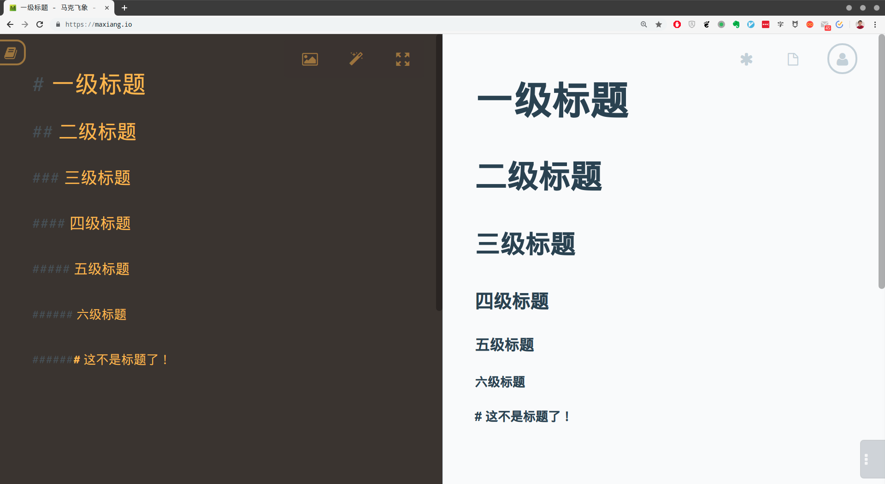

# 第2章 论文的前期准备

## 本章提要

在接下来的几章中，我将以自己当年撰写大学毕业论文的过程为例，具体介绍`Markdown`的使用方法与技巧。本章将介绍的是论文的前期准备工作。首先，我会介绍几款值得一试的`Markdown`编辑器。然后就进入基本语法的教学，我们将会学习如何通过标题标记来拟定论文大纲、通过列表标记来表列论文的参考资料、通过设定待办事项来安排写作进度。当然，这里需要特别说明的是，用来做例子的是我2006年时的大学毕业论文，这篇论文无论在内容的新鲜度还是在技术的深度上都是不值一提的。使用它完全是因为配合教学`Markdown`的需要，充当一个使用场景，所以我也不会完全显示论文的全部内容。

## 2.1 选择编辑器

所谓“工欲善其事必先利其器”，毕竟`Markdown`本身只是一门用于写作的标记语言，如果我们想要用它来创作论文这样的工程级项目的话，还是应该要为自己选择一款能称心如意的编辑器。但这说起来容易，做起来却没有那么简单。由于`Markdown`一门开放性的语言，开源社区为它开发了五花八门的扩展功能，有些得到了某种程度的标准化，有些则完全没有被标准化，这导致支持`Markdown`的编辑器虽然很多，并且在基本用法上大同小异，但在扩展支持上就很不一致了，有些不支持`LaTeX`数学公式，有些不支持`Mermaid`做图库，我们只能根据自己所做的项目来选择这些编辑器。所以，接下来我会分三个使用场景来介绍几款`Markdown`编辑器。

### 2.1.1 笔记类编辑器

在做笔记的时候，我们需要的是随时可以创建、编辑、搜索、整理自己的笔记。在这种情况下，我们只需要编辑器支持最基本的`Markdown`语法，不需要它支持太多扩展，但应该要支持多种平台（MacOS、Windows、Android、iOS），多种设备（PC、平板、手机），多种访问方式（Web浏览器、客户端、API），然后还应该要能进行云端同步，并且提供强大的分类管理和搜索功能。在这里，我会在这里两款笔记类软件：

- **Evernote**[^1]：这是一款全球知名的笔记软件，中文版名称叫做**印象笔记**，但我推荐大家尽量使用它的国际版（因为中文版的功能受到了部分限制）。它支持所有的主流平台，并且可以使用Web浏览器来访问。最近在Mac/PC的客户端中增加了对`Markdown`的支持，但Web方式和手机客户端还尚未提供支持。

  在Evernote客户端中创建`Markdown`笔记的方式有三种：

  1. 我们可以点击左上角「新建 Markdown 笔记」来创建新的`Markdown`笔记。
  2. 我们可以点击「菜单栏-文件-新建笔记-新建 Markdown 笔记」来创建`Markdown`笔记（在Mac中相同操作则是点击顶部的「菜单栏-文件-新建 Markdown 笔记」）。
  3. 我们也可以使用快捷键`Ctrl+alt+D`（在Mac上则是`CMD+D`）来快速创建`Markdown`笔记。

- **有道云笔记**[^2]：这是一款国内知名的中文笔记类软件，同样支持所有的主流平台，并且可以使用Web浏览器来访问。更重要的是，它所有的访问方式，无论是Web方式还是客户端方式，都支持`Markdown`编辑。本书在笔记类方面的应用也主要会使用这款软件来做演示。

  在有道云笔记中创建`Markdown`笔记更简单，只需像下图一样找到新建文档的按钮，然后在其中选择「新建 Markdown 笔记」即可：

  

### 2.1.2 本地文件编辑器

在如今这个时代，当我们需要在本地计算机上对文件进行编辑时，往往就需要编辑器具有完善的编辑功能，就`Markdown`来说，这时我们就不满足于编辑器只支持基本语法了，我们会根据自己的编辑需要来选择支持某部分扩展特性的`Markdown`编辑器。例如，接下来我们要撰写的是计算机专业的大学论文，预估少不了会编辑数学公式、流程图、UML图以及代码高亮显示，那么选择的编辑器就必须要能支持`Markdown`的`LaTeX`扩展、`Mermaid`库以及文件预览功能。当然，符合这些要求的软件也不少，但考虑到本章的整体谋篇，我在这里同样只推荐两款具有代表性的`Markdown`编辑器。

- **Typora**[^3]：​ Typora是一款轻便简洁的`Markdown`编辑器。由于使用了即时渲染技术，所以它可以和Word、Pages一样提供”所见即所得“的写作体验。这也是它与其他`Markdown`编辑器最显著的区别，不再需要分栏显示编写区和预览区了。除此之外，Typora也是一款支持多平台的`Markdown`编辑器，我们在Linux、MacOS和Windows中都可以使用这款软件，这可比只能在Windows下使用的MarkdownPad，或者只能在MacOS/iOS下使用的Ulysses要好多了。下面是我在Ubuntu Linux下设置Typora扩展支持时的操作界面：

  
  
- **VSCode**[^4]：VSCode是Visual Studio Code的缩写，这是一款通用的代码编辑器，它同样在Linux、MacOS和Windows下都可以使用。正是由于这是一款通用的代码编辑器，主要的作用是编写程序代码，因此提供了强大的文件管理和版本控制，这些功能可以帮助我们轻松地实现工程级的项目管理。

  更为重要的是，VSCode具有非常强大的插件体系，以便它可以胜任几乎所有编程语言和标记语言的编辑。譬如对于`Markdown`，我们只需要在VSCode的插件管理系统中搜索Markdown Extension Pack，然后安装该插件即可，如下图所示：

  

### 2.1.3 其他应用的Markdown编辑器

在某些应用场景中，我们可能会需要直接透过Web或SSH的方式直接编辑服务器端的文件。这时候就需要用到浏览器和vim的`Markdown`插件，下面我们就来介绍一下它们。

- **Markdown Here**[^5]：这是除微软的IE浏览器之外，几乎所有的主流浏览器，包括Google Chrome、Mozilla Firefox和Apple Safari都支持的一款`Markdown`编辑插件。有了这款插件，我们就可以在浏览器中用`Markdown`编写电子邮件和微信公众号，然后用该插件将所编写的内容一键转换成相应的`HTML`渲染效果，当然，在这之前我们还是要对该插件做一些基本的样式设定：

  

  该插件的使用也非常简单，下面我们以电子邮件为例来做个简单的示范：

  1. 先新建一封电子邮件，并在其中输入用`Markdown`标记的内容，当然，我们在这里可暂时不用去管这些标记的具体含义：

     

  2. 然后我们就只需单击一下浏览器中Markdown Here插件的图标，上述内容就自动转换成了相应的`HTML`渲染效果：

     

- **vim插件**：vim是一款由vi扩展而来的、闻名于世界的命令行编辑器。当我们要将用`Markdown`编码的内容以Web服务的形式来发布（譬如用hexo发布的博客，或用gitbook发布的电子书等）的时候，通常会遇到一些需要对某一段文本进行小幅修改的情况。对于这种需求，我们往往会选择通过SSH方式直接登陆到服务器上用vim来修改，而不是在本地修改完再重新整体发布一次到服务器上，这不仅操作太繁琐，而且也太小题大做。
  
  虽然vim本身就可以对`Markdown`文件进行编辑，但如果我们想提高编辑的效率和体验，就应该安装一下相应的插件。vim的插件通常是通过一个叫vundle的插件管理器来安装的。关于vundle的安装、配置与基本使用，我们将会在本书的*附录A：Vundle简易教程*中具体介绍，不熟悉这部分内容的读者可以先去阅读一下这篇附录，再继续后面的内容。

  在安装和配置完vundle之后，我们就可以用它来安装插件了。具体来说，与`Markdown`的编辑相关的主要有以下三个插件：

  1. **vim-markdown**：这是一款针对`Markdown`语法高亮的插件。
  2. **previm**： 这是一款用于预览`Markdown`渲染效果的插件。
  3. **vim-colorschemes**：这是一款用于配置各种颜色主题的插件。

下面是我在Ubuntu Linux下用vim编辑本书第一章时的截图：


## 2.2 论文的前期规划

在准备好写作工具之后，我们就可以开始正式对论文进行规划了。在进入具体的写作之前，先做一些规划工作是一个不错的选择，这样做的主要目的是将整个论文的创作过程纳入工程化管理，让它有一个清晰的框架，明确整体的写作方向，并做好创作的进度管理。具体来说就是，我们接下来要拟定论文的大纲，然后再根据大纲来表列可能会用到的参考资料，最后我们会对论文的整个写作进度做出一个计划性的时间安排。显然，这些内容应该都属于笔记性质的内容，所以我们会用有道云笔记来完成这部分的工作。

首先，我们要在有道云笔记中新建一个文件夹，将其命名为「毕业论文规划」，如下图所示：


本章接下来所有的工作都会在这个文件夹中进行，下面先来拟定论文的大纲。

### 2.2.1 拟定论文大纲

有过写作经验的人大概都知道，一篇文章的大纲通常同时就是它各章节的分级标题，所以我们会用`Markdown`的标题元素来撰写论文的大纲。在`Markdown`中，标题的级别是由其标题文本之前的井号（`#`）数量来指定的，譬如我这篇论文的标题是「网上书籍销售系统的设计」，那么在`Markdown`中，我们就应该这样写：

```markdown
# 网上书籍销售系统的设计
```

这就被视为整篇文章的一级标题，请注意，`#`与标题文本之间要用一个空白符隔开。同样的，二级标题就是在标题文本前面加两个`#`，三级标题则是加三个`#`，譬如在论文中，我第一章的标题是「第1章：系统概述」，第一章第一节的标题是「1.1 系统的设计目的和意义」，那么在`Markdown`中，我们就应该这样写：

```markdown
# 网上书籍销售系统的设计
## 第1章：系统概述
### 1.1 系统的设计目的和意义
```

由于最初设计目的的原因，`Markdown`中的标题与`HTML`是一一对应的，所以它最多可以写六个级别的标题（即`HTML`中的`<h1>`到`<h6>`），也就是说，在`Markdown`中，标题文本之前的`#`最多可以有六个，其效果如下：



当然，在通常情况下，我们在一篇论文中的标题层级不会超过四级，否则论文会因为被分得太细而显得支离破碎，这既会影响写作的流畅感，也会影响阅读的整体感觉。具体到眼下这篇论文中，我们只需要设置三级标题即可，具体如下：

```markdown
# 网上书籍销售系统的设计
## 第1章：系统概述
### 1.1 系统的设计目的和意义
### 1.2 系统的可行性分析
## 第2章：系统数据库的设计
### 2.1 数据库中的表关系
### 2.2 数据库中各表的设计
### 2.3 数据库设计的优化
## 第3章：功能模块的划分
### 3.1 业务逻辑分析
### 3.2 划分功能模块
## 第4章：开发环境与工具的选择
### 4.1 服务器端
### 4.2 浏览器端
## 第5章：各功能模块的实现
### 5.1 全局作用的函数和变量
### 5.2 用户模块
### 5.3 公告模块
### 5.4 书籍模块
### 5.5 导航模块
### 5.6 交易模块
## 第6章：系统程序的发布
### 6.1 前期准备
### 6.2 发布工具
### 6.3 发布过程
### 6.4 后续维护
## 第7章：设计总结
### 7.1 本系统的优点
### 7.2 本系统存在的问题
### 7.3 分析并提出观点
```

下面，就让我们将上述大纲录入到有道云笔记中，看看具体的效果吧。


如你所见，默认情况下，有道与笔记的文件编辑区被分成了两个部分：左边的编码区，显示的是`Markdown`的原始编码，右边是预览区，显示的是`Markdown`编码所对应的`HTML`渲染效果。这也是大部分`Markdown`编辑器会呈现的布局，当然也有例外，譬如在Typora这种强调”所见即所得“的编辑器中，编码区与预览区合二为一了：


如你所见，Typora这款编辑器不仅能即时地根据我们输入的`Markdown`编码显示出了相应的`HTML`渲染效果，还直接将我们设置的标题同步显示在了左侧的大纲视图中，这对提升我们的写作体验是非常有帮助的。

### 2.2.2 表列参考资料

### 2.2.3 安排写作进度

## 本章小结

[^1]:注释：官方网站：https://evernote.com/

[^2]:注释：官方网站：https://note.youdao.com/

[^3]:注释：官方网站：https://www.typora.io/

[^4]:注释：官方网站：https://code.visualstudio.com/

[^5]:注释：官方网站：https://markdown-here.com/