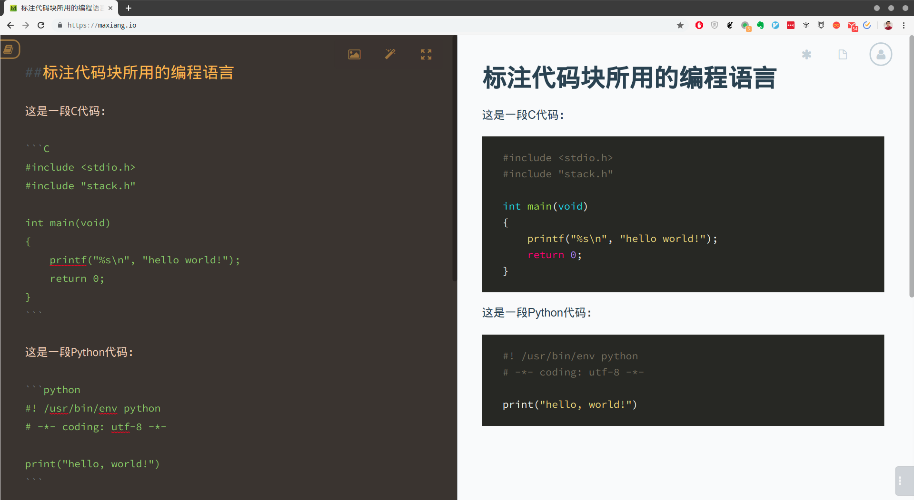

# 第3章 撰写一篇论文

## 本章提要

在上一章中，我们通过演示一篇论文的前期准备工作，为大家介绍了标题、列表、超链接以及待办事项四种`Markdown`标记的用法。接下来，我们就要开始正式撰写论文了。和之前一样，我们仍会继续以论文写作的过程为导引，逐步深入地介绍其余主要的`Markdown`标记，以及它们的具体使用。这其中既会包含用来表示段落、强调、引用、代码这些基本元素的原生`Markdown`标记，也会涉及到与表格、`Mermaid`、`LaTeX`相关的扩展标记，以及它们的基本用法。

## 3.1 本地编辑器：VSCode

依据我们在上一章中所划分的应用场景，论文的写作应该属于在本地计算机上的编辑工作，而且根据之前拟定的论文大纲来看，我接下来要撰写的是一部可分为七个章节的作品。为了便于后期对作品进行版本控制和审阅修改，我将每一章都存储成了一个独立的`Markdown`文档。鉴于接下来的这部分工作都将通过支持项目管理功能的VSCode编辑器来完成。所以，我们要先花一点时间简单介绍一下这款编辑器的基本使用。

在VSCode编辑器中，项目管理是以「工作区」为单位来组织的。所以，我们首先要做的第一件事就是创建一个名为「毕业论文」的VSCode工作区，其操作步骤如下：

1. 利用本地文件管理系统创建一个名为「毕业论文」的空文件夹，并根据论文大纲中的一级标题创建七个扩展名为`.md`的文本文档，每一个文档对应论文的一个章节：

   

2. 在VSCode编辑器中单击菜单「文件 - 打开文件夹...」，打开上面所创建的文件夹：

   

3. 在VSCode编辑器中单击菜单「文件 - 将工作区另存为...」，保存为「毕业论文」。

当然了，如果读者使用的是其他本地编辑器（譬如Sublime Text、Atom或Typora等），它们也都有与「工作区」类似的项目管理单位，操作大同小异，各位大可以自行举一反三，做点随机应变即可。接下来，就让我们在VSCode编辑器中打开名为「01_系统概述.md」的文档,将论文大纲中第一章的部分录入，顺便来看一下这款编辑器的布局吧：


如你所见，整个编辑器除去最顶部的菜单栏和最左侧的工具栏，其主体部分主要被分成了三个部分：左侧的上半部分是「文件管理器」，其中显示的是当前工作区中的所有文档；左侧下部分是文档的「大纲视图」，各位可以看到，我们刚刚录入的标题内容已经以大纲的形式同步显示在这一部分了；右侧就是文档的编辑器，这篇论文的`Markdown`编码就是要这一区域中进行。

除此之外，我们在具体编写`Markdown`文档时还可以打开「预览视图」，以实时监控`Markdown`编码的渲染效果。打开「预览视图」的操作非常简单，步骤如下：

1. 在VSCode编辑器中使用快捷键`Ctrl+Shift+P`打开命令模式，从中选择「Markdown：打开侧边预览」：

   

   然后我们就会在右侧看见当前文档的预览：

   

2. 如果我们想更专注于当前文档的编写，也可以选择隐藏掉左侧的「文件管理 器」和「大纲视图」，只需要用鼠标单击一下最左侧工具栏中的第一个图标，或者使用快捷键`Ctrl+Shift+P`打开命令模式，从中选择「视图：切换侧边栏可见性」，然后编辑器的主要区域就只剩下编码区和预览区了：

   

   如果我们想重新打开侧边栏，只需要再次用鼠标单击一下最左侧工具栏中的第一个图标，或者使用快捷键`Ctrl+Shift+P`打开命令模式，从中选择「视图：切换侧边栏可见性」即可。

接下来，就让我们正式进入论文的撰写工作吧！

## 3.2 文字与代码

我们之所以要用`Markdown`来写作，而不直接使用无格式的纯文本，主要是为了将作品中的文字标记成各种元素，用这些元素来表达各种不同的语义。因此，我们在使用`Markdown`标记时，脑中必须要有一个清晰的概念：*我们标记的是语义，不是外观样式*。譬如，被标记**加粗**或**倾斜**的文字代表的应该是作者对这段文字的着重强调，而不作者认为这段文字加粗或倾斜会比较好看。同样的，被标记为**引用**的文字它代表的则是作者对其他作品的引述，而不是作者认为某段文字应该有个文本框。

这也就意味着，如果我们想用好`Markdown`标记，首先就要先熟悉这些标记所代表的语义。下面，就让我们从最基本的文字元素开始。

### 3.2.1 段落与换行

在`Markdown`中，段落是由一行或多行文本组成的语义元素，对应的是`HTML`中`<p>段落</p>`标记。该元素的前后必须各有一个以上的空白行，并且段落之间无论有多少个空行，在渲染效果中都只显示一个空行。举个例子，下面这段文字是著名宋词《水调歌头-明月几时有》的原文：

```Markdown
明月几时有？把酒问青天。不知天上宫阙，今夕是何年？我欲乘风归去，又恐琼楼玉宇，高处不胜寒。起舞弄清影，何似在人间？
转朱阁，低绮户，照无眠。不应有恨，何事长向别时圆？人有悲欢离合，月有阴晴圆缺，此事古难全。但愿人长久，千里共婵娟。
```

我们将会看到，虽然上面这段文字是分做两行被录入的（这里不考虑因编辑器自身大小而形成的自动换行），但在渲染效果中，这段文字不仅只显示为一个段落，连我们输入的逻辑换行符也消失了，只有软件界面自身形成的自动换行。

> 明月几时有？把酒问青天。不知天上宫阙，今夕是何年？我欲乘风归去，又恐琼楼玉宇，高处不胜寒。起舞弄清影，何似在人间？
> 转朱阁，低绮户，照无眠。不应有恨，何事长向别时圆？人有悲欢离合，月有阴晴圆缺，此事古难全。但愿人长久，千里共婵娟。

现在，让我们在刚才输入的两行之间再插入一个空行（也可以插入多个空行，效果是一样的）：

```Markdown
明月几时有？把酒问青天。不知天上宫阙，今夕是何年？我欲乘风归去，又恐琼楼玉宇，高处不胜寒。起舞弄清影，何似在人间？

转朱阁，低绮户，照无眠。不应有恨，何事长向别时圆？人有悲欢离合，月有阴晴圆缺，此事古难全。但愿人长久，千里共婵娟。
```

然后我们就会看到，这一回文字的渲染效果变成了两个段落，对应的是这篇词文的上下阕：

> 明月几时有？把酒问青天。不知天上宫阙，今夕是何年？我欲乘风归去，又恐琼楼玉宇，高处不胜寒。起舞弄清影，何似在人间？
>
> 转朱阁，低绮户，照无眠。不应有恨，何事长向别时圆？人有悲欢离合，月有阴晴圆缺，此事古难全。但愿人长久，千里共婵娟。

然而，这种书写方式依然不符合中国古诗词的优雅风格，因为这篇宋词除了分上下阕，通常在阕内也是要分行的，但这种分行不分段的书写形式（即输入`HTML`中的`<br />`标记）在`Markdown`中应该如何实现呢？答案是：*在每一行结尾处先输入两个空格，然后再键入回车键*：

```Markdown
明月几时有？把酒问青天。                <!--行尾应有两个空格-->
不知天上宫阙，今夕是何年？              <!--行尾应有两个空格-->
我欲乘风归去，又恐琼楼玉宇，高处不胜寒。  <!--行尾应有两个空格-->
起舞弄清影，何似在人间？               <!--行尾应有两个空格-->

转朱阁，低绮户，照无眠。                <!--行尾应有两个空格-->
不应有恨，何事长向别时圆？              <!--行尾应有两个空格-->
人有悲欢离合，月有阴晴圆缺，此事古难全。  <!--行尾应有两个空格-->
但愿人长久，千里共婵娟。               <!--行尾应有两个空格-->
```

请注意：这里的`<!-- 注释信息 -->`是`HTML`中的注释标记，由于兼容性的关系，`HTML`标记通常都可以应用在`Markdown`文档中。我们可以用该标记来提示文档在后续处理中需要留意的信息，譬如这里的每个段内分行处都有两个空格，而空格是不可见字符，所以就有必要做个特别提示。接下来，就让我们来看看上述编码的渲染效果吧，这段文字的呈现已经完全符合我们对中国古诗词的一贯书写方式了：

> 明月几时有？把酒问青天。  
> 不知天上宫阙，今夕是何年？  
> 我欲乘风归去，又恐琼楼玉宇，高处不胜寒。  
> 起舞弄清影，何似在人间？
>
> 转朱阁，低绮户，照无眠。  
> 不应有恨，何事长向别时圆？  
> 人有悲欢离合，月有阴晴圆缺，此事古难全。  
> 但愿人长久，千里共婵娟。

下面，让我们重新回到论文的撰写工作中，先来看看下面这几段文字的渲染效果：


如你所见，上图不仅有一般性的文字段落，列表中的每个列表项也可以由一个或多个段落组成。当然，如果某个列表项有多个段落，需要注意一下其第一个段落之后的缩进格式。譬如：


但是，如果我们没有做适当的缩进，譬如像下面这样，那么大家就会看到列表项1的第二个段落脱离了列表，成为了普通的文本段落：


### 3.2.2 文字强调

在处理完文本的分段和分行之后，让我们再回头仔细观察一下刚才撰写的论文内容，譬如对于其中的第一个列表：

> - ASP：全称 Active Server Pages，是一种以 VBScript 为编程语言的服务器端脚本。特点是易学易用，能快速上手，无需多少学习成本，非常适合本系统这种小型站点的服务器端开发，也能代表比较典型的传统服务器脚本。
>
> - JavaScript：目前普遍采用的一种浏览器端脚本语言。尽管在一些细节上存在着各种浏览器之间的兼容问题，但市场已经证明了它的可靠性，将其应用于本系统的浏览器端处理也是合适的。
>
> - HTML：这是所有 Web 技术的基础，可行性无须置疑。
>
> - Access 数据库：Microsoft Office 组件之一，具有容易获得、功能完整、上手简单、便于移植的特点，适合于本系统的开发和发布。

相信大家都会觉得这段文字看上去难免有些苍白，缺乏重点。而从作者的角度来说，我们肯定会希望能凸显每个列表项的主题以及其中的一些关键字，以便提示阅读时应注意的重点。在这种情况下，我们就需要用到能表达强调语义的元素了。在`Markdown`中，用于表示强调的语义元素主要有三种，分别是粗体显示（对应`HTML`的`<b>粗体显示</b>`标记）、斜体显示（对应`HTML`中`<i>斜体显示</i>`标记）与粗体+斜体显示。这些语义元素又各自有一到两种不同风格的语法，下面我们就在有道云笔记中逐一来演示一下这些语法及其渲染效果：


在使用以上语义元素时，我们需要记住两件事：

1. 保持语法的一致性：当我们选择了一种粗体或斜体语法之后，请至少在同一文档或同一作品中坚持使用相同的语法。这种语法上的一致性不仅有利于文档的可读性，也有利于文档的后续批量化处理。

2. 谨慎使用扩展标记：扩展标记不属于原生的`Markdown`语法，所以会有一些`Markdown`阅读器或格式转换器不支持其渲染效果。所以，除非是非常明确的应用场景，否则应尽可能地避免使用这些标记。

现在，就让我们在之前提到的论文文本加入一些用于表示强调的标记吧：

```Markdown
- **ASP**：全称 Active Server Pages，是一种以 VBScript 为编程语言的*服务器端脚本*。特点是易学易用，能快速上手，无需多少学习成本，非常适合本系统这种小型站点的服务器端开发，也能代表比较典型的传统服务器脚本。

- **JavaScript**：目前普遍采用的一种*浏览器端脚本语言*。尽管在一些细节上存在着各种浏览器之间的兼容问题，但市场已经证明了它的可靠性，将其应用于本系统的浏览器端处理也是合适的。

- **HTML**：这是所有 Web 技术的基础，可行性无须置疑。

- **Access**：Microsoft Office 中的*数据库*组件，具有容易获得、功能完整、上手简单、便于移植的特点，适合于本系统的开发和发布。
```

如你所见，这一回我们用粗体凸显了每个列表项的主题，并用斜体凸显了其中的一些关键字。这样一来，当我们再次查看这段文字的渲染效果时，这段文字给人的感觉就好了不少：

> - **ASP**：全称 Active Server Pages，是一种以 VBScript 为编程语言的*服务器端脚本*。特点是易学易用，能快速上手，无需多少学习成本，非常适合本系统这种小型站点的服务器端开发，也能代表比较典型的传统服务器脚本。
>
> - **JavaScript**：目前普遍采用的一种*浏览器端脚本语言*。尽管在一些细节上存在着各种浏览器之间的兼容问题，但市场已经证明了它的可靠性，将其应用于本系统的浏览器端处理也是合适的。
>
> - **HTML**：这是所有 Web 技术的基础，可行性无须置疑。
>
> - **Access**：Microsoft Office 中的*数据库*组件，具有容易获得、功能完整、上手简单、便于移植的特点，适合于本系统的开发和发布。

### 3.2.3 引用区块

在写作过程中，我们难免要引用一些名人名言或其他作品中的某段话，这时候就需要用到能标记出引用文本的元素了。在`Markdown`中，标记应用文本的语法很简单，下面我们就在有道云笔记中演示一下：


如你所见，想要标记一段引用文本，只需要在这段文本的每一行之前加上一个“`>`”符号即可。请注意：这里所说的“行”，指的是我们输入的逻辑行，包括用于分段的空白行，但不包含软件界面自身形成的自动换行。

除此之外，我们还可以做一些嵌套引用，即我们引用的文本自身也引用了其他地方的文本，譬如：

```Markdown
> 自五四运动以来，太多话被塞到了鲁迅的嘴里，于是就有了一个共识：
> > 大家都认为鲁迅说过：
> > > 这句话不是我说的！
```

我们可以来看看上述编码的渲染效果：

> 自五四运动以来，太多话被塞到了鲁迅的嘴里，于是就有了一个共识：
> > 大家都认为鲁迅说过：
> > > 这句话不是我说的！

当然，引用文本中自然也能使用其他`Markdown`元素，包括标题、列表等。这些都不在话下，使用方式也完全相同，这里就不多累述了。

### 3.2.4 代码元素

由于我们正在撰写的是一篇计算机专业的论文，展示程序代码显然是绕不过去的一个环节。在显示代码时，我们通常会要求被标记为代码的文本必须要将其所有字符原样呈现，也就是说，在表示代码语义的元素内，所有`Markdown`的语法标记（譬如“`#`”、“`*`”等字符）都会失效，回归字符本身的含义。在`Markdown`中，用来标记代码的语义元素主要有两种：

- **行内代码**：顾名思义，就是将代码显示在普通的文本行之内。这种标记代码的语法就是在代码文本的两侧各加一个“ ` ”符号（输入该符号的按键在普通键盘左侧的第一列键中，位于数字1键的左边）。例如：

  ```Markdown
  在C语言中。我们可以通过`printf(“Hello World！”)`来在终端输出“Hello World！”字样。
  ```

   其渲染效果如下：
   > 在C语言中。我们可以通过`printf(“Hello World！”)`来在终端输出“Hello World！”字样。

- **代码区块**：顾名思义，就是将代码显示在一个单独的区块中，通常用于显示多行代码。这种标记代码的语法就是在代码文本的之前和之后都插入一个只包含三个“ ` ”符号的行。例如：

  

  另外，为了让`Markdown`阅读器或转换器更好地渲染目标代码的高亮效果，我们通常还会在第一行的三个“ ` ”符号之后声明一下这段代码所使用的编程语言，譬如：

  

下面，让我们再次回到论文的撰写工作中来，论述一下系统的实现部分吧，这一次轮到古老的`ASP`代码了：


### 3.2.5 其他文本元素

在写作过程中，我们有时候还会用到一些不太常见，且难以归类的文本元素。在这一节中，我们就来简单介绍一下这些元素。

首先，我们要介绍一些**特殊字符**，这些字符由于`Markdown`自身的语法及其兼容`HTML`的关系，在文本中的某些地方会具有一些特殊作用。在这种情况下，如果我们不想这些字符显示为行内代码，就需要在这些字符前面加上一个反斜杠“\\”来显示它们了。这些字符的数量并不多，我们可以在这里将它们罗列一下：

| Markdown语法 | 渲染效果 | 符号说明 |
|:-----------:|:-------:|:-------:|
| `\\`        |   \\    | 反斜杠   |
| `\*`        |   \*    | 星 号    |
| `\_`        |   \_    | 下划线   |
| `\{ \}`     | \{ \}   | 花括号   |
| `\[ \]`     | \[ \]   | 方括号   |
| `\( \)`     | \( \)   | 圆括号   |
| `\#`        | \#      | 井号    |
| `\+`        | \+      | 加号    |
| `\-`        | \-      | 减号    |
| `\.`        | \.      | 英文句点 |
| `\!`        | \!      | 英文叹号 |

除了以上这些特殊字符之外，我们有时候还会用到一个叫做**分隔线**的文本元素。分隔线有三种不同的符号（分别是星号`*`、减号`-`和下划线`_`）以及下面三种不同的语法风格：


当然，这里同样要提醒大家注意保持语法的一致性，当我们选择了一种分割线符号和语法风格之后，请至少在同一文档或同一作品中坚持使用相同的符号和语法风格。这种一致性不仅有利于文档的可读性，也有利于文档的后续批量化处理。

最后，还有一个语义元素也需要稍微关注一下，那就是**脚注**元素。在撰写文章时，我们总免不了要对文中的某些句子和单词加一些注解。在`Markdown`中，我们可以这样在文章中添加脚注：

```Markdown
在这个示例段落中，我们打算为大家演示一下如何在 Markdown 文档中添加脚注，以便大家对脚注[^1]这个语义元素[^2]有一个直观的认知。

* * *

[^1]:这是第一个脚注。

[^2]:这是第二个脚注。
```

如你所见，如果我们想对某一文本添加一个脚注，就在该文本后面加上一个与之对应脚注编号（譬如`[^1]`、`[^2]`），然后，在别处另起一个段落（通常会选择在某一部分或整篇文章的结尾处，以该编号加英文冒号为开头（譬如`[^1]:`）来编写脚注的内容。下面，我们来看看上述编码的渲染效果：


## 3.3 数学与图表

## 本章小结


    