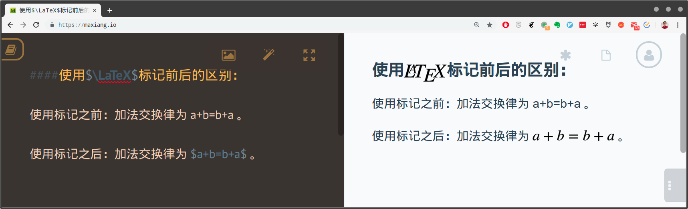
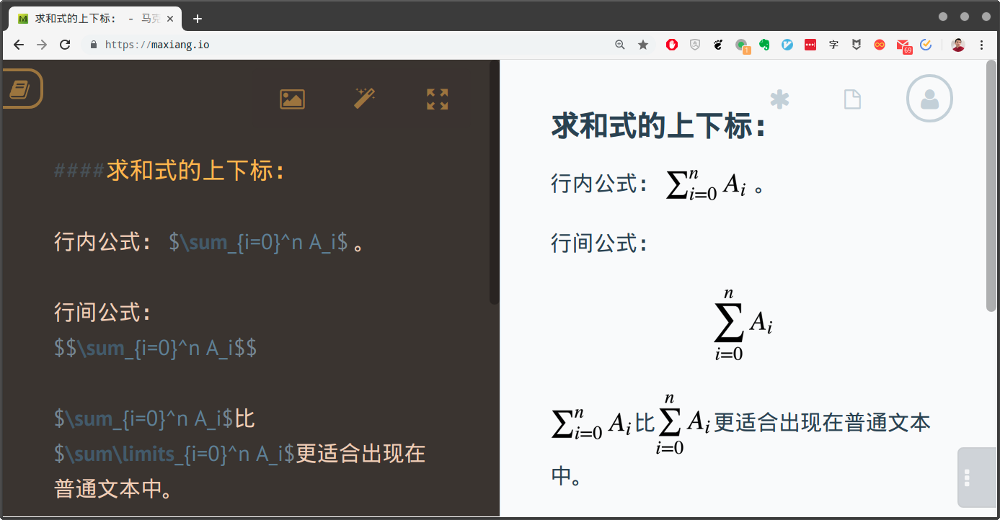
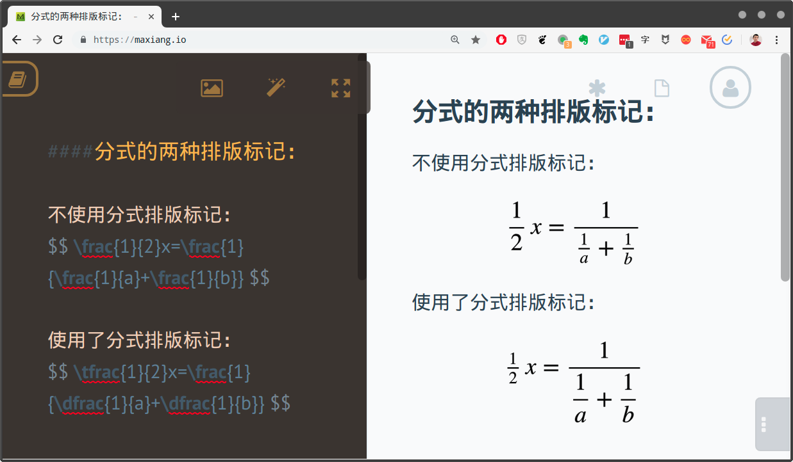
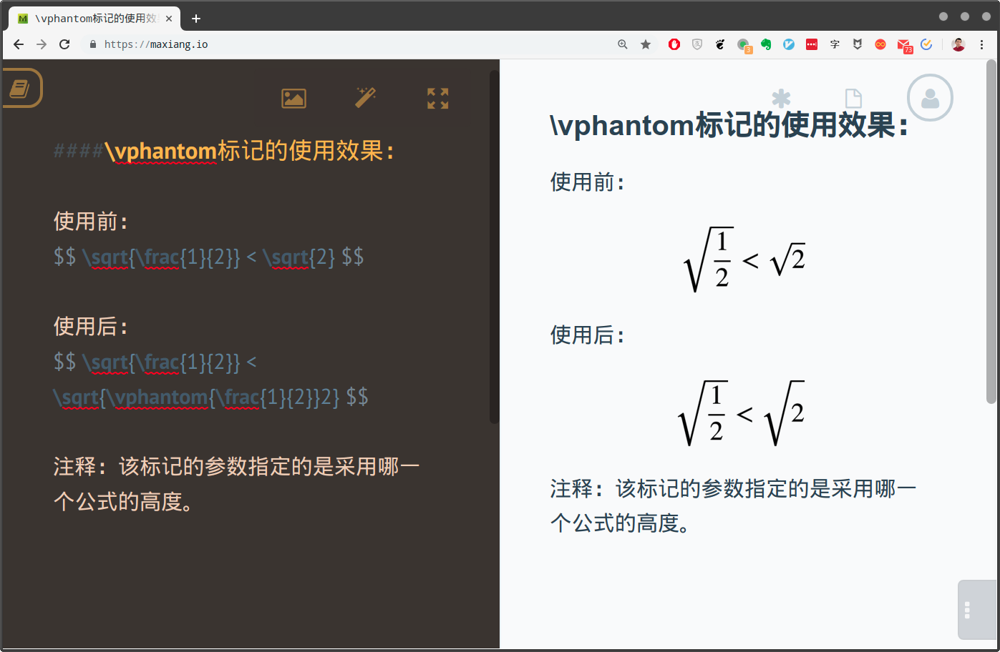
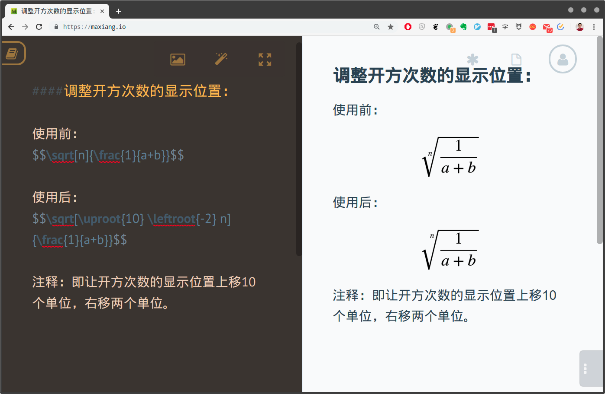

# 第四章 谈谈数学问题

## 本章提要

在之前的两章中，我们以笔者大学毕业时的论文撰写过程为导引，逐一为大家介绍了`Markdown`的基本语法，以及这种轻量型标记语言在写作阶段的大部分应用。到目前为止，关于写作阶段的内容，我们就只剩下“如何用`Markdown`来描述数学问题”这一议题没有讨论了。之所以一直避而不谈这个议题，一方面是因为笔者的这篇论文主要论证的是一个网上书籍销售系统的构建过程，本身并没有涉及到数学问题。另一方面，更重要的是因为在`Markdown`文档中描述数学问题要涉及到$\LaTeX$标记的运用，相对比较复杂，所以我们打算单独用一章的篇幅来讨论这个议题。

在这一章中，我们首先会介绍如何在`Markdown`文档中插入$\LaTeX$标记，以呈现数学公式。然后，我们会具体介绍如何用$\LaTeX$标记来描述基本四则运算、二项式方程、矩阵运算以及集合运算等数学问题。相信在学习完本章的内容之后，大家应该都能随心所欲地在`Markdown`文档中讨论数学问题了。

## 4.1 使用$\LaTeX$标记

在`Markdown`中，数学问题的描述是通过引入$\LaTeX$标记来完成的。由于$\LaTeX$本身就是一门独立的标记语言，所以在介绍如何引入其相关标记之前，我们最好先对这门语言做一个简单的介绍。

### 4.1.1 $\LaTeX$是什么？

事情得从$\TeX$说起，众所周知，$\TeX$是美国著名的计算机教授高德纳（Donald Ervin Knuth）[^1]为撰写其伟大著作《计算机程序设计艺术》专门开发的一套排版系统。由于《计算机程序设计艺术》是一部讨论计算机算法的鸿篇巨作，其中涉及了大量的数学问题，所以为其开发的排版系统自然就在编辑复杂的数学公式方面具备了与生俱来的优势，这种先天优势使得它在数学、物理学和计算机科学等与数学表述密切相关的学术领域中非常流行，甚至很多人学习$\TeX$就是为了使用它在数学领域中的强大表述能力。

但$\TeX$的功能过于强大，它会要求我们在排版过程中精确描述到每一个细节，有时甚至是一个字母或标点也要照顾到。这对于大多数人来说，可能就学习成本太高，并且用起来太过繁琐和费时了。于是在上个世纪80年代，美国计算机科学家莱斯利·兰伯特（Leslie Lamport）[^2]在$\TeX$的基础上开发出了$\LaTeX$这个新的排版系统（目前的版本为$\LaTeX2e$）。从本质上来说，该排版系统其实就是一组封装了$\TeX$处理细节的宏，它可以让那些不了解排版和程序设计相关知识的人们也能使用$\TeX$所提供的强大功能，并在几天甚至几个小时之内就能排版出具有专业质感的印刷品，而不必深陷于琐碎的排版细节中。

在中文支持方面，$\LaTeX$目前主要使用的`XeTeX`排版引擎，该引擎支持UTF-8编码和现代字体，可以直接使用本地计算机中安装的字体，这大大降低了$\LaTeX$的使用难度。

### 4.1.2 插入$\LaTeX$标记

正如上面所说的，$\LaTeX$本质上是一组封装了$\TeX$处理细节的宏。所以我们接下来所使用的每一个标记实际上都是一个宏。$\LaTeX$的这些标记主要有两种形式，第一种形式是数学公式，而数学公式的编辑原本就是本章的主要议题，我们会在下一节中做详细介绍。在这里，我们要先来简单了解一下$\LaTeX$标记的命令形式，因为这种形式也会出现在复杂的公式中。这种形态的$\LaTeX$标记通常会以一个反斜杠开头，后面紧接着该命令的名称，这个名称既可能是个单一符号，也可能是一个字符串。命令名称之后还可以有一些指定参数，我们通常会用花括号将它们括起来（如果该参数只有一个字符，花括号可以省略）。除此之外，如果有可选参数，则用方括号括起来，具体如下：

- 无参数形式：`\command`。
- 有参数形式：`\command{参数1}{参数2}……{参数N}`。
- 带可选参数形式：`\command[可选参数]{参数1}{参数2}……{参数N}`。

例如，我们现在这里所显示的“$\LaTeX$”字样，使用的就是一个无参数形式的$\LaTeX$标记`\LaTeX`。再例如，我们之前所使用开方标记`\sqrt`，就需要有一个指定参数来表示被开方数。另外，我们还可以用该标记的可选参数来指定开方的次数。关于`\sqrt`标记的具体使用，我们在下一节中会详细介绍。

在`Markdown`中，引入$\LaTeX$标记的工作是靠`Mathjax`库[^3]来完成的。和我们之前使用`Mermaid`库一样，`MathJax`也是一个跨浏览器的`JavaScript`程序库，它使用`MathML`、`LaTeX`和`ASCIIMathML`标记在Web浏览器中显示数学符号。当然，在使用这个库之前，必须要先确认我们所使用的`Markdown`编辑器是支持`Mathjax`的，譬如在VSCode编辑器中，我们需要安装Markdown+Math插件。

在设置好编辑环境之后，我们就可以在`Markdown`文档中插入$\LaTeX$标记了。具体来说，$\LaTeX$标记的引用方式主要有以下两种：

- **行内引用**：采用行内引用方式的$\LaTeX$标记通常与正常文本处于同一逻辑行中（软件界面导致的自动换行不算），具体语法就是*在待引用标记的前后各加一个美元符号*。例如，如果我们想显示“我正在使用$\LaTeX$来排版论文。”这句话，只需进行如下编码即可：
  
  ```Markdown
  我正在使用$\LaTeX$来排版论文。
  ```

- **单独引用**：采用单独引用方式的$\LaTeX$标记通常会独立于正常文本，自成一行，具体语法就是*在待引用标记的前后各加两个美元符号*。例如，如果我们想讨论勾股定理，就可以使用如下编码来描述该定理：

  ```Markdown
  在平面上的一个直角三角形中，如果设直角三角形的两条直角边长度分别是a和b，斜边长度是c，那么按照勾股定理，这三边的关系如下：
  
  $$ a^{2} + b^{2} = c^{2} $$
  
  这也就意味着：
  
  $$ a = \sqrt{c^{2} - b^{2}} $$
  $$ b = \sqrt{c^{2} - a^{2}} $$
  $$ c = \sqrt{a^{2} + b^{2}} $$
  ```

  其渲染效果如下

  > 在平面上的一个直角三角形中，如果设直角三角形的两条直角边长度分别是a和b，斜边长度是c，那么按照勾股定理，这三边的关系如下：
  >
  > $$ a^{2} + b^{2} = c^{2} $$
  >
  > 这也就意味着：
  >
  > $$ a = \sqrt{c^{2} - b^{2}} $$  
  > $$ b = \sqrt{c^{2} - a^{2}} $$  
  > $$ c = \sqrt{a^{2} + b^{2}} $$

请暂时不用担心看不懂上面所使用的$\LaTeX$标记，因为我们会在下一节中详细介绍这些标记及其使用方法。在这里，大家只需要对$\LaTeX$标记的引用方式有清楚的认知就可以了。

## 4.2 编辑数学公式

数学公式的编辑一直以来都是我们在撰写科学类文章过程中所面临的最大麻烦之一，相信各位之前应该都尝试过各种在电子文档中输入数学公式的方法，但这些方法多数都不尽如人意，这恐怕也是驱使很多人最终下定决心来学习$\LaTeX$的主要原因。毕竟，对数学公式进行编辑和排版本身就是$\TeX$最重要的设计初衷之一，目前似乎也找不到比它更强大的数学公式编辑方法了。所以在接下来的内容中，我们就来详细、深入地介绍一下如何用$\LaTeX$编辑数学公式。

### 4.2.1 初识公式

众所周知，数学公式与普通文本最大的不同就在于，数学公式中的每一个字符都有特定的含义，这些字符并不像普通文本那样只是单纯地横向或纵向排列，它们有一套属于自己的特殊结构和规则。例如，在上面勾股定理的推导公式中：

$$ c = \sqrt{a^{2} + b^{2}} $$

我们可以看到，$a$和$b$都由各自的平方号，外面还套着一个开根号，这些数学符号的排列既复杂又井然有序，在电子文档中实现这样的排列结构就是我们使用$\LaTeX$编辑数学公式要完成的主要工作。

在$\LaTeX$中，数学公式按照$\LaTeX$表示引用方式的不同，也可以分为采用行内引用的**行内公式**和采用单独引用的**行间公式**两大类。譬如$f(x,y)= x^2 + y^2$，这就是一个行内公式，它们通常与普通文本同处于一个逻辑行内。而行间公式则就是我们在上面关于描述沟勾股定理的示例所看到的那种形式，它们通常独立于普通文本，自成一行。

在了解了数学公式的独特性和它们在文档中的引用形式之后，接下来就可以正式开始学习数学公式的编辑了。下面，让我们先从最基本的四则运算开始。在`Markdown`中编写四则运算的公式很简单，就是在相应的数学表达式加上$\LaTeX$标记，譬如，如果我们想编写$x=a+b-c*d$这样的公式，就只需要输入`$x=a+b-c*d$`即可（当然也可以使用行间公式的形式）。在这里，大家心里可能会有一个疑问：加减乘除这些运算中使用的符号都是可以直接从键盘输入的，描述这类运算时似乎没有必要使用$\LaTeX$标记吧？要想回答这个疑问，我们不妨先来看看使用$\LaTeX$标记前后的区别：



如你所见，相同的表达式在使用了$\LaTeX$标记之后，表达式中的每个字符都被设置了特定的字体。譬如，字母采用了倾斜的意大利字体，而数字和加号则采用的是直立的等宽字体，并且每个字符之间也都设置了相应的间距。正是这些排版样式将一个干巴巴的表达式变成了具有学术质感的数学公式。所以，即使没有用到任何特殊符号，我们也会建议读者尽量使用$\LaTeX$标记来描述数学问题。

### 4.2.2 公式结构

正如我们之前所说，编辑数学公式并不是在简单地堆砌一堆数学符号，它们都是一些特定结构的组合。我们可以仔细回想一下自己迄今为止所见过的各种公式，看看是不是能从中提炼出几种特定的公式结构？这些结构中有哪些规则？下面我们就来回答一下这两个问题，用$\LaTeX$标记来描述一下这些公式结构。

#### 4.2.3.1 上标与下标

在众多数学公式中，上标和下标无疑是两种最常见的公式结构了。其中，上标通常位于其目标符号的右上方，而下标则通常位于其目标符号的右下方，但在某些情况下，它们也会出现在目标符号的正上方和正下方，例如$10^2$、$a_i$、$a^2_i$、$\sum\limits_{i=0}^n$等。

在$\LaTeX$中，上标用特殊字符“^”表示，下标用特殊字符“`_`”表示，上标和下标可以同时作用于同一个目标符号，并且它们的顺序是可以互换的，我们可以先写上标再写下标，也可以反过来写，两者互不影响。另外，如果上标或下标的内容的多于一个字符，就用括号将其括起来。下面来具体演示一下：

| 公式编码             | 渲染效果            |
|---------------------|-------------------|
| `$10^2$`            | $10^2$            |
| `$2^{1024}$`        | $2^{1024}$        |
| `$a_i$`             | $a_i$             |
| `$a_{i+1}$`         | $a_{i+1}$         |
| `$a_i^2$`           | $a_i^2$           |
| `$a^2_i$`           | $a^2_i$           |
| `$A_{i,j}=2^{i+j}$` | $A_{i,j}=2^{i+j}$ |

除此之外，上标与下标之间还是可以相互嵌套的，譬如：

| 公式编码             | 渲染效果            |
|---------------------|-------------------|
| `$2^{n_i}$`         | $2^{n_i}$         |
| `$2_{n^i}$`         | $2_{n^i}$         |
| `$2^{n^i}$`         | $2^{n^i}$         |
| `$2_{n_i}$`         | $2_{n_i}$         |
| `$2^{2^{2^{2}}}$`   | $2^{2^{2^{2}}}$   |

在求和、积分等这类算子符号上，$\LaTeX$基于排版因素的考虑，为避免文字过于拥挤或难看的行间距，对于行内公式和行间公式的上下标位置有不同的处理，譬如以求和式为例，其行内公式的上下标位于求和符号的右上角和右下角，而行间公式则位于求和符号的正上方和正下方。当然，我们也可以使用特定的$\LaTeX$标记来指定上下标的位置。例如，如果想让求和式的行内公式采用与行间公式相同的上下标位置，可以对它使用`\limits`标记。下面，我们来具体演示一下求和式的上下标：



不止如此，我们还可以引用`amsmath`宏组中的$\LaTeX$标记，对上下标的位置进行更精确的指定。例如使用`\sideset`标记，可以在一个符号的四个角上各指定一个上下标。除此之外，我们还可以通过`\overset`或`\underset`标记来指定一般符号的上下标位于其正上方或正下方。下面，我们就来演示一下这些标记的使用：

| 公式编码                              | 渲染效果                           |
|-------------------------------------|-----------------------------------|
| `$\sideset{^a_b}{} A$`              | $\sideset{^a_b}{} A$              |
| `$\sideset{}{^c_d} A$`              | $\sideset{}{^c_d} A$              |
| `$\sideset{^a_b}{^c_d} A$`          | $\sideset{^a_b}{^c_d} A$          |
| `$\overset{*}{A}$`                  | $\overset{*}{A}$                  |
| `$\underset{*}{A}$`                 | $\underset{*}{A}$                 |
| `$\overset{*}{\underset{*}{A}}$`    | $\overset{*}{\underset{*}{A}}$    |

对于`amsmath`宏组中其他与上下标相关的$\LaTeX$标记，读者可以自行参考相关的$\LaTeX$文档，这里就不再一一累述了。

#### 4.2.3.2 线条与括号

我们在进行数学公式的推演和分析时，经常会需要在公式的上下方画上一些线或者花括号，以便标注一些信息，这也形成了一种独特的**标注结构**。在这一节中，我们就来介绍一下这种结构的公式编辑。先来看最简单的线条标注，在$\LaTeX$中，线条标注是通过`\overline`和`\underline`这两个标记来完成的。请注意，这两个标记不止可以作用在一般结构的数学公式上，它们可以与任意结构的公式进行嵌套组合。下面，我们来演示一下它们的用法：

| 公式编码                                       | 渲染效果                                      |
|-----------------------------------------------|---------------------------------------------|
| `$\overline{ab}=\overline{a}*\overline{b}$`   | $\overline{ab}=\overline{a}*\overline{b}$   |
| `$\underline{c}=\underline{a^2+b^3}$`         | $\underline{c}=\underline{a^2+b^3}$         |
| `$\underline{\overline{a^2}+\overline{b}^3}$` | $\underline{\overline{a^2}+\overline{b}^3}$ |
| `$a^{\overline{2}}+b^{\underline{^3}}$`       | $a^{\overline{2}}+b^{\underline{^3}}$       |

除此之外。我们还可以使用`amsmath`宏组中提供的六种带箭头的线条：

| 公式编码                       | 渲染效果                           |
|-------------------------------|-----------------------------------|
| `$\overrightarrow{a+b}$`      | $\overrightarrow{a+b}$            |
| `$\overleftarrow{a+b}$`       | $\overleftarrow{a+b}$             |
| `$\overleftrightarrow{a+b}$`  | $\overleftrightarrow{a+b}$        |
| `$\underrightarrow{a+b}$`     | $\underrightarrow{a+b}$           |
| `$\underleftarrow{a+b}$`      | $\underleftarrow{a+b}$            |
| `$\underleftrightarrow{a+b}$` | $\underleftrightarrow{a+b}$       |

学习完线条标注的方法之后，接下来我们来看看如何用花括号来进行标注。在$\LaTeX$中，公式上下方的花括号标注是用`\overbrace`和`\underbrace`这两个标记来完成的，它们与之前线条标注之间最大的区别，就是花括号可以通过上标和下标来对公式进行文字标注，这在我们描述数学公式的分析过程中是非常有用的。下面我们就来演示一下这两个标记的用法：

| 公式编码                                   | 渲染效果                                 |
|-------------------------------------------|----------------------------------------|
| `$a+c-\overbrace{b*d}$`                   | $a+c-\overbrace{b*d}$                  |
| `$a+c-\underbrace{b*d}$`                  | $a+c-\underbrace{b*d}$                 |
| `$a+c-\overbrace{b*d}^{\text{乘法优先}}$`  | $a+c-\overbrace{b*d}^{\text{乘法优先}}$  |
| `$a+c-\underbrace{b*d}_{\text{乘法优先}}$` | $a+c-\underbrace{b*d}_{\text{乘法优先}}$ |

#### 4.2.3.3 分式与根式

由于**分式**与**根式**都属于数学公式中极为常见的结构，并且它们在结构上也都相对简单，所以，我们打算将它们放在同一节中来介绍。先从**分式**开始，在$\LaTeX$中，分式是通过`\frac`标记来实现的，其第一个参数为分子，第二个参数为分母。下面，我们来演示一下分式标记的具体使用：

| 公式编码                       | 渲染效果                           |
|-------------------------------|-----------------------------------|
| `$\frac{1}{2}$`               | $\frac{1}{2}$                     |
| `$\frac{1}{a}$`               | $\frac{1}{a}$                     |
| `$\frac{1}{a+b}$`             | $\frac{1}{a+b}$                   |
| `$\frac{a+b}{2}$`             | $\frac{a+b}{2}$                   |

请注意，我们在表格中使用的都是分式的行内公式形态，如果拿它们对比一下分式的行间公式形态，就会发现其行内公式形态的分子和分母都使用了较小的字号，以配合普通文本的行高和行间距，以影响排版的整体质感，譬如：


当然，有时在行间公式中，我们也会想要让公式某一部分的字体小一点，采用行内公式形态，某一部分的字体大一点，采用行间公式形态。这时候，我们就可以使用`amsmath`宏组中提供的`\dfrac`（行间形态）和`\tfrac`（行内形态）来具体指定。譬如通过如下公式的比对，我们可以看到使用指定标记之后的效果：



除此之外，我们还会看到一些类似的、分上下两层的公式结构，譬如二项式系数，它使用的是`\binom`标记，用法与分式标记完全一致，这里就不一一累述了。下面，我们来看看**根式**的结构，在$\LaTeX$中，根式是通过`\sqrt`标记来完成，该命令标记除了用于表示被开方数的指定参数外，还可以通过一个可选参数来表示开方的次数。我们来演示一下根式标记的具体使用：

| 公式编码                       | 渲染效果                           |
|-------------------------------|-----------------------------------|
| `$\sqrt{4}$`                  | $\sqrt{4}$                        |
| `$\sqrt[3]{8}$`               | $\sqrt[3]{8}$                     |
| `$\sqrt[n]{a+b}$`             | $\sqrt[n]{a+b}$                   |
| `$\sqrt[n]{\frac{1}{a+b}}$`   | $\sqrt[n]{\frac{1}{a+b}}$         |

同样地。我们也可以使用`amsmath`宏组中提供的标记，对根式的排版样式做一些指定。例如，在一般状况下，根式的高度是随着其内容变化的，但当我们需要将几个根式并列出现在同一个公式中时，就会希望这些根式的高度是一致的，这时候就会需要用到`\vphantom`标记。我们可以来比对一下该标记使用之后的效果：



再例如，我们还可以通过`\uproot`和`\leftroot`这两个标记来调整开方次数所显示的位置，这两个命令标记的参数允许我们输入基于标准位置的偏移单位（正数代表上移或左移，负数代表下移或右移），以调整位置：



#### 4.2.3.4 矩阵公式

现在我们来介绍最后一种公式结构：**矩阵**。在$\LaTeX$中，矩阵的编辑和一般的公式结构，矩阵定义的是一个独立的单元环境，我们需要用单元定义标记`\begin`和`\end`来定义一个`matrix`环境。例如，下面是两个$2*2$的矩阵在执行加法运算：

    $$
        \begin{matrix}
            a & b \\
            c & d \\
        \end{matrix}
        +
        \begin{matrix}
            a & b \\
            c & d \\
        \end{matrix}
    $$
f
正如你所见，在上述矩阵的定义过程中，不同的列之间用符号“`&`”分隔，不同的行之间则用“`\\`”分割，其渲染效果如下：

> $$
>    \begin{matrix}
>        a & b \\
>        c & d \\
>    \end{matrix}
>    +
>    \begin{matrix}
>        a & b \\
>        c & d \\
>     \end{matrix}
> $$

但是，我们发现这样的矩阵在样式上实在太过简陋，尤其在当我们像上面一样，将多个矩阵并列写在同一个公式中时，它们似乎应该要有个边框会更好。所以，如今我们更常用的是`amsmath`宏组中提供的其他五种矩阵样式，下面我们就来看看这些矩阵样式与原生样式的对比：

|matrix|pmatrix|bmatrix|Bmatrix|vmatrix|Vmatrix|
|:--:|:--:|:--:|:--:|:--:|:--:|
|$\begin{matrix} a & b \\ c & d \\ \end{matrix}$ | $\begin{pmatrix} a & b \\ c & d \\ \end{pmatrix}$ | $\begin{bmatrix} a & b \\ c & d \\ \end{bmatrix}$ | $\begin{Bmatrix} a & b \\ c & d \\ \end{Bmatrix}$ | $\begin{vmatrix} a & b \\ c & d \\ \end{vmatrix}$ | $\begin{Vmatrix} a & b \\ c & d \\ \end{Vmatrix}$ |

这些标记的方法大同小异，只要将`\begin`和`\end`中的`matrix`参数改成相应的矩阵样式名称即可。比如，如果我们想为之前参与加法运算的矩阵加上一个中括号，就可以这样做：

    $$
        \begin{bmatrix}
            a & b \\
            c & d \\
        \end{bmatrix}
        +
        \begin{bmatrix}
            a & b \\
            c & d \\
        \end{bmatrix}
    $$

其渲染效果如下：

> $$
>    \begin{bmatrix}
>        a & b \\
>        c & d \\
>    \end{bmatrix}
>    +
>    \begin{bmatrix}
>        a & b \\
>        c & d \\
>     \end{bmatrix}
> $$

当然，如果某些矩阵过大，且无需将其中的元素全部输入，也可以在矩阵中使用`\cdots`、`\ddots`、`\vdots`这三个标记来输入一些省略号，以表示这些被省略的元素。例如：

    $$
        \begin{bmatrix}
            1 & a_1 & a_1^2 & \cdots & a_1^n \\
            1 & a_2 & a_2^2 & \cdots & a_2^n \\
            \vdots & \vdots & \vdots & \ddots & \vdots \\
            1 & a_m & a_m^2 & \cdots & a_m^n \\
        \end{bmatrix}
    $$

在这里，`\cdots`代表的是横向省略号、`\ddots`则代表了斜向省略号、而`\vdots`则代表纵向省略号，其渲染效果如下：

> $$
>   \begin{bmatrix}
>       1 & a_1 & a_1^2 & \cdots & a_1^n \\
>       1 & a_2 & a_2^2 & \cdots & a_2^n \\
>       \vdots & \vdots & \vdots & \ddots & \vdots \\
>       1 & a_m & a_m^2 & \cdots & a_m^n \\
>    \end{bmatrix}
> $$

在矩阵中0元素比较多的情况下，我们还可以使用嵌套矩阵的方法来编写一个分块矩阵，例如：

    $$
        \begin{bmatrix}
            \begin{matrix} 1&1\\0&1 \end{matrix} & \Large{0} \\
            \Large{0} & \begin{matrix} 1&1\\0&1 \end{matrix} \\
        \end{bmatrix}
    $$

如你所见，我们实际上是让内嵌矩阵成为了外层矩阵的元素，其渲染效果如下：

> $$
>    \begin{bmatrix}
>         \begin{matrix} 1&1\\0&1 \end{matrix} & \Large{0} \\
>         \Large{0} & \begin{matrix} 1&1\\0&1 \end{matrix} \\
>     \end{bmatrix}
> $$

以上这些矩阵采用的都是行间公式的形态，但我们有时候也会在普通文本中编写一些简单的行内矩阵，这就需要用很小的字体来显示矩阵，这时候就可以采用`amsmath`宏组中提供的`smallmatrix`行内矩阵样式。当然，由于这种矩阵样式并没有设置括号，所以我们要手工为其添加一对括号，例如：

```Markdown
我们也可以用$\left[ \begin{smallmatrix} a & -b \\ b & a \end{smallmatrix} \right]$这样的矩阵来表示一个复数。
```

其渲染效果如下：

> 我们也可以用$\left[ \begin{smallmatrix} a & -b \\ b & a \end{smallmatrix} \right]$这样的矩阵来表示一个复数。

### 4.2.3 数学符号

在掌握了以上几种公式结构之后，我们基本上能够构建起一个数学公式的主要骨干了。但是，数学公式具体所要计算的内容则还是需要其使用的具体数学符号来决定。在$\LaTeX$中，我们可以将数学公式中的符号按照作用分成三大类，它们分别用于标记字母与字体、运算与关系、分隔与连接这三种数学语义。在这一节中，我们就来介绍一下这三大类数学符号中比较常用的部分符号。如果读者想要知道全部的数学符号，还需要自行去查阅相关的$\TeX$文档。

#### 4.2.3.1 字母与字体

让我们先从字母开始，数学公式中使用的字母主要为拉丁字母和希腊字母。其中，拉丁字母就是英文所用的字母，这26个字母（包括其大小写形态）都可以直接从键盘输入，不需要特定的标记来表示。但希腊字母的情况就要复杂一些了，除了部分大写形态与拉丁字母一致，可以直接用键盘输入外，其他就必须要用特定的$\LaTeX$标记来表示了，其字母表如下：

| 字母编码 | 显示效果 | 字母编码 | 显示效果 | 字符编码 | 显示效果 | 字符编码 | 显示效果 |
|:--:|:--:|:--:|:--:|:--:|:--:|:--:|:--:|
|\alpha|$\alpha$|A|$A$|\beta|$\beta$|B|$B$|
|\gamma|$\gamma$|\Gamma|$\Gamma$|\delta|$\delta$|\Delta|$\Delta$|
|\epsilon|$\epsilon$|E|$E$|\zeta|$\zeta$|Z|$Z$|
|\eta|$\eta$|H|$H$|\theta|$\theta$|\Theta|$\Theta$|
|\iota|$\iota$|I|$I$|\kappa|$\kappa$|K|$K$|
|\lambda|$\lambda$|\Lambda|$\Lambda$|\mu|$\mu$|M|$M$|
|\nu|$\nu$|N|$N$|\xi|$\xi$|\Xi|$\Xi$|
|o|$o$|O|$O$|\pi|$\pi$|\Pi|$\Pi$|
|\rho|$\rho$|P|$P$|\sigma|$\sigma$|\Sigma|$\Sigma$|
|\tau|$\tau$|T|$T$|\upsilon|$\upsilon$|\Upsilon|$\Upsilon$|
|\phi|$\phi$|\Phi|$\Phi$|\chi|$\chi$|X|$X$|
|\psi|$\psi$|\Psi|$\Psi$|\omega|$\omega$|\Omega|$\Omega$|

这其中，部分希腊字母还有变量专用形态，它们的$\LaTeX$标记通常以`\var-`开头，具体如下：

| 小写形态 | 大写形态 | 变量形态 | 显示效果 |
|:--:|:--:|:--:|:--:|
|\epsilon|E|\varepsilon|$\epsilon \mid E \mid \varepsilon$|
|\theta|\Theta|\vartheta|$\theta \mid \Theta \mid \vartheta$|
|\rho|P|\varrho|$\rho \mid P \mid \varrho$|
|\sigma|\Sigma|\varsigma|$\sigma \mid \Sigma \mid \varsigma$|
|\phi|\Phi|\varphi|$\phi \mid \Phi \mid \varphi$|

下面，我们再来看看这些字母使用的字体。在通常情况下，数学公式中的变量采用的是斜体的意大利体，常数采用的是直体的罗马体。当然，在特定情况下，我们也可以用以下$\LaTeX$标记来指定相关字母的字体：

| 字体标记 | 字体名称| 显示效果 | 字体标记 | 字体名称 | 显示效果 |
|:--:|:--:|:--:|:--:|:--:|:--:|:--:|
|\rm|罗马体|$\rm{Sample}$|\cal|花体|$\cal{SAMPLE}$|
|\it|意大利体|$\it{Sample}$|\Bbb|黑板粗体|$\Bbb{SAMPLE}$|
|\bf|粗体|$\bf{Sample}$|\mit|数学斜体|$\mit{SAMPLE}$|
|\sf|等线体|$\sf{Sample}$|\scr|手写体|$\scr{SAMPLE}$|
|\tt|打字机体|$\tt{Sample}$|
|\frak|旧德式字体|$\frak{Sample}$|

指定字体的方式很简单，我们只需要以`{\字体{Sample}}`的形式使用上述字体标记，就可以将“Sample”这几个字符设置为指定字体了。除此之外，在必要情况下，我们还可以使用`\color`标记来指定这些字体的颜色，该标记的第一个参数为颜色的名称，第二个参数是被指定颜色的字符，譬如`$\color{black}{Sample}$`，就是将“Sample”这几个字符设置为`black`这个颜色（当然，这些颜色主要是面向Web浏览器的，对印刷品没有多大的意义）。在这里，可供我们选择的颜色如下：

| 颜色名称 | 显示效果 | 颜色名称 | 显示效果 |
|:--:|:--:|:--:|:--:|
|black|$\color{black}{Sample}$|grey|$\color{grey}{Sample}$|
|silver|$\color{silver}{Sample}$|white|$\color{white}{Sample}$|
|maroon|$\color{maroon}{Sample}$|red|$\color{red}{Sample}$|
|yellow|$\color{yellow}{Sample}$|lime|$\color{lime}{Sample}$|
|olive|$\color{olive}{Sample}$|green|$\color{green}{Sample}$|
|teal|$\color{teal}{Sample}$|auqa|$\color{auqa}{Sample}$|
|blue|$\color{blue}{Sample}$|navy|$\color{navy}{Sample}$|
|purple|$\color{purple}{Sample}$|fuchsia|$\color{fuchsia}{Sample}$|

#### 4.2.3.2 运算与关系

##### 关系运算符

|输入|显示|输入|显示|输入|显示|输入|显示|
|:--:|:--:|:--:|:--:|:--:|:--:|:--:|:--:|
|\pm|$\pm$|\times|$\times$|\div|$\div$|\mid|$\mid$|
|\nmid|$\nmid$|\cdot|$\cdot$|\circ|$\circ$|\ast|$\ast$|
|\bigodot|$\bigodot$|\bigotimes|$\bigotimes$|\bigoplus|$\bigoplus$|\leq|$\leq$|
|\geq|$\geq$|\neq|$\neq$|\approx|$\approx$|\equiv|$\equiv$|
|\sum|$\sum$|\prod|$\prod$|\coprod|$\coprod$|\backslash|$\backslash$|

##### 集合运算符

|输入|显示|输入|显示|输入|显示|
|:--:|:--:|:--:|:--:|:--:|:--:|
|\emptyset|$\emptyset$|\in|$\in$|\notin|$\notin$|
|\subset|$\subset$|\supset|$\supset$|\subseteq|$\subseteq$|
|\supseteq|$\supseteq$|\bigcap|$\bigcap$|\bigcup|$\bigcup$|
|\bigvee|$\bigvee$|\bigwedge|$\bigwedge$|\biguplus|$\biguplus$|

##### 对数运算符

|输入|显示|输入|显示|输入|显示|
|:--:|:--:|:--:|:--:|:--:|:--:|
|\log|$\log$|\lg|$\lg$|\ln|$\ln$|

##### 三角运算符

|输入|显示|输入|显示|输入|显示|
|:--:|:--:|:--:|:--:|:--:|:--:|
|30^\circ|$30^\circ$|\bot|$\bot$|\angle A|$\angle A$|
|\sin|$\sin$|\cos|$\cos$|\tan|$\tan$|
|\csc|$\csc$|\sec|$\sec$|\cot|$\cot$|

##### 微积分运算符

|输入|显示|输入|显示|输入|显示|
|:--:|:--:|:--:|:--:|:--:|:--:|
|\int|$\int$|\iint|$\iint$|\iiint|$\iiint$|
|\iiiint|$\iiiint$|\oint|$\oint$|\prime|$\prime$|
|\lim|$\lim$|\infty|$\infty$|\nabla|$\nabla$|

##### 逻辑运算符

|输入|显示|输入|显示|输入|显示|
|:--:|:--:|:--:|:--:|:--:|:--:|
|\because|$\because$|\therefore|$\therefore$|
|\forall|$\forall$|\exists|$\exists$|\not\subset|$\not\subset$|
|\not<|$\not<$|\not>|$\not>$|\not=|$\not=$|

#### 4.2.3.3 分隔与连接

##### 戴帽符号

|输入|显示|输入|显示|
|:--:|:--:|:--:|:--:|
|\hat{xy}|$\hat{xy}$|\widehat{xyz}|$\widehat{xyz}$|
|\tilde{xy}|$\tilde{xy}$|\widetilde{xyz}|$\widetilde{xyz}$|
|\check{x}|$\check{x}$|\breve{y}|$\breve{y}$|
|\grave{x}|$\grave{x}$|\acute{y}|$\acute{y}$|

##### 连线符号

|输入|显示|
|:--:|:--:|
|\fbox{a+b+c+d}|$\fbox{a+b+c+d}$|
|\overleftarrow{a+b+c+d}|$\overleftarrow{a+b+c+d}$|
|\overrightarrow{a+b+c+d}|$\overrightarrow{a+b+c+d}$|
|\overleftrightarrow{a+b+c+d}|$\overleftrightarrow{a+b+c+d}$|
|\underleftarrow{a+b+c+d}|$\underleftarrow{a+b+c+d}$|
|\underrightarrow{a+b+c+d}|$\underrightarrow{a+b+c+d}$|
|\underleftrightarrow{a+b+c+d}|$\underleftrightarrow{a+b+c+d}$|
|\overline{a+b+c+d}|$\overline{a+b+c+d}$|
|\underline{a+b+c+d}|$\underline{a+b+c+d}$|
|\overbrace{a+b+c+d}^{Sample}|$\overbrace{a+b+c+d}^{Sample}$|
|\underbrace{a+b+c+d}_{Sample}|$\underbrace{a+b+c+d}_{Sample}$|
|\overbrace{a+\underbrace{b+c}_{1.0}+d}^{2.0}|$\overbrace{a+\underbrace{b+c}_{1.0}+d}^{2.0}$|
|\underbrace{a\cdot a\cdots a}_{b\text{ times}}|$\underbrace{a\cdot a\cdots a}_{b\text{ times}}$|

##### 箭头符号

- 推荐使用符号：
|输入|显示|输入|显示|输入|显示|
|:--:|:--:|:--:|:--:|:--:|:--:|
|\to|$\to$|\mapsto|$\mapsto$|
|\implies|$\implies$|\iff|$\iff$|\impliedby|$\impliedby$|

- 其它可用符号：
|输入|显示|输入|显示|
|:--:|:--:|:--:|:--:|
|\uparrow|$\uparrow$|\Uparrow|$\Uparrow$|
|\downarrow|$\downarrow$|\Downarrow|$\Downarrow$|
|\leftarrow|$\leftarrow$|\Leftarrow|$\Leftarrow$|
|\rightarrow|$\rightarrow$|\Rightarrow|$\Rightarrow$|
|\leftrightarrow|$\leftrightarrow$|\Leftrightarrow|$\Leftrightarrow$|
|\longleftarrow|$\longleftarrow$|\Longleftarrow|$\Longleftarrow$|
|\longrightarrow|$\longrightarrow$|\Longrightarrow|$\Longrightarrow$|
|\longleftrightarrow|$\longleftrightarrow$|\Longleftrightarrow|$\Longleftrightarrow$|

## 本章小结

<!-- 以下是注释区 -->

[^1]:注释：高德纳教授是现代计算机科学的先驱人物，他创立了算法分析理论，并在数个计算机理论分支上都做出了犹如基石一般的贡献，于1974年荣获图灵奖。
[^2]:注释：莱斯利·兰伯特是来自纽约的一位计算机科学家，$\LaTeX$排版系统的开发者，2013年荣获图灵奖。
[^3]:注释：官方网站：https://www.mathjax.org
