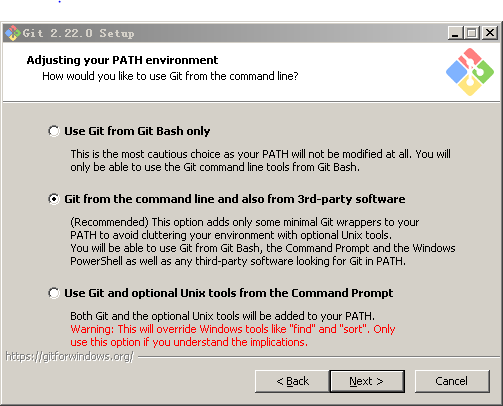

# 第5章 作品的审阅与维护

## 本章提要

我写这本书的目的之一，就是想阐述一种“像写程序一样写作”的方法论。在我个人看来，写作和写程序代码在本质上并没有多少差异，两者的首要工作都应该是用语言工具将问题或观点表达清楚，然后在表达清晰的基础上，我们再来追求一些表达的效率。该简单明了的地方，不要拐弯抹角、废话连篇，该突出重点的地方不要语焉不详、故弄玄虚。最后才是追求美感，锦上添花。如今有些文学流派，完全本末倒置，一个简单的故事，他偏偏要堆砌一堆优美的废话，无病呻吟，还号称自己“三年得二句，捻断数根须”，而且他表达的这种意境还要有缘人得之，这听上去，就像是那件只有聪明人才能看见的衣服，大概只有不谙世事的小孩才能说点实话。人间本就很复杂，我们大可不必如此画蛇添足，自欺欺人。有时候，作品的成功在于知道如何在设计上做减法，而不是盲目地往里添加各种其实并没有什么用的东西。

另一方面，和程序中始终会存在bug一样，我们在写作时表达中也始终会存在各种各样的问题，有些是表达逻辑上的缺陷，有些是表达视角上的问题，甚至还有些只是一些语病、错别字问题。我们可能写不出没有bug的程序和没有问题的文章，但可以一直持续地完善自己的作品，优秀的文章和优秀的程序一样，来自于写完之后的精心打磨和维护，在这一章中，我们将继续以之前的论文为导引，讨论一下`Markdown`文档的审阅、修改与维护。

## 5.1 选择合适的审阅工具

在一件作品完成之后，其质量的第一个把关者通常都应该是作者自己。每一个作者在写作过程中，多多少少都会存在一些输入性错误（相当于纸和笔时代的笔误），他们应该尽可能地找出作品中错误的文字、标点、代码以及图表。除此之外，我们的作品中通常还少不了会存在一些词不达意、表达不够充分的，甚至是表达错误，存在语病的文字。最后，作品本身的结构，譬如章节的先后顺序可能也需要做一些调整。所有的这一切，都是我们在自我检阅过程中要完成的任务。

要想较好地完成自我检阅工作，我们首先要做的就是通读自己的作品。在通读过程中，我们应该尽可能地专注于作品本身的内容，这时候任何与作品内容无关的事物都应被视为干扰，即使是最简单的`Markdown`标记也不例外。为了在通读作品时排除这些干扰，最简单直接的做法就是使用`Markdown`的预览器来完成通读工作。但这种做法有一个明显的缺陷：这些预览器只能显示`Markdown`标记的渲染效果，它们并不支持文章的直接修改。也就是说，每当我们发现作品中存在问题时，就要去编辑器中找到该问题所在的相应位置才能修改，这终归让人感觉没有Microsoft Word那样做到“所见即所得”的使用体验。所以在这里，我会建议大家使用同样实现了“所见即所得”的Typora编辑器来完成作品检阅阶段的工作。下面，我们就来介绍一下这款编辑器的具体使用。让我们先从利用这款编辑器的优势开始：

首先，当然是这款编辑器的**跨平台特性**。Typora支持MacOS、Windows以及各种Linux桌面发行版，我们可以在各种工作环境中使用这款编辑器，不受具体操作系统的限制。譬如，我的台式机上运行的是Ubuntu，而我的笔记本电脑是Macbook Air，它运行的是MacOS，我通常会在不同的时间段里分别在这两台电脑上对相同的文章进行编辑，Typora在两边的用户体验是完全一致的，完全感觉不到使用环境的不同。下面，我们就来简单介绍一下如何在MacOS、Windows和Ubuntu这三个系统中如何下载安装Typora吧。

Typora在MacOS和Windows下的安装过程极为简单，其步骤如下：

- 第一步. 在浏览器中打开下载地址： https://typora.io/
- 第二步. 在打开的页面中找到如下图所示的下载链接，下载相应系统的安装包，并根据安装向导完成安装即可。

  

*请注意*：MacOS的版本需在10.10以上。

而该编辑器在Ubuntu上的安装则更复杂一点，我们需要使用apt包管理器来安装（当然你也可以直接下载二进制安装包），这样做的好处是，今后我们可以直接使用apt命令来进行软件更新，其步骤如下：

- 第一步. 在浏览器中打开相关下载页面： https://typora.io/#linux
- 第二步. 复制页面中显示的`shell`命令，并在终端中执行。

```bash
  # or run:
  # sudo apt-key adv --keyserver keyserver.ubuntu.com --recv-keys BA300B7755AFCFAE
  wget -qO - https://typora.io/linux/public-key.asc | sudo apt-key add -
  
  # add Typora's repository
  sudo add-apt-repository 'deb https://typora.io/linux ./'
  sudo apt-get update

  # install typora
  sudo apt-get install typora
```

*请注意*：上述下载页面也提供了二进制安装包的下载链接，其位于上面这段`shell`代码的正下方，显示为`>> or,download binary file x63 x86`字样。

然后是最重要的**即时预览**功能。一般`Markdown`编辑器的界面往往都是并列着两个窗口，左边的窗口是编码区，用于编写`Markdown`标记源码，右边的窗口则是预览区，用于显示相应的`HTML`渲染效果。在写作过程中，为了及时掌握标记的效果，在编写源码时同步查看一下渲染效果是可以接受的，因为有些标记的复杂应用（譬如制作图表，编写数学公式）还是需要我们在专注于标记本身的编码，但如果到了自我检阅阶段，需要专注于作品内容时这种安排就确实让人觉得有些不便了，这时候Typora的即时渲染功能，所见即所得的优势就凸显了出来。下面是该编辑器打开之前那篇论文第二章时的效果：
  


接下来是其支持的**扩展功能**：Typora主要支持的是`GitHub Flavored Markdown(GFM)`风格的语法，并提供了任务列表、表情符号、数学公式、代码高亮、图表生成等扩展支持，当然，部分扩展在默认设定下是没有被打开的，我们需要通过依次点击「文件-偏好设置」菜单，打开设置界面，在如下界面中勾选相关选项：


在设置完成之后，我们就可以来看看该编辑器对于这些扩展的支持情况，譬如下面是`LaTeX`数学公式和`Mermaid`图库生成的渲染效果：


当我们将光标移动到相关元素上时，编辑器就会自动显示该公式和图形元素背后的`Markdown`标记，我们可以随时就发现的问题对它们进行修改。譬如下面是修改序列图时的状态：


除此之外，Typora还对几乎所有的`Markdown`语法都提供了**快捷操作**，我们可通过「段落」和「格式」这两个菜单中的选项来快速设置`Markdown`文档中的元素标记。当然，在我们足够熟练之后，还可以通过这些快捷操作对应的快捷键来实现更为高效的操作。以下是「格式」菜单部分的快捷操作及其相应的快捷键：


再来是「段落」菜单部分的快捷操作及其相应的快捷键：


而在阅读体验方面，Typora不仅界面设计得简约美观，还默认自带了6种`Markdown`的**预览主题**，我们可通过「主题」菜单进行随意切换，以进一步改善我们的阅读体验。譬如，下面是以`Newsprint`主题来显示上述论文第二章的效果；


## 5.2 转换成更通用的格式

当然，一部作品仅仅靠自我审阅是远远不够的，因为每个作者都有其自身的思考盲区，总有一些问题靠他自己是发现不了的。所以下一步就是要找若干个可靠的人来对作品进行更细致而广泛地审阅或试读，并根据他们的反馈来进行更进一步的修改。这时候，我们就必须要解决一个问题，那就是，*作品要以什么格式分发给我们的审阅者或试读者？*

### 5.2.1 目标格式与转换工具

要想解决这个问题，我们就得先来想一想参与作品审阅或试读的会是哪一些人。譬如，我们在这里用来举例的是一篇大学毕业论文，它的审阅者或试读者可能就是同专业的同学，以及直接指导这篇论文的老师，当然也有可能会有一些愿意帮助你完成论文的热心网友。虽然`Markdown`文档本身纯文本的特性很适合用来做分发和传阅，但我们必须考虑`Markdown`的实际普及情况，对于很多人来说，`Markdown`可能还完全是一个陌生事物，我们不能在邀请别人审阅或试读自己作品的时候跟他说：“Hey，你应该先了解一下`Markdown`语法，最好先安装一个叫做Typora的编辑器”。何况这些人中可能还有我们的老师和前辈。所以，更合适的做法是将`Markdown`文档视为作品的源文件，然后像使用程序源代码一样用编译器或解释器输出用户可以直接使用的文档格式。

对于程序来说，这种文档格式应该是一些二进制的可执行文件（譬如Windows下的`.exe`或`.dll`文件）。但对于文字作品来说，这种文档格式应该是怎么样的呢？首先，它应该是一种主流的跨平台文档格式，也就是说，这种格式的文档应该在所有主流操作系统上都只需要通过简单安装一款软件就能直接打开，并且这款软件应该是大多计算机用户都会安装，并且日常都在使用的，不需要进行复杂的系统配置。其次，这种格式的文档应该带给用户良好，并且一致的阅读体验。它应该像印刷品一样有美观的排版，将平台因素对文档呈现效果的影响降到最低。最后，这种文档格式应该要支持一定的批阅功能，以便读者在对作品提出审阅意见的同时不必修改文档本身的内容。综合以上要求，我们就会发现，目前最能满足需求的应该就只有`PDF`和`docx`这两种文档格式了。

在确定了目标文档格式之后，接下来的问题是，我们要用什么工具来做格式转换呢？换而言之，将`Markdown`文档输出成目标格式的“编译器”或“解释器”是什么呢？事实上，这个问题我们可以在Typora编辑器上找到答案。在该编辑器的「文件-导出」菜单中，我们可以看到它支持将`Markdown`文档导出哪些格式，但在点击你要导出的格式之后（譬如`docx`），它会提示你这些功能需要先安装Pandoc。这就是我们要使用的转换工具。

### 5.2.2 Pandoc的安装与使用

Pandoc是一款由`Haskell`语言实现的著名的标记语言转换工具，支持多种操作系统，采用命令行交互界面，可实现不同标记语言之间的格式转换，堪称该领域中的“瑞士军刀”。在本节，我们就来详细介绍一下这款工具的安装与使用。

首先，我们需要在自己的操作系统中安装Pandoc（如果需要用它将相关格式转换成`PDF`文件的话，还必须同时安装$\LaTeX$组件）。正如上面所说，Pandoc支持几乎所有的操作系统，我们在这里照例以Windows、MacOS和Ubuntu三个系统为例来介绍Pandoc的安装步骤。

首先是在Windows下，其安装步骤如下：

- 步骤1. 在浏览器中打开下载页面：https://github.com/jgm/pandoc/releases/latest
- 步骤2. 下载最新的安装包：pandoc-<版本号>-windows.msi
- 步骤3. 双击安装包后按照向导提示一步步完成安装
- 步骤4. 设置好Pandoc的环境变量

接着是在MacOS下，Pandoc有两种安装方式：

1. 二进制安装包：
   - 步骤1. 在浏览器中打开下载页面：https://github.com/jgm/pandoc/releases/latest
   - 步骤2. 下载最新的二进制安装包： pandoc-<版本号>-osx.pkg
   - 步骤3. 双击安装包后按照向导提示一步步完成安装

2. homebrew包管理器，这种方式只需要在终端中执行以下命令即可：
  
   ```bash
   sudo brew install pandoc
   ```

最后，在Ubuntu下，Pandoc的安装方式也有两种：

1. 二进制安装包：
   - 步骤1. 在浏览器中打开下载页面：https://github.com/jgm/pandoc/releases/latest
   - 步骤2. 下载最新的二进制安装包： pandoc-<版本号>-amd64.deb
   - 步骤3. 双击安装包后按照向导提示一步步完成安装

2. apt包管理器，这种方式只需要在终端中执行以下命令即可：

    ```bash
    sudo apt-get install pandoc
    ```

除此之外，我们在所有的操作系统中都可以选择先安装`Haskell`平台，然后使用其中的cabal工具来安装Pandoc，其命令如下：

```bash
cabal update
cabal install pandoc
```

在完成安装之后，可以在终端中输入`pandoc -v`来查看我们所安装的版本，只要看到类似于下面这样的输出，就说明Pandoc安装成功了：


在确认安装了Pandoc之后，接下来就可以开始使用Pandoc了。我们先来看看Pandoc到底支持哪一些标记语言：

| Pandoc可读取的源格式    | Pandoc可生成的目标格式                                                           |
|-----------------------|-------------------------------------------------------------------------------|
| Markdown              | HTML格式：包括XHTML，HTML5及HTML slide                                          |
| reStructuredText      | 文字处理软件格式：包括docx、odt、OpenDocument XML                                 |
| textile               | 电子书格式：包括EPUB（第2版及第3版）、FictionBook2                                 |
| HTML                  | 技术文档格式：包括DocBook、GNU TexInfo、Groff manpages、Haddock                   |
| DocBook               | 页面布局格式：InDesign ICML                                                     |
| LaTeX                 | 大纲处理标记语言格式：OPML                                                        |
| MediaWiki标记语言      | TeX格式：包括LaTeX、ConTeXt、LaTeX Beamer                                        |
| OPML                  | PDF格式：需要LaTeX支持                                                           |
| Org-Mode | 轻量级标记语言格式：包括Markdown、reStructuredText、textile、Org-Mode、MediaWiki标记语言、AsciiDoc |
| Haddock               | 自定义格式：可使用lua自定义转换规则                                                 |

或许，上述表格中的很多格式可能都让人觉得很陌生，没有关系，我们在这里的主要目标就是将`Markdown`文档转换成`PDF`和`docx`格式，这并不需要掌握Pandoc所支持的所有文档个。下面，我们就先来看看如何用Pandoc将`Markdown`文档输出为Microsoft Word文档（即`docx`格式）。

通过在终端中输入`pandoc -h`，我们可以了解到Pandoc命令的基本格式如下：

> pandoc [options] [input-file] ...

并且有以下常用选项：

| 选项　　　　　　　　　　| 含义　　　　　　　　　　                                                      |
|---------------------|---------------------------------------------------------------------------|
| `-f FORMAT`,<br> `-r FORMAT`,<br> `--from=FORMAT`,<br> `--read=FORMAT` | 指定输入文件的格式，若不指定，pandoc可以从明显的文件后缀名中推测，若无明显提示，默认的输入文件格式是`Markdown`，默认的输出文件格式是`HTML`           |
| `-t FORMAT`,<br> `-w FORMAT`,<br> `--to=FORMAT`,<br> `--write=FORMAT` | 指定输出文件的格式         |
| `-o FILE`,<br> `--output=FILE` | 写输出到FILE文件而不是到标准输出                                    |
| `--list-input-formats` | 列出支持的输入文件格式                                                     |
| `--list-output-formats` | 列出支持的输出文件格式                                                    |
| `--list-extensions`     | 列出支持的`Markdown`扩展，+代表默认支持，-代表默认不支持                      |
| `-s`,<br> `--standalone` | 产生输出文件时附带适当的头注和脚注（比如`HTML`）                             |
| `-c URL`,<br> `–css=URL` | 链接到`CSS`样式表。该选项能够使用多次来引入多个文件，所指定的文件能够以指定的顺序依次引入。|

所以根据帮助信息中给出的说明，如果要想将`Markdown`文档转换为Microsoft Word文档，我们需执行如下命令：

```bash
pandoc input.md -o output.docx -c Github.css
```

在这里，input.md是输入文件，`-o`选项后面跟的参数代表的输出文件，这里就是output.docx，`-c`选项指定的是`Markdown`文档的渲染演示，这里选择的是Github的样书。另外，如果我们在`Markdown`文档中使用了$\LaTeX$标记，那就还需要在上述命令的后面再加上一个`--latex-engine=xelatex`参数，以用来指定$\LaTeX$引擎。

在通常情况下，Pandoc会根据文件的后缀名自动判断格式。当然，我们也可以显式地指定输入文件和输出文件格式，譬如：

```bash
pandoc -f markdown -t docx input.md -o output.docx -c Github.css
```

如你所见，`-f`选项代表的是输入文件的格式，这里指定了`markdown`。而`-t`选项代表的则是输出文件的格式，这里指定的是`docx`。读到这里，有过编译C/C++或Java程序经验的读者肯定已经发现了，Pandoc的使用方式与我们曾经使用过的gcc、javac等编译器是何其相似。这意味着，我们也可以使用`makefile`这样的项目配置文件来管理`Markdown`项目的输出，真正实现像管理程序项目一样管理我们的写作项目，譬如，下面是我为自己论文项目编写的一个`makefile`文件，它会根据我修改的`Markdown`文档来更新输出的Microsoft Word文档：

```makefile
# 时间：2019年04月22日
# 作用：将markdown文件转换成docx格式

src = $(shell find ./ -name "*.md")
docx = $(src:%.md=../docx/%.docx)

all: $(docx)
    ls -l ../docx

../docx/%.docx:%.md
    pandoc -f markdown+tex_math_dollars -t docx $< -o $@  --latex-engine=xelatex

clean:
    rm -rf $(docx)
```

当然，我们需要先像管理程序带一样将上面这个`makefile`文件和所有的`Markdown`文件一起放入项目的`src`子目录中，然后再创建一个`docx`目录以作为输出目录，最后才能进到`src`目录中执行`make`命令。如果有读者对`makefile`的写法并不熟悉，可以参考我在*附录B：Makefile简易教程*中所做的相关介绍。

对于将`Markdown`文档转成`PDF`格式，我们当然也可以采用类似的方法，只需要将Pandoc命令修改如下即可：

```bash
pandoc -f markdown -t pdf input.md -o output.pdf -c Github.css --latex-engine=xelatex -V mainfont=heiti
```

但我们在这里其实可以用一种更简单的方式，即我们在一开始就提到的，Typora编辑器的「文件-导出」菜单。在安装了Pandoc之后，Typora编辑器支持将`Markdown`文档导出为HTML、PDF、docx、odt、rtf、epub、LaTeX、Media Wiki等格式。譬如，下面是之前论文第二章导出的`PDF`文档：


当然，如果你对输出的`PDF`文档在排版时有更细致的要求（譬如想调整图片的大小、实现图文绕排），我们也可以选择先将`Markdown`文档导出为$\TeX$格式的源文件，在使用$\LaTeX$进行排版处理之后再输出`PDF`格式。

## 5.3 使用版本控制系统

在完成毕业论文的初稿之后，指导老师往往会针对性地提出各种不同的问题，让我们进行多轮修改，有时候甚至要改上七八稿以上。在这种情况下，我们应该如何管理这篇论文的各个修改版本呢？众所周知，我们通常都是在空间这个维度上对项目进行管理的。毕竟，项目中的源文件（譬如C源码文件、`Markdown`文件）、输出文件（譬如可执行文件、`PDF`文件）以及配置文件（譬如`makefile`文件）都是以文件和目录的形式存储在磁盘空间上的，但现在我们想要管理的是自己不同时间段里所做的修改，这种时间维度上的项目管理应该怎么做呢？答案就是：使用版本控制系统 （Version Control System）。

版本控制系统是一种记录文件修改演化的系统，它的作用就是方便我们找回项目在某个特定时间点（即版本）上的文件、查看这些版本前后都做了哪些修改，并对这些修改进行比瑞，以修正一些致命性的错误。从版本控制系统的发展历史来看，它主要经历了本地版本控制、集中式版本控制和分布式版本控制三个阶段：

- **本地版本控制(Local Version Control System)**：这顾名思义就是本地化的版本控制系统，它没有网络协作等较为先进的版本控制的概念。

- **集中式版本控制(Centralized Version Control System)**：这种版本控制系统通常设置有一台用于执行版本控制服务的中央服务器，这台服务器会一直处于运行状态，由用户上传或下载其项目的各个版本。这类系统在很长一段时间里都是版本控制的主流方式，著名的`CVS`与`SVN`都是这一类版本控制系统的代表。

- **分布式版本控制(Distributed Version Control System)**：这种版本控制系统解决了集中式版本控制可能因为其中央服务器故障而带来的麻烦，它可以让每一台客户端都完全镜像整个被纳入版本控制的项目。也就是说，在分布式版本控制系统中，任何一台机器都可以视为版本控制服务器。即使有一台服务器失去服务能力，其它服务器还可以继续协作维持版本控制系统的正常运转。

对于毕业论文这种个人属性比较强，而又需要与人分享协作的项目来说，显然分布式版本控制系统是比较合适的选择。所以，接下来我们就以时下最流行的分布式版本控制系统——git——为例来介绍一下`Markdown`项目的管理。

### 5.3.1 git简介

git是林纳斯·托瓦兹（Linus Torvalds）为更好地管理Linux内核开发而设计的一个分布式版本控制软件。这款软件与其它主流版本控制系统最大的区别是：在项目版本更新的过程中，git并没有直接去记录基于初始文件的变化数据，而是通过一系列快照（Snapshot，就像是个小型的文件系统）来保存记录每个文件。在此过程中，对于那些没有发生变化的文件，它们在新版本中就会是一个指向其最近一次更新的链接。此外，几乎所有git的操作都是在本地进行的，所以并不存在服务器”延迟”的问题，几乎所有的操作都是瞬间完成的。例如，如果我们想要查看项目的版本历史，就不必特地去服务器上抓取历史记录了，直接在本地浏览即可。而且，这种几乎完全本地化的操作方式也为许多特殊的应用场景提供了支持，譬如：我们在开发过程中都可能会遇到要在无网络环境中需要对自己的项目进行修改，并同时要用版本控制系统将这些修改记录下来的尴尬场景，这时，git无疑就是最好的选择了。

下面我们来简单介绍一下git的存储机制。在git中，我们的项目文件主要有三种状态，它们分别是：

- **Committed**： 在这种状态下，文件或数据已经安全的存放在了git本地数据库中。
- **Modified**： 在这种状态下，文件或数据已经修改但是尚未commit到数据库。
- **Staged**： 在这种状态下，   文件或数据已被标记要放入到下一次commit中。

为了实现这种不同状态的存储，一个git镜像应该要被三个组成部分（这里假设我们的项目目录叫`git-repo`）：

- **Git directory**： 该目录是存放项目中所有元数据以及对象的地方（即`git-repo/.git/`）
- **Working directory**： 该目录用于存储从git项目数据库中`checkout`出的一个单独的（默认情况下是最新的）项目版本，用于对指定项目版本中的文件进行修改和编辑（即`git-repo/`）
- **Staging area**： 这个区域实际上是存放在Git directory（`git-repo/.git/`）中的一个简单的文件，里面存放着下一次需要commit的文件的信息。

### 5.3.2 git的安装与配置

git支持多种操作系统，采用命令行交互界面，在这里，我们以Windows为例来介绍一下如何安装和配置git（MacOS和Ubuntu下的安装则更为简单，使用相应的包管理器即可安装，请读者参考相关帮助信息）：

- 步骤1. 在浏览器中打开git for Windows的下载页面： https://gitforwindows.org/

- 步骤2. 下载安装包，并打开安装包启动安装向导，在这一步请选择好安装路径和要安装的组件：

  

- 步骤3. 设置环境变量。如果我们希望在Windows自带的终端中使用git，在这里就必须选择第二项或第三项：

  

- 步骤4. 配置文本文件的换行符形式：

  

接下来，我们还要来做一些基本配置。在这里，我用`Python`专门编写了一个git的配置脚本，以便日后重复使用这些配置（具体配置选项请看代码中的注释说明）：

```python
#! /usr/bin/env python
'''
    @author: lingjie
    @name:   git_configuration
'''

import os
import sys
import platform

title = "=    Starting " + sys.argv[0] + "......    ="
n = len(title)
print(n*'=')
print(title)
print(n*'=')

cmds = [
    "git config --global user.name 'lingjie'",               # 配置用户名
    "git config --global user.email 'lingjie@mail.com'",     # 配置邮箱，请注意，该邮箱纯属虚构，如有雷同必是巧合
    "git config --global push.default simple",               # 配置push命令的默认行为
    "git config --global color.ui true",                     # 配置git以多种颜色输出信息
    "git config --global core.quotepath false",              # 解决中文文件名乱码问题，前提是终端环境要支持utf8编码
    "git config --global i18n.logOutputEncodiing utf-8",     # 配置日志信息输出编码为utf8
    "git config --global i18n.commitEncoding utf-8",         # 配置提交信息输出编码为utf8
]

if platform.system() == "Windows":                          # 根据所在操作系统设置换行符
    cmds.append("git config --global core.autocrlf true")
else:
    cmds.append("git config --global core.autocrlf input")

for cmd in cmds:
    print(cmd)
    os.system(cmd)

print(n*'=')
print("=     Done!" + (n-len("=     Done!")-1)*' ' + "=")
print(n*'=')
```

## 本地基本操作

首先我们要初始化一个Repository，如果完全是新建一个项目，我们可以：

```bash
$ mkdir test
$ cd test
$ git init
```

这个时候，test目录下就会多出一个叫做.git的目录，该目录下会有个config文件，他的内容如下：

```text
[core]
    repositoryformatversion = 0
    filemode = true
    bare = false
    logallrefupdates = true
```

我们需要加入自己的用户信息（注意，该信息必须与你配置ssh的时候的信息保持一致）：

```text
[user]
    name = <your_username>
    email = <your_mail_addr@yourmail.com>
```

当然，用户信息我们完全可以用命令行来配置，在git init命令之前输入如下命令：

```bash
$ git config –global user.name “your_username”
$ git config –global user.email “your_mail_addr@yourmail.com”
```

如果项目目录已经存在，我们可以直接：

```bash
$ cd existing_git_repo
$ git init
```

接下来就是一些基本的操作了……

首先要用的是：git status，该命令用于查看目前git镜像的状态，在使用git的过程中，我们将会反复的使用到这个工具：

```bash
$ git status
# On branch master
#
# Initial commit
#

nothing to commit (create/copy files and use “git add” to track)
```

可以看出，git status给出了相当详细的信息，第一行中首先给出的是git的分支(branch)状态信息，接着，git会告诉你现在还没有东西提交到镜像中，建议 先使用命令git add来对文件进行追踪。所以，接下来我们介绍git add命令， 假设在的工作目录中使用python语言写一个helloworld的小程序，将代码保存完成后，我们得到一个hello.py文件，然后，我们希望将这个文件被git镜像追踪(track)到，那么只需要：

```bash
$ git add hello.py
```

这样，我们就将hello.py加入到了git镜像中去进行版本控制，再次使用git status来查看目前的镜像状态:

```bash
$ git status
# On branch master
#
# Initial commit
#
# Changes to be committed:
# (use “git rm –cached …” to unstage)
#
# new file: hello.py
#
```

注意，这里它提到了changes to be committed，意思是该文件已经处于staged状态，接下去你可以根据自己的需要将其提交(commit)，或者如果你觉得这是一个误操作，该文 件不应当被提交，你可以通过git rm –cached命令来取消它的staged状态(你会 发现status信息中给出了精确的提示)。
现在，我们通过命令git commit将hello.py提交:

```bash
$ git commit
```

这时，会出现一个带有status信息的文本给你编辑(使用什么编辑器取决于你对git的配置)，在以”#”开头的注释行下输入一些文本，用于注释此次提交，方便于其他代码协作者的维护与理解！
你也可以通过命令参数-m来直接输入注释内容，加快提交速度:

```bash
$ git commit -m “comment here”
```

至此，你的文件hello.py已经处于tracked状态！。
现在，我们有一个hello.py在镜像中了，接下来，假设发现了一个小错误，额，比如一个循环的条件写错了，于是我们需要针对文件完成修改，之后，当我们再次git status的时候：

```bash
# On branch master
# Changed but not updated:
# (use “git add …” to update what will be committed)# (use “git che
#  ckout — …” to discard changes in working directory)
#
# modified: hello.py
# no changes added to commit (use “git add” and/or “git commit -a”)
```

git status显示，hello.py被修改过了，如果你想要提交，需要再次git add该文件，或者，可以直接使用git commit -a跳过add的步骤，直接提交(尚未track的文件必须先git add才能进行提交)。
在提示中，还有提到说，如果你想撤销对hello.py的修改，就可以使用git checkout命令来实现，这里的情况会是:

```bash
$ git checkout – hello.py
```

如果你这么做了，你就会发现，你的hello.py又回到了之前没有被修改过的时候的状态。在Unix/Unix-like系统中，几乎都会有一个 小巧的对比文件不同的工具叫做diff，在git中也有这么一个工具，来详细比较你修改后准备提交的文件与修改前的状态的不同之处，恩，也许你猜到了，这 个命令就是git diff。
现在我们尝试着再次修改一下hello.py，然后运行git diff:

```bash
$ git diff
diff –git a/ hello.py b/ hello.py
index befc634..a86316b 100644
— a/hello.py
+++ b/hello.py
@@ -1,3 +1,4 @@
+/* new comment line */
if __name__ == “__main__”:
    print “hello, world!”
```

通过git的diff工具，很容易了解到我们更改了哪些地方。这个时候，如果我们想撤销之前的更改，可以使用git reset命令：

```bash
$ git reset HEAD hello.py
$ git status
# On branch master
# Untracked files:
# (use “git add …” to include in what will be committed)
#
# hello.py

nothing added to commit but untracked files present (use “git add” to track)
```

再次git status，hello.py又回到了untracked状态！

接下来，如果需要修改README.txt（通常是项目的自述文件）的文件名（千万要记得我们的文件在git的镜像中进行版本控制管理，不要鲁莽的直接使用unix命令mv或者rm来对git镜像中的文件进行普通的文件操作），我们该使用git mv命令：

```bash
$ git mv README.txt tutorial.txt
$ git status
# On branch master
# Changes to be committed:
# (use “git reset HEAD …” to unstage)
#
# renamed: README.txt -> tutorial.txt
#
$ git commit -a -m “renamed a file”
[master 55ce30d] renamed a file
1 files changed, 0 insertions(+), 0 deletions(-)
rename README.txt => tutorial.txt (100%)
```

可以看到，在提交变更后，README.txt在文件系统以及git镜像中都被成功地重命名为了tutorial.txt。同样的，你可以unstage来撤销对该文件的重命名，the choice is yours！ 如果我们不再需要tutorial.txt这个文件，我们可以将其从git镜像中删除，git中删除文件的命令是git rm:

```bash
$ git rm tutorial.txt
rm ‘tutorial.txt’
$ git status
# On branch master
# Changes to be committed:
# (use “git reset HEAD …” to unstage)
#
# deleted: tutorial.txt
#
$ git commit -a -m ” deleted a file”
[master 7d81981] deleted a file
1 files changed, 0 insertions(+), 1 deletions(-)
delete mode 100644 tutorial.txt
```

正如之前所提到的，这些操作都是可以恢复的，因为git是版本控制系统，所以自然而然的就会有一套版本历史管理机制。
我们可以用工具git log提供了查看git镜像的commit历史:

```bash
$ git log
commit 7d819818530ce89322019ba5000723c973eb0420
Author: ghosTM55
Date: Sun Mar 14 15:26:22 2010 +0800

deleted a file

commit 55ce30d88fb5c81d20bdf86e2034053613fed632
Author: ghosTM55
Date: Sun Mar 14 15:11:39 2010 +0800
renamed a file
commit 2ed9f1f9bd1a7561cd7e57dcdbd7f2cda54668fb
Author: ghosTM55
Date: Sun Mar 14 14:58:11 2010 +0800
a little change
```

基本上可以清楚地看到，git详细记录了每次commit的信息(checksum值、提交者信息、提交时间)。 下面简单的说一下分支管理的操作，git的分支管理是异常的简单和方便，可以用git branch命令进行非常直观的操作：
首先可以在工作目录下查看当前的项目存在多少分支：

```bash
$ git branch
* master
test
```

可以清楚地看到，目前该项目存在两个分支master和test，带*的是当前分支（我们可以用命令git checkout test切换到test反之）。接下来我们为项目添加一个分支：

```bash
$ git branch new
$ git branch
* master
new
test
```

我们看到新分支new已经添加进git的镜像里了，如果要删除该分支，我们可以如此：

```bash
$ git branch -d new
Deleted branch new (was 63c0da1).
$ git branch
* master
test
```

这时候我们就看到new已不在镜像中。

## 远程基本操作

要参与任何一个 Git 项目的协作，必须要了解该如何管理远程仓库。远程仓库是指托管在网络上的项目仓库，可能会有好多个，其中有些你只能读，另外有些可以写。同他人协作开发某 个项目时，需要管理这些远程仓库，以便推送或拉取数据，分享各自的工作进展。管理远程仓库的工作，包括添加远程库，移除废弃的远程库，管理各式远程库分 支，定义是否跟踪这些分支，等等。本节我们将详细讨论远程库的管理和使用。

在使用github远程仓库之前，我们需要先就其ssh链接方式来做一些设置：

- 步骤1. 首先来配置ssh的key。我们可以先查看系统的用户目录（在windows下通常是`C:\Documents and Settings\`，其他系统通常都是`/home/`），如果当前系统中已经完成了对ssh的配置，用户目录下就会存在一个名为`ssh`的隐藏目录，该目录下会存有`id_rsa`、`id_rsa.pub`这两个文件。现在请将其备份一下，然后生成新的，在用户目录中打开终端输入以下命令（请注意，请将用尖括号标注的信息替换成你要配置的具体参数）:

  ```bash
  $ ssh-keygen -t rsa -C “<指定你的电子邮箱地址>”
  Enter file in which to save the key (~/.ssh/id_rsa):
  Enter passphrase (empty for no passphrase): <在此处输入你为其设定一个密码>
  Enter same passphrase again: <重复一遍密码>
  Your identification has been saved in ~/.ssh/id_rsa.
  Your public key has been saved in ~/.ssh/id_rsa.pub.
  The key fingerprint is:
      e8:ae:60:8f:38:c2:98:1d:6d:84:60:8c:9e:dd:47:81 your_mail_addr@yourmail.com
  ```

- 步骤2. 将Public Key 添加到你所需要提交的服务器上（这里以GitHub为例，其他服务器的方式联系相关的管理员），打开你的GitHub->SSH Public Key->点击”Add another public key”, 将你的public key（id_rsa.pub）的内容拷贝到GitHub中。

- 步骤3. 测试配置是否成功，同样的，在cygwin里如此输入：

  ```bash
  ssh -T git@github.com
  ```

看到以下信息表示操作成功，接下来，我们可以学习一些基本使用。

```bash
Hi <your_username> You’ve successfully authenticated, but GitHub does not provide shell access.
```

### 查看当前的远程库

要查看当前配置有哪些远程仓库，可以用 git remote 命令，它会列出每个远程库的简短名字。在克隆完某个项目后，至少可以看到一个名为 origin 的远程库，Git 默认使用这个名字来标识你所克隆的原始仓库：

```bash
$ git clone git://github.com/schacon/ticgit.git
Initialized empty Git repository in /private/tmp/ticgit/.git/
remote: Counting objects: 595, done.
remote: Compressing objects: 100% (269/269), done.
remote: Total 595 (delta 255), reused 589 (delta 253)
Receiving objects: 100% (595/595), 73.31 KiB | 1 KiB/s, done.
Resolving deltas: 100% (255/255), done.
$ cd ticgit
$ git remote
origin
```

也可以加上 -v 选项（译注：此为 –verbose 的简写，取首字母），显示对应的克隆地址：
    

```bash
$ git remote –v
origin    git://github.com/schacon/ticgit.git
```

如果有多个远程仓库，此命令将全部列出。比如在我的 Grit 项目中，可以看到：

```bash
$ cd grit
$ git remote –v
bakkdoor git://github.com/bakkdoor/grit.git
cho45 git://github.com/cho45/grit.git
defunkt git://github.com/defunkt/grit.git
koke git://github.com/koke/grit.git
origin git@github.com:mojombo/grit.git
```

这样一来，我就可以非常轻松地从这些用户的仓库中，拉取他们的提交到本地。请注意，上面列出的地址只有 origin 用的是 SSH URL 链接，所以也只有这个仓库我能推送数据上去。

### 添加远程仓库

要添加一个新的远程仓库，可以指定一个简单的名字，以便将来引用，运行 git remote add <shortname> <url>：

```bash
$ git remote
origin
$ git remote add pb git://github.com/paulboone/ticgit.git
$ git remote –v
origin    git://github.com/schacon/ticgit.git
pb    git://github.com/paulboone/ticgit.git
```

现在可以用字串 pb 指代对应的仓库地址了。比如说，要抓取所有 Paul 有的，但本地仓库没有的信息，可以运行 git fetch pb：

```bash
$ git fetch pb
remote: Counting objects: 58, done.
remote: Compressing objects: 100% (41/41), done.
remote: Total 44 (delta 24), reused 1 (delta 0)
Unpacking objects: 100% (44/44), done.
From git://github.com/paulboone/ticgit
* [new branch] master -> pb/master
* [new branch] ticgit -> pb/ticgit
```

现在，Paul 的主干分支（master）已经完全可以在本地访问了，对应的名字是 pb/master，你可以将它合并到自己的某个分支，或者切换到这个分支，看看有些什么有趣的更新。

### 从远程仓库抓取数据

正如之前所看到的，可以用下面的命令从远程仓库抓取数据到本地：

```bash
$ git fetch [remote-name]
```

此命令会到远程仓库中拉取所有你本地仓库中还没有的数据。运行完成后，你就可以在本地访问该远程仓库中的所有分支，将其中某个分支合并到本地，或者只是取出某个分支，一探究竟。（我们会在第三章详细讨论关于分支的概念和操作。）

如果是克隆了一个仓库，此命令会自动将远程仓库归于 origin 名下。所以，git fetch origin 会抓取从你上次克隆以来别人上传到此远程仓库中的所有更新（或是上次fetch 以来别人提交的更新）。有一点很重要，需要记住，fetch 命令只是将远端的数据拉到本地仓库，并不自动合并到当前工作分支，只有当你确实准备好了，才能手工合并。(说明：事先需要创建好远程的仓库，然后执 行：git remote add <仓库名> <仓库url]> ;git fetch <远程仓库名>，即可抓取到远程仓库数据到本地，再用git merge remotes/<仓库名>/master就可以将远程仓库merge到本地当前branch。这种分支方式比较适合独立-整合开发，即各自开发测试好后 再整合在一起。比如，Android的Framework和AP开发。

可以使用–bare 选项运行git init 来设定一个空仓库，这会初始化一个不包含工作目录的仓库。

```bash
$ cd /opt/git
$ mkdir project.git
$ cd project.git
$ git –bare init
```

这时，Join，Josie 或者Jessica 就可以把它加为远程仓库，推送一个分支，从而把第一个版本的工程上传到仓库里了。)
如果设置了某个分支用于跟踪某个远端仓库的分支（参见下节及第三章的内容），可以使用 git pull 命令自动抓取数据下来，然后将远端分支自动合并到本地仓库中当前分支。在日常工作中我们经常这么用，既快且好。实际上，默认情况下 git clone 命令本质上就是自动创建了本地的 master 分支用于跟踪远程仓库中的 master 分支（假设远程仓库确实有 master 分支）。所以一般我们运行 git pull，目的都是要从原始克隆的远端仓库中抓取数据后，合并到工作目录中当前分支。

### 推送数据到远程仓库

项目进行到一个阶段，要同别人分享目前的成果，可以将本地仓库中的数据推送到远程仓库。实现这个任务的命令很简单： git push <remote-name> <branch-name>。如果要把本地的 master 分支推送到 origin 服务器上（再次说明下，克隆操作会自动使用默认的 master 和 origin 名字），可以运行下面的命令：

```bash
$ git push origin master
```

只有在所克隆的服务器上有写权限，或者同一时刻没有其他人在推数据，这条命令才会如期完成任务。如果在你推数据前，已经有其他人推送了若干更新，那 你的推送操作就会被驳回。你必须先把他们的更新抓取到本地，并到自己的项目中，然后才可以再次推送。有关推送数据到远程仓库的详细内容见第三章。

### 查看远程仓库信息

我们可以通过命令 git remote show <remote-name> 查看某个远程仓库的详细信息，比如要看所克隆的origin 仓库，可以运行：

```bash
$ git remote show origin
* remote origin
URL: git://github.com/schacon/ticgit.git
Remote branch merged with ‘git pull’ while on branch master
master
Tracked remote branches
master
ticgit
```

除了对应的克隆地址外，它还给出了许多额外的信息。它友善地告诉你如果是在 master 分支，就可以用git pull命令抓取数据合并到本地。另外还列出了所有处于跟踪状态中的远端分支。
在实际使用过程中，git remote show 给出的信息可能会像这样：

```bash
$ git remote show origin
* remote origin
URL: git@github.com:defunkt/github.git
Remote branch merged with ‘git pull’ while on branch issues
issues
Remote branch merged with ‘git pull’ while on branch master
master
New remote branches (next fetch will store in remotes/origin)
caching
Stale tracking branches (use ‘git remote prune’)
libwalker
walker2
Tracked remote branches
acl
apiv2
dashboard2
issues
master
postgres
Local branch pushed with ‘git push’
master:master
```

它告诉我们，运行 git push 时缺省推送的分支是什么（译注：最后两行）。它还显示了有哪些远端分支还没有同步 到本地（译注：第六行的 caching 分支），哪些已同步到本地的远端分支在远端服务器上已被删除（译注：Stale tracking branches 下面的两个分支），以及运行 git pull 时将自动合并哪些分支（译注：前四行中列出的 issues 和 master 分支）。(此命令也可以查看到本地分支和远程仓库分支的对应关系。)

### 远程仓库的删除和重命名

在新版 Git 中可以用 git remote rename 命令修改某个远程仓库的简短名称，比如想把 pb改成 paul，可以这么运行：

```bash
$ git remote rename pb paul
$ git remote
origin
paul
```

注意，对远程仓库的重命名，也会使对应的分支名称发生变化，原来的 pb/master分支现在成了paul/master。 碰到远端仓库服务器迁移，或者原来的克隆镜像不再使用，又或者某个参与者不再贡献代码，那么需要移除对应的远端仓库，可以运行 git remote rm 命令：

```bash
$ git remote rm paul
$ git remote
Origin
```

## 本章小结