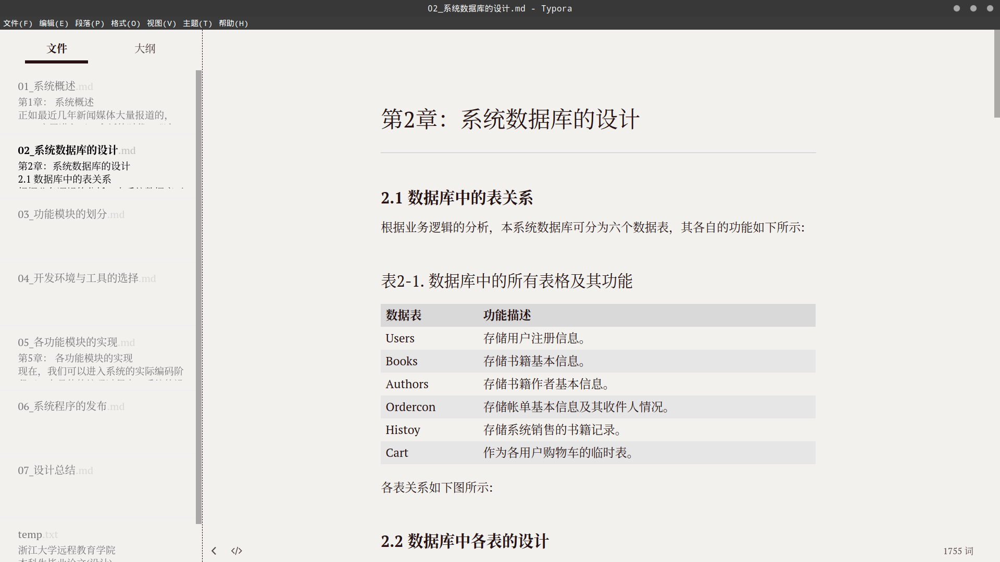

# 第5章 作品的审阅与维护

## 本章提要

我写这本书的目的之一，就是想阐述一种“像写程序一样写作”的方法论。在我个人看来，写作和写程序代码在本质上并没有多少差异，两者的首要工作都应该是用语言工具将问题或观点表达清楚，然后在表达清晰的基础上，我们再来追求一些表达的效率。该简单明了的地方，不要拐弯抹角、废话连篇，该突出重点的地方不要语焉不详、故弄玄虚。最后才是追求美感，锦上添花。如今有些文学流派，完全本末倒置，一个简单的故事，他偏偏要堆砌一堆优美的废话，无病呻吟，还号称自己“三年得二句，捻断数根须”，而且他表达的这种意境还要有缘人得之，这听上去，就像是那件只有聪明人才能看见的衣服，大概只有不谙世事的小孩才能说点实话。人间本就很复杂，我们大可不必如此画蛇添足，自欺欺人。有时候，作品的成功在于知道如何在设计上做减法，而不是盲目地往里添加各种其实并没有什么用的东西。

另一方面，和程序中始终会存在bug一样，我们在写作时表达中也始终会存在各种各样的问题，有些是表达逻辑上的缺陷，有些是表达视角上的问题，甚至还有些只是一些语病、错别字问题。我们可能写不出没有bug的程序和没有问题的文章，但可以一直持续地完善自己的作品，优秀的文章和优秀的程序一样，来自于写完之后的精心打磨和维护，在这一章中，我们将继续以之前的论文为导引，讨论一下`Markdown`文档的审阅、修改与维护。

## 5.1 选择合适的审阅工具

在一件作品完成之后，其质量的第一个把关者通常都应该是作者自己。每一个作者在写作过程中，多多少少都会存在一些输入性错误（相当于纸和笔时代的笔误），他们应该尽可能地找出作品中错误的文字、标点、代码以及图表。除此之外，我们的作品中通常还少不了会存在一些词不达意、表达不够充分的，甚至是表达错误，存在语病的文字。最后，作品本身的结构，譬如章节的先后顺序可能也需要做一些调整。所有的这一切，都是我们在自我检阅过程中要完成的任务。

要想较好地完成自我检阅工作，我们首先要做的就是通读自己的作品。在通读过程中，我们应该尽可能地专注于作品本身的内容，这时候任何与作品内容无关的事物都应被视为干扰，即使是最简单的`Markdown`标记也不例外。为了在通读作品时排除这些干扰，最简单直接的做法就是使用`Markdown`的预览器来完成通读工作。但这种做法有一个明显的缺陷：这些预览器只能显示`Markdown`标记的渲染效果，它们并不支持文章的直接修改。也就是说，每当我们发现作品中存在问题时，就要去编辑器中找到该问题所在的相应位置才能修改，这终归让人感觉没有Microsoft Word那样做到“所见即所得”的使用体验。所以在这里，我会建议大家使用同样实现了“所见即所得”的Typora编辑器来完成作品检阅阶段的工作。下面，我们就来介绍一下这款编辑器的具体使用。让我们先从利用这款编辑器的优势开始：

首先，当然是这款编辑器的**跨平台特性**。Typora支持MacOS、Windows以及各种Linux桌面发行版，我们可以在各种工作环境中使用这款编辑器，不受具体操作系统的限制。譬如，我的台式机上运行的是Ubuntu，而我的笔记本电脑是Macbook Air，它运行的是MacOS，我通常会在不同的时间段里分别在这两台电脑上对相同的文章进行编辑，Typora在两边的用户体验是完全一致的，完全感觉不到使用环境的不同。下面，我们就来简单介绍一下如何在MacOS、Windows和Ubuntu这三个系统中如何下载安装Typora吧。

Typora在MacOS和Windows下的安装过程极为简单，其步骤如下：

- 第一步. 在浏览器中打开下载地址： https://typora.io/
- 第二步. 在打开的页面中找到如下图所示的下载链接，下载相应系统的安装包，并根据安装向导完成安装即可。

  

*请注意*：MacOS的版本需在10.10以上。

而该编辑器在Ubuntu上的安装则更复杂一点，我们需要使用apt包管理器来安装（当然你也可以直接下载二进制安装包），这样做的好处是，今后我们可以直接使用apt命令来进行软件更新，其步骤如下：

- 第一步. 在浏览器中打开相关下载页面： https://typora.io/#linux
- 第二步. 复制页面中显示的`shell`命令，并在终端中执行。

```bash
  # or run:
  # sudo apt-key adv --keyserver keyserver.ubuntu.com --recv-keys BA300B7755AFCFAE
  wget -qO - https://typora.io/linux/public-key.asc | sudo apt-key add -
  
  # add Typora's repository
  sudo add-apt-repository 'deb https://typora.io/linux ./'
  sudo apt-get update

  # install typora
  sudo apt-get install typora
```

*请注意*：上述下载页面也提供了二进制安装包的下载链接，其位于上面这段`shell`代码的正下方，显示为`>> or,download binary file x63 x86`字样。

然后是最重要的**即时预览**功能。一般`Markdown`编辑器的界面往往都是并列着两个窗口，左边的窗口是编码区，用于编写`Markdown`标记源码，右边的窗口则是预览区，用于显示相应的`HTML`渲染效果。在写作过程中，为了及时掌握标记的效果，在编写源码时同步查看一下渲染效果是可以接受的，因为有些标记的复杂应用（譬如制作图表，编写数学公式）还是需要我们在专注于标记本身的编码，但如果到了自我检阅阶段，需要专注于作品内容时这种安排就确实让人觉得有些不便了，这时候Typora的即时渲染功能，所见即所得的优势就凸显了出来。下面是该编辑器打开之前那篇论文第二章时的效果：
  


接下来是其支持的**扩展功能**：Typora主要支持的是`GitHub Flavored Markdown(GFM)`风格的语法，并提供了任务列表、表情符号、数学公式、代码高亮、图表生成等扩展支持，当然，部分扩展在默认设定下是没有被打开的，我们需要通过依次点击「文件-偏好设置」菜单，打开设置界面，在如下界面中勾选相关选项：


在设置完成之后，我们就可以来看看该编辑器对于这些扩展的支持情况，譬如下面是`LaTeX`数学公式和`Mermaid`图库生成的渲染效果：


当我们将光标移动到相关元素上时，编辑器就会自动显示该公式和图形元素背后的`Markdown`标记，我们可以随时就发现的问题对它们进行修改。譬如下面是修改序列图时的状态：


除此之外，Typora还对几乎所有的`Markdown`语法都提供了**快捷操作**，我们可通过「段落」和「格式」这两个菜单中的选项来快速设置`Markdown`文档中的元素标记。当然，在我们足够熟练之后，还可以通过这些快捷操作对应的快捷键来实现更为高效的操作。以下是「格式」菜单部分的快捷操作及其相应的快捷键：


再来是「段落」菜单部分的快捷操作及其相应的快捷键：


而在阅读体验方面，Typora不仅界面设计得简约美观，还默认自带了6种`Markdown`的**预览主题**，我们可通过「主题」菜单进行随意切换，以进一步改善我们的阅读体验。譬如，下面是以`Newsprint`主题来显示上述论文第二章的效果；



## 5.2 转换成更通用的格式

当然，一部作品仅仅靠自我审阅是远远不够的，因为每个作者都有其自身的思考盲区，总有一些问题靠他自己是发现不了的。所以下一步就是要找若干个可靠的人来对作品进行更细致而广泛地审阅或试读，并根据他们的反馈来进行更进一步的修改。这时候，我们就必须要解决一个问题，那就是，*作品要以什么格式分发给我们的审阅者或试读者？*

### 5.2.1 目标格式与转换工具

要想解决这个问题，我们就得先来想一想参与作品审阅或试读的会是哪一些人。譬如，我们在这里用来举例的是一篇大学毕业论文，它的审阅者或试读者可能就是同专业的同学，以及直接指导这篇论文的老师，当然也有可能会有一些愿意帮助你完成论文的热心网友。虽然`Markdown`文档本身纯文本的特性很适合用来做分发和传阅，但我们必须考虑`Markdown`的实际普及情况，对于很多人来说，`Markdown`可能还完全是一个陌生事物，我们不能在邀请别人审阅或试读自己作品的时候跟他说：“Hey，你应该先了解一下`Markdown`语法，最好先安装一个叫做Typora的编辑器”。何况这些人中可能还有我们的老师和前辈。所以，更合适的做法是将`Markdown`文档视为作品的源文件，然后像使用程序源代码一样用编译器或解释器输出用户可以直接使用的文档格式。

对于程序来说，这种文档格式应该是一些二进制的可执行文件（譬如Windows下的`.exe`或`.dll`文件）。但对于文字作品来说，这种文档格式应该是怎么样的呢？首先，它应该是一种主流的跨平台文档格式，也就是说，这种格式的文档应该在所有主流操作系统上都只需要通过简单安装一款软件就能直接打开，并且这款软件应该是大多计算机用户都会安装，并且日常都在使用的，不需要进行复杂的系统配置。其次，这种格式的文档应该带给用户良好，并且一致的阅读体验。它应该像印刷品一样有美观的排版，将平台因素对文档呈现效果的影响降到最低。最后，这种文档格式应该要支持一定的批阅功能，以便读者在对作品提出审阅意见的同时不必修改文档本身的内容。综合以上要求，我们就会发现，目前最能满足需求的应该就只有`PDF`和`docx`这两种文档格式了。

在确定了目标文档格式之后，接下来的问题是，我们要用什么工具来做格式转换呢？换而言之，将`Markdown`文档输出成目标格式的“编译器”或“解释器”是什么呢？事实上，这个问题我们可以在Typora编辑器上找到答案。在该编辑器的「文件-导出」菜单中，我们可以看到它支持将`Markdown`文档导出哪些格式，但在点击你要导出的格式之后（譬如`docx`），它会提示你这些功能需要先安装Pandoc。这就是我们要使用的转换工具。

### 5.2.2 Pandoc的安装与使用

Pandoc是一款由`Haskell`语言实现的著名的标记语言转换工具，支持多种操作系统，采用命令行交互界面，可实现不同标记语言之间的格式转换，堪称该领域中的“瑞士军刀”。在本节，我们就来详细介绍一下这款工具的安装与使用。

首先，我们需要在自己的操作系统中安装Pandoc（如果需要用它将相关格式转换成`PDF`文件的话，还必须同时安装$\LaTeX$组件）。正如上面所说，Pandoc支持几乎所有的操作系统，我们在这里照例以Windows、MacOS和Ubuntu三个系统为例来介绍Pandoc的安装步骤。

首先是在Windows下，其安装步骤如下：

- 步骤1. 在浏览器中打开下载页面：https://github.com/jgm/pandoc/releases/latest
- 步骤2. 下载最新的安装包：pandoc-<版本号>-windows.msi
- 步骤3. 双击安装包后按照向导提示一步步完成安装

接着是在MacOS下，Pandoc有两种安装方式：

1. 二进制安装包：
   - 步骤1. 在浏览器中打开下载页面：https://github.com/jgm/pandoc/releases/latest
   - 步骤2. 下载最新的二进制安装包： pandoc-<版本号>-osx.pkg
   - 步骤3. 双击安装包后按照向导提示一步步完成安装

2. homebrew包管理器，这种方式只需要在终端中执行以下命令即可：
  
   ```bash
   sudo brew install pandoc
   ```

最后，在Ubuntu下，Pandoc的安装方式也有两种：

1. 二进制安装包：
   - 步骤1. 在浏览器中打开下载页面：https://github.com/jgm/pandoc/releases/latest
   - 步骤2. 下载最新的二进制安装包： pandoc-<版本号>-amd64.deb
   - 步骤3. 双击安装包后按照向导提示一步步完成安装

2. apt包管理器，这种方式只需要在终端中执行以下命令即可：

    ```bash
    sudo apt-get install pandoc
    ```

下面，我们就先来看一下Pandoc到底支持哪一些标记语言：

| Pandoc可读取的源格式    | Pandoc可生成的目标格式                                                           |
|-----------------------|-------------------------------------------------------------------------------|
| Markdown              | HTML格式：包括XHTML，HTML5及HTML slide                                          |
| reStructuredText      | 文字处理软件格式：包括docx、odt、OpenDocument XML                                 |
| textile               | 电子书格式：包括EPUB（第2版及第3版）、FictionBook2                                 |
| HTML                  | 技术文档格式：包括DocBook、GNU TexInfo、Groff manpages、Haddock                   |
| DocBook               | 页面布局格式：InDesign ICML                                                     |
| LaTeX                 | 大纲处理标记语言格式：OPML                                                        |
| MediaWiki标记语言      | TeX格式：包括LaTeX、ConTeXt、LaTeX Beamer                                        |
| OPML                  | PDF格式：需要LaTeX支持                                                           |
| Org-Mode | 轻量级标记语言格式：包括Markdown、reStructuredText、textile、Org-Mode、MediaWiki标记语言、AsciiDoc |
| Haddock               | 自定义格式：可使用lua自定义转换规则                                                 |

## 5.3 使用版本控制系统

## 本章小结