# 第6章 Markdown的其他应用

## 本章提要

到目前为止，我们都是以论文写作这一工作的需求为导引来介绍`Markdown`在文字创作类项目中的应用的。这样做的好处是能较为全面地涵盖这门标记语言的各种特性和扩展，但对于其开放性，灵活度的体现尚略显不足。`Markdown`的作用远不止是充当文字创作类项目的“源码”那么单一，它还能用来制作演示文稿、线上电子书和博客系统。在这一章中，我们将致力于介绍`Markdown`在这些特定领域中的应用。

## 6.1 制作演示文稿

对于平常靠键盘就能完成大部分工作的人来说（譬如我），用Microsoft PowerPoint或Apple Keynote这类软件来制作演示文稿始终是一个挺折磨人的事情。想想那个过程吧，我们必须要时不时让手离开键盘，拿着鼠标来回又点击又拖拽的，短短十几页的演示文稿往往要花费两三个小时以上的时间。而且整个过程充满了“感觉可以了”，“看起来还行”之类的不确定感，也许对于喜欢画画的朋友来说，这是个很熟悉，甚至是很享受的体验，但对我这种喜欢用命令行和少量快捷键来控制计算机，且从不打游戏的人来说，这无疑是一件很难受的事情。当然，使用这些软件的确能制作出包含精美图文的、具有各种炫酷效果的演示文稿，但在大多数情况下，演示文稿的作用只不过是在论文答辩、会议简报或主题演讲的过程中做一点穿针引线，提示重点的辅助而已，如何提炼内容的重点才是我们制作这些演示文稿的关键，那些精美的图案和炫酷的效果对大多数人来说，并没有那么必要。而且习惯了盗版软件的我们可能还忘了，这些软件都不是免费的，价格还并不便宜，鉴于现在的时空背景，我们确定自己能一直使用盗版么？即使愿意花钱，我们也一定能卖到这些外国软件吗？这些都恐怕已经不只是道德问题，而是大家可能很快就要面对的现实问题了。[^1]

### 6.1.1 Marp简介

接下来，就让我们抛开对于炫酷效果的执念，看看`Markdown`这种自由开放、简洁高效的写作方式能给大家带来的解决方案，也就是我们打算在这里给大家推荐的一款工具：Marp。这是一款基于`Electron`框架[^2]开发的开源软件，它可以将`Markdown`格式的文字以演示文稿的形式显示出来，并支持导出为`PDF`文档，非常适合于对演示文稿的设计感要求不高，但对其内容产出效率有比较高要求的用户。该软件主要具有以下优点：

- 开源、自由、免费，使用不受任何非技术因素的限制。
- 跨平台，支持Windows、MacOS、Linux等主流操作系统平台。
- 支持实时预览，提供有`Markdown`、`1:1 Slide`、`Slide List`三种预览模式。
- 提供有`Default`和`Gaia`两种主题。
- 可以在演示文稿中显示表格、表情符号、数学公式以及背景图这些特定元素。
- 可调整演示文稿的页面尺寸。

当然，这款软件也有不足之处 譬如：

- 软件功能相对单薄，不支持图文绕排等复杂内容的显示。
- `1:1 Slide`预览模式不支持使用上下键翻页。
- `Markdown`、`Slide List`这两种预览模式则不支持左右滑动。

所以，我们在选择一个工具之前需要充分了解自己需求，区分出哪些是必需的，哪些是可有可无的，哪些完全没有必要的，这样才能找出最适合自己的、高性价比的解决方案，切忌意识形态用事，选择华而不实或者不足以解决问题的工具。

### 6.1.2 Marp的安装

Marp是以一个“开箱即用”的软件，安装过程非常简单，步骤如下：

- 步骤1. 打开浏览器，访问Marp的官方网站：`https://yhatt.github.io/marp/`。

  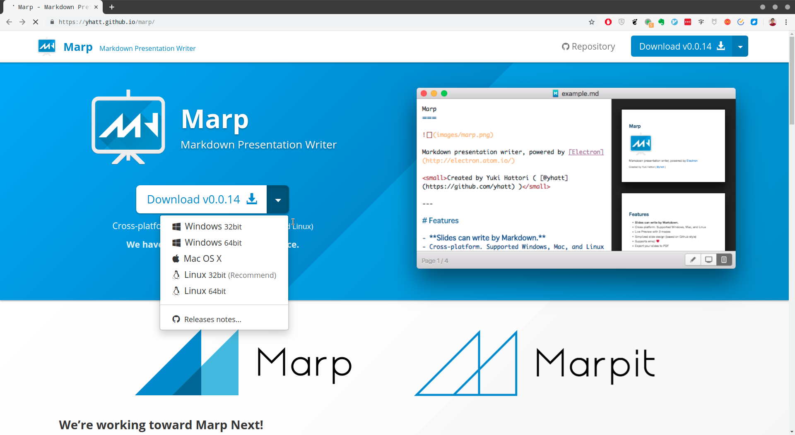

- 步骤2. 从上面点开的下拉菜单中选择符合自身需求的操作系统平台（譬如，我这里所使用的是Linux 32bit），以下载相应的软件包。

- 步骤3. 将下载到的软件包解压到我们要安装该软件的目录中，譬如我这里选择的是`/home/owlman/bin/app/marp/`这个目录。

  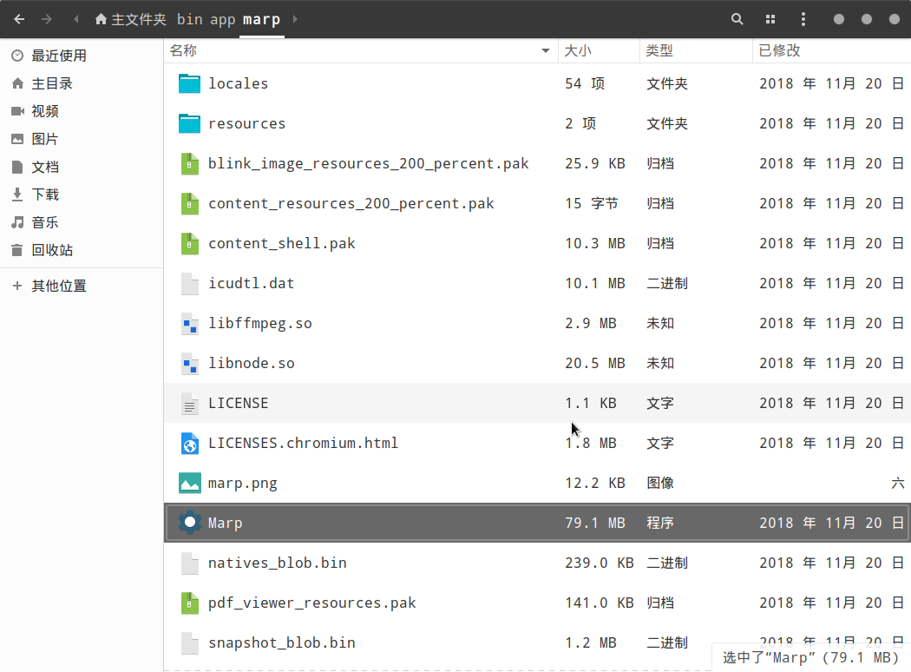

- 步骤4（可选）. 我们也可以为该程序设置一个快捷方式，譬如在Ubuntu下，我们可以创建一个`Marp.desktop`，内容如下：

   ```bash
   [Desktop Entry]
   Name=Marp
   Type=Application
   StartupNotify=true
   Icon=/home/owlman/bin/app/marp/marp.png
   Exec=/home/owlman/bin/app/marp/Marp
   ```

   然后将该文件保存在`/usr/share/applications`目录中即可，当然，在这里我们需要自己准备一个`marp.png`图形文件，以充当快捷方式的图标。

### 6.1.3 Marp的使用

在完成安装之后，我们就可以通过上述步骤4中创建的快捷方式或者直接在安装目录中单击`Marp`程序文件来启动该程序了，该程序的初始界面如下：

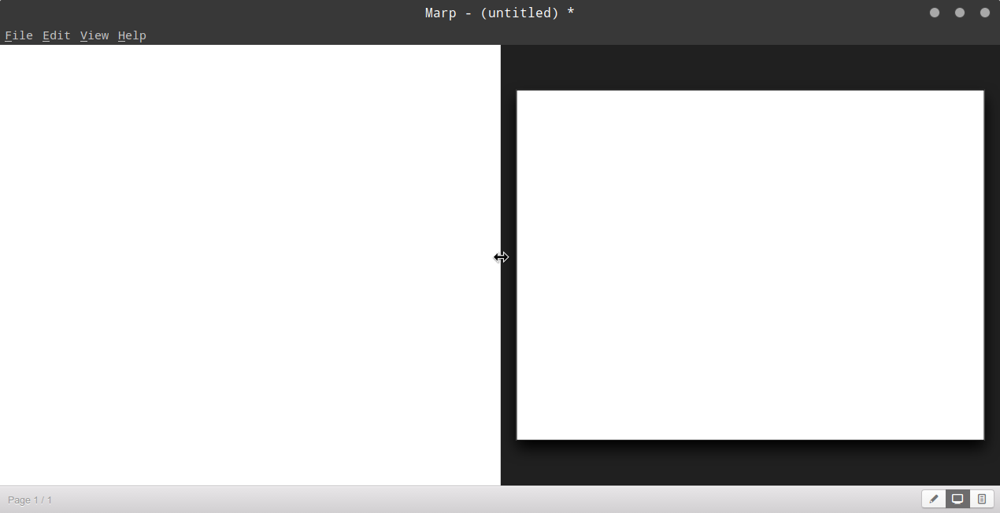

现在，让我们先来熟悉一下这个界面。正如你所看到的，Marp的界面采用了常见的菜单栏、编辑区和底部工具栏三段式布局。其编辑区与大多数`Markdown`编辑器一样分成了左右两个区域，左边是`Markdown`编码区，右边是预览区。而在底部工具栏的右侧，我们看到三个按钮，它们对应了Marp的三种预览模式，从左至右分别为：

- `Markdown`模式：`Markdown`渲的普通染效果预览。
- `1:1 Slide`模式：演示文稿效果的预览，这也是Marp的默认模式。
- `Slide List`模式：这种形式会以列表的形式预览演示文稿，可执行滑动操作。

在熟悉了软件界面之后，接下来就可以开始学习如何用`Markdown`来制作演示文稿了。但正式这趟学习旅程之前，我们还是有必要先来介绍一下Marp所特有的两个概念：

- 第一，由于Marp本身就是由Github团队开发的，所以它的`Markdown`语法采用的是`GitHub Flavored Markdown`风格，支持Github对标准语法所做的部分扩展。

- 第二，Marp在`GitHub Flavored Markdown`语法的基础上还增加了一种**指令**元素，以便用来调整演示文稿的显示效果。该类元素的格式为`<!--指令名称:指令值-->`，譬如，如果我们想让演示文稿的页面采用`16:9`的长宽比。就可以在文稿的开头添加`<!--$size: 16:9-->`这样一条指令。当然，同一个指令元素中也可以包含多条指令，譬如：

  ```Markdown
  <!--
    $size: 16:9
    page_number:true
  -->
  ```

  这条指令不仅把演示文稿的长宽比设置成了16:9，而且会显示页码。
  

下面，我们通过Marp自带的示例来讲解一下如何用`Markdown`制作演示文稿。首先，请在Marp的菜单栏中依次点击「Help - Open Example - marp basic example」菜单来打开这个演示文稿示例，下面是该示例在默认的`1:1 Slide`模式下的效果：

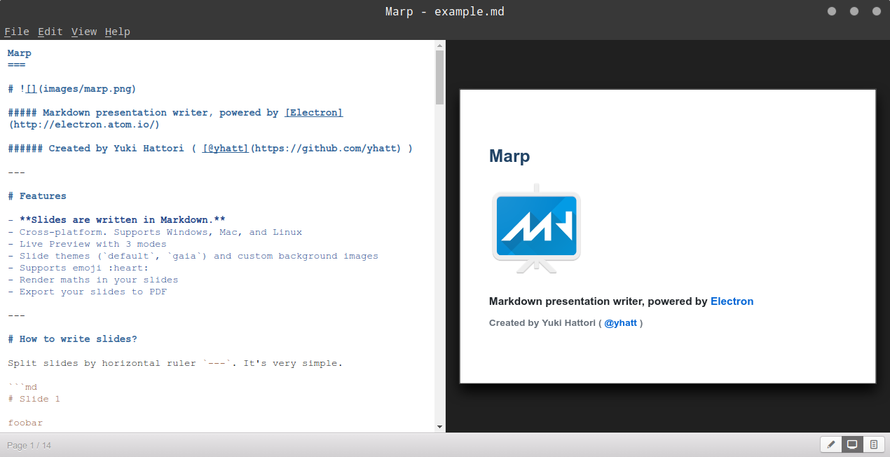

各位可以自行通过右下角的按钮来查看一下其他预览模式。下面，我们来看一下这个示例前两页的`Markdown`编码：

    Marp
    ===

    # 

    ##### Markdown presentation writer, powered by [Electron](http://electron.atom.io/)

    ###### Created by Yuki Hattori ( [@yhatt](https://github.com/yhatt) )

    ---

    # Features

    - **Slides are written in Markdown.**
    - Cross-platform. Supports Windows, Mac, and Linux
    - Live Preview with 3 modes
    - Slide themes (`default`, `gaia`) and custom background images
    - Supports emoji :heart:
    - Render maths in your slides
    - Export your slides to PDF

    ---

从这两页的编码中，我们可以看出，`Markdown`的大部分语义元素在Marp中的渲染效果都与普通的`Markdown`文档一致，唯一不同的是`---`分隔符。该元素在一般`Markdown`文档中只是一条简单的分割线，而在Marp中，它就成为了演示文稿的分页符，用于将演示文稿的内容切分到不同的页面中，这是我们要学习的第一个Marp特有的`Markdown`语法。

如果我们继续看下去，就会发现这个示例不仅仅是一个语法示范，它本身就是一个Marp环境下的`Markdown`语法教程。譬如，在该实例第5-11页的编码中，我们可以看到，它详细列举了在Marp的指令元素中可以使用的指令。当然，如果你看不明白或者不喜欢看这些英文的演示文稿也没关系，我们接下来会根据这几页文稿的内容再来做一点转述说明。首先是作用于整个演示文稿的**全局性指令**：

- **`$theme`指令**：用于指定演示文稿的主题样式，Marp只提供有以下两种主题：

    | 主题名称 | 设置指令 |
    |:--------|:--------|
    | **Default** |`<!-- $theme: default -->`
    | **Gaia** |`<!-- $theme: gaia -->`

- **`$width` / `$height`指令**：用于指定演示文稿页面的宽度和高度，默认计量单位为像素`px`，除此之外，我们还能指定其他计量单位，包括`cm`、`mm`、`in`、`pt`、`pc`。譬如，我们想将页面宽度设置为9厘米，就可以使用如下指令：

  ```Markdown
  <!-- $width: 9cm -->
  ```

- **`$size`指令**：用于指定演示文稿页面的长宽比，默认为`4:3`，除此之外，我们可以选择`16:9`、`A0`-`A8`、`B0`-`B8`等预置的长宽比。譬如，如果我们想要将页面设置为`A4`的长宽比，就可以使用如下指令：

  ```Markdown
  <!-- $size: A4 -->
  ```

接下来是只作用于指令所在页面及其后续页面的**页面级指令**（当然，如果将指令置于整个演示文稿的顶部，它一样会影响所有页面）：

- **`page_number`指令**：用于显示页面编号，如果我们想让某页面及其后续页面在右下角显示页面编号，就可以使用如下指令：
  
    ```Markdown
    <!-- page_number: true -->
    ```

- **`template`指令**：用于指定页面所用的主题模版。譬如，如果我们想使用`gaia`主题的`invert`模版，就可以使用如下指令：
  
  ```Markdown
  <!--
      $theme: gaia        
      template: invert
  -->
  ```
  
- **`footer`指令**：用于为当前页面及其后续页面设置页脚。譬如，如果我们想让页面在页脚处显示“这里是页脚”这几个字，就可以使用如下指令：

  ```Markdown
  <!-- footer: 这里是页脚 -->
  ```

- **`prerender`指令**：用于为页面的渲染效果做一些预处理工作。如果我们为页面设置的背景图片过大，我们就可以使用如下指令来改善渲染效果：

  ```Markdown
  <!-- prerender: true -->
  ```

在上面介绍的最后一个指令时，我们提到了演示文稿页面的背景图片。这也是一个Marp所特有的`Markdown`语义元素，请参考Marp自带示例的第12页的编码：

    #### Slide background Images

    You can set an image as a slide background.

    ```html
    
    ```

    Options can be provided after `bg`, for example ``.

    Options include:

    - `original` to include the image without any effects
    - `x%` to include the  image at `x` percent of the slide size

    Include multiple`` tags to stack background images horizontally.

    

    ---

正如这张演示文稿中所说明的，在Marp中加入背景图片的语法是``，即在使用图片元素时，在图片说明处将其注明为`bg`。上述页面的渲染效果如下：

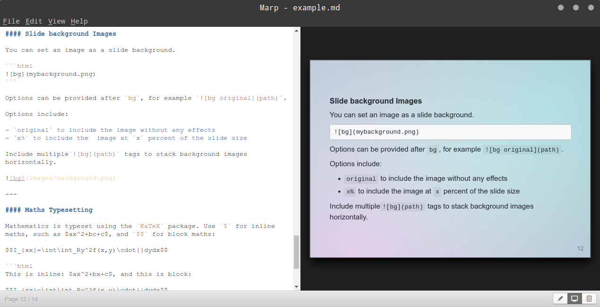

到目前为止，我们已经将在Marp中制作演示文稿会用到的`Markdown`语法介绍完了。最后，让我们来综合运用一下这些语法，制作一个用于自我介绍的演示文稿。首先，我们希望这个演示文稿可以转换成`PDF`文档，以便附在论文的前面，所以将页面设置为`A4`。然后，所有页面采用`gaia`主题，并且在页脚处显示"个人简介"的字样，并显示页码。在内容安排上，第一页中会放置一些个人的基本信息，第二页罗列一些代表作品，第三页给出一些联系方式。具体编码如下：

    <!--
        $size: A4
        $theme:gaia
        page_number:true
        footer: 个人简介
    -->

    # 个人简介

    **凌杰**：浙江大学远程教育学院“荣誉学员”、2012年度“十大远程骄子”。目前为自由开发者、技术译者。精通多门编程语言，拥有丰富的软件开发及测试经验。个人崇尚黑客文化，支持开源运动，时常出没于国内外各种技术社区，曾担任上海交通大学饮水思源BBS的技术区区长，并兼任该区C/C++板板主多年。近些年来还参与了多项技术相关的外文翻译工作。

    ---

    ## 代表作品

    - 《元素模式》
    - 《git学习指南》
    - 《NLTK基础教程》
    - 《Python算法教程》
    - 《JavaScript面向对象编程指南》

    ---

    ## 联系方式

    - 个人主页：http://owlman.org/
    - 新浪微博：https://weibo.com/owlman
    - 电子邮件：jie_owlman@163.com

下面来看看具体效果，首先是第一页：

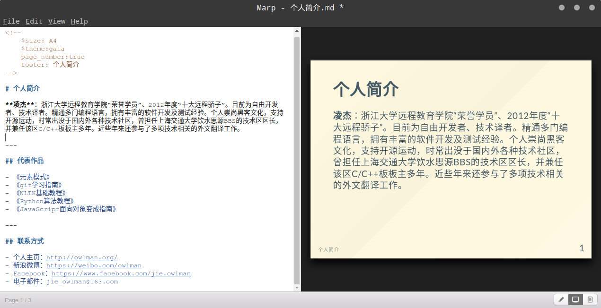

接着是第二页，我罗列了自己的一些译作：


最后一页是是提供本人的联系方式：

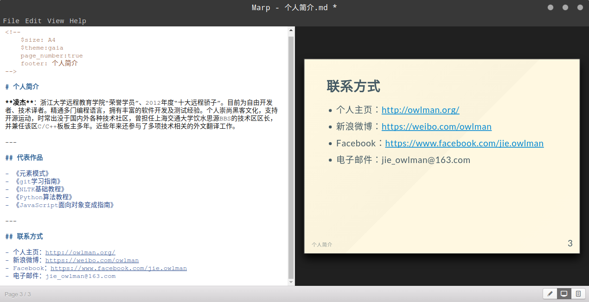

## 6.2 发布为线上电子书

古往今来，对于许多喜欢写作的人来说，出版个人文集一直是人生的一大愿望。这在以前可真不是一件容易的事，不仅累积的文章数量要能足以汇集成册，而且这些文章的主题、内容要能被市场接受，具有一定的市场价值，这样才会有出版社愿意替出版，当然，你有足够的声望或资金也可以说服出版社出版自己的个人文集。总而言之，写出大量符合市场需求的文章，和成为名人或富人都不是轻而易举就可以做到的。但如今，如果我们的目的不是想靠文集赚取版税，只是想把自己的文章分享给大众的话，其实是不用劳烦出版社的，我们可以通过制作**线上电子书**或者构建**博客系统**的方式来发布自己的文集。关于博客系统的构建，我们会在下一节中介绍，这里先来介绍线上电子书的制作。

需要注意的是，线上电子书与我们在Kindle等设备或专用软件中使用的文件型电子书不一样，它实际上是一个网站，而不是一个具有特定格式，需要权威机构授权的电子文件。这意味着，制作线上电子书的成本实际上与构建网站是一样的，基本上只需要购置一个域名和一个能存放网页的服务器即可。而我们之前也提过，`Markdown`这门标记语言的设计初衷就为了方便将人们撰写的文章转换成相应的`HTML`页面，所以它在制作线上电子书方面具有先天的优势。

在这里，我们打算为大家介绍一个基于`Markdown`来制作线上电子书的工具：gitbook。千万不要被名字迷惑了，就像`JavaScript`不是基于`Java`的脚本一样，gitbook也不是一本关于git的书，它是一个基于Node.js运行环境的、用于制作和管理电子书的命令行工具。该工具能将`Markdown`或`AscilDoc`格式的文档编译成静态网站或`PDF`、`ePub`等格式的电子书，并且能结合git版本控制系统来管理这些电子书及其源文件，是目前最流行的开源书籍解决方案。

### 6.2.1 gitbook的安装

要想安装gitbook，我们首先得要确保自己的计算机上已经安装了Node.js运行环境[^3]，具体方法就是在命令行终端中输入`node -v`命令，只要看到终端返回如下版本信息，就说明当前环境中已经安装了Node.js运行环境：

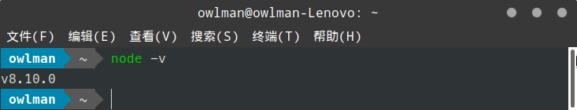

当然，如果没有看到类似的版本信息，那就说明我们需要先安装一下Node.js运行环境。我们在附录C中介绍如何在各主流操作系统上安装Node.js，读者可以自行参考。在确认了Node.js运行环境之后，我们就可以通过Node.js的包管理器npm来安装gitbook了，具体命令如下：

```bash
 npm install -g gitbook-cli
```

如果安装过程一切顺利（如果是MacOS或Linux系统，可能还会有用户权限的问题，请切换至root用户或用`sudo`命令来提升权限），我们在命令行终端中输入`gitbook -V`就能看到如下版本信息了：

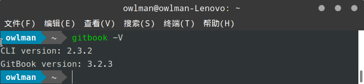

至此，gitbook就算是安装好了。接下来，让我们继续以之前的毕业论文为例，看看如何用gitbook将其发布为线上电子书。

### 6.2.2 gitbook的基本使用

要将之前的论文项目发布成一部线上电子书，首先需要将其初始化一个gitbook项目。下面，让我们打开命令行终端，进入到论文项目的所在目录中，并执行`gitbook init`命令：

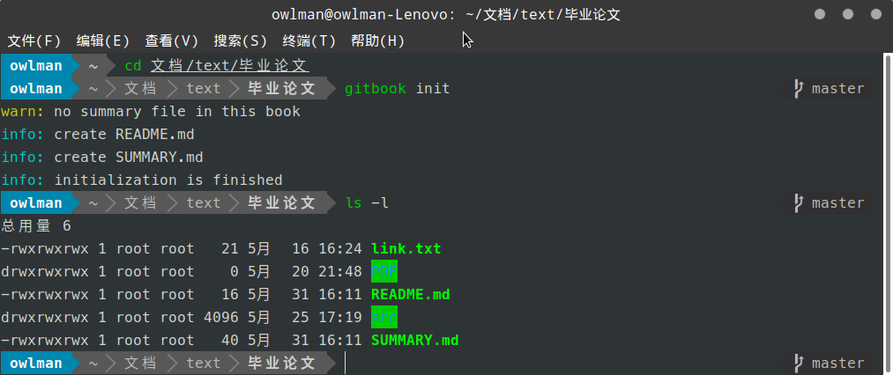

在上述初始化过程顺利完成之后，我们就可以看到论文的项目目录下多了两个文件，这两个文件各自都有着特定的功能：

- **README.md**：这是项目的自述文件，默认情况下，该文件也会是该线上电子书的首页，我们可以将其当作封面来处理。
- **SUMMARY.md**：这是项目的目录文件，线上书籍的目录安排，章节顺序要在该文件中设置。

下面，我们就来具体设置一下这两个文件。首先是`README.md`文件，我们打算让它成为这本书的封面，所以在其中使用了一些分割线、空行和列表等语义元素来呈现这篇论文的标题和署名，具体如下：

```Markdown
------

  

**浙江大学远程教育学院 — 本科生毕业论文**

# 网上书籍销售系统的设计


- 姓名：凌杰
- 导师：王某某 教授
- 专业：计算机科学与技术
- 学号：D0000000000001[^1]
- 日期：2006年5月31日


------

[^1]:本学号纯属虚构，如有雷同概不负责。
```

设计完了封面，我们再来编辑`SUMMARY.md`文件，设置一下这本书的目录和章节顺序，具体内容如下：

```Markdown
## 目录

- [论文封面](README.md)
- [第1章：系统概述](src/01_系统概述.md)
- [第2章：系统数据库的设计](src/02_系统数据库的设计.md)
- [第3章：功能模块的划分](src/03_功能模块的划分.md)
- [第4章：开发环境与工具的选择](src/04_开发环境与工具的选择.md)
- [第5章：各功能模块的实现](src/05_各功能模块的实现.md)
- [第6章：系统程序的发布](src/06_系统程序的发布.md)
- [第7章：设计总结](src/07_设计总结.md)

```

如你所见，目录的设置就是将各章节的源文件以链接的形式表列`SUMMARY.md`文件中。在保存该文件之后，我们接下来就可以用`git build`命令来生成组成线上电子书的`HTML`页面了：

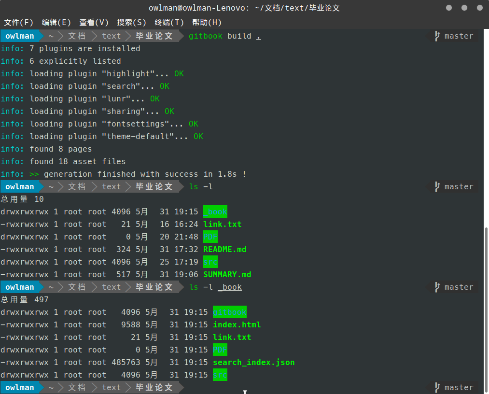

如果一切顺利，我们就在论文项目的目录下看到一个名为`_book`的子目录，组成线上电子书的`HTML`页面都被存储在了该目录下，我们可以像发布一般网站一样将它们发布到服务器上。为了方便电子书制作过程中的测试，gitbook自身也提供了一个Web服务器程序，我们可以使用`gitbook serve`命令来启动该服务器：

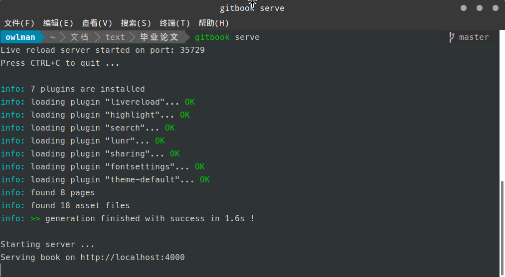

现在，我们就可以根据上述输出中最后一行给出的`URL`来查看生成的线上电子书了。请打开浏览器并于地址栏中输入`http://localhost:4000/`，你就应该会看到如下页面：

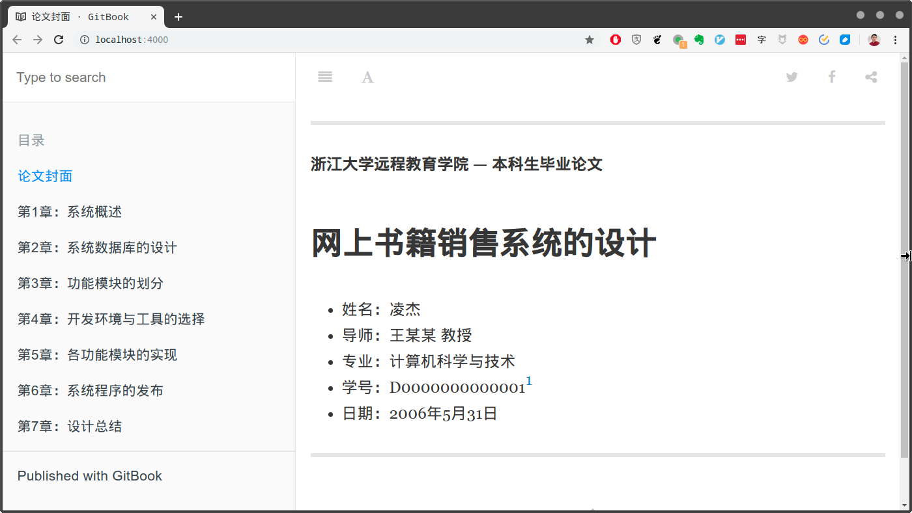

我们可以通过单击左侧的目录链接跳转到论文的任意一章，以查看效果。譬如下面是第5章的内容：

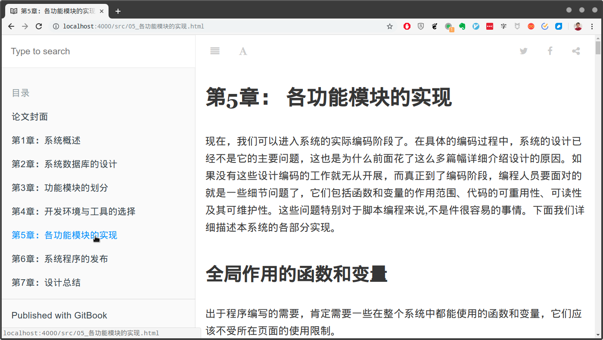

### 6.2.3 gitbook的高级配置


## 6.3 构建博客系统

## 本章小结

<!-- 以下是注释区 -->

[^1]:注释：在作者写下这些文字的同时，新闻正在热炒Google终止向华为提供软件支持的事件。
[^2]:注释：这是一个基于JavaScript、HTML、CSS构建的跨平台的桌面应用框架。官方网站：https://electronjs.org/
[^3]:注释：Node.js是一个能够在服务器端运行JavaScript的开放源代码、跨平台JavaScript运行环境。官方网站：https://nodejs.org/
