# 第6章 Markdown的其他应用

## 本章提要

到目前为止，我们都是以论文写作这一工作的需求为导引来介绍`Markdown`在文字创作类项目中的应用的。这样做的好处是能较为全面地涵盖这门标记语言的各种特性和扩展，但对于其开放性，灵活度的体现尚略显不足。`Markdown`的作用远不止是充当文字创作类项目的“源码”那么单一，它还能用来制作演示文稿、线上电子书和个人博客系统。在这一章中，我们将致力于介绍`Markdown`在这些特定领域中的应用。

## 6.1 制作演示文稿

对于平常靠键盘就能完成大部分工作的人来说（譬如我），用Microsoft PowerPoint或Apple Keynote这类软件来制作演示文稿始终是一个挺折磨人的事情。想想那个过程吧，我们必须要时不时让手离开键盘，拿着鼠标来回又点击又拖拽的，短短十几页的演示文稿往往要花费两三个小时以上的时间。而且整个过程充满了“感觉可以了”，“看起来还行”之类的不确定感，也许对于喜欢画画的朋友来说，这是个很熟悉，甚至是很享受的体验，但对我这种喜欢用命令行和少量快捷键来控制计算机，且从不打游戏的人来说，这无疑是一件很难受的事情。当然，使用这些软件的确能制作出包含精美图文的、具有各种炫酷效果的演示文稿，但在大多数情况下，演示文稿的作用只不过是在论文答辩、会议简报或主题演讲的过程中做一点穿针引线，提示重点的辅助而已，如何提炼内容的重点才是我们制作这些演示文稿的关键，那些精美的图案和炫酷的效果对大多数人来说，并没有那么必要。而且习惯了盗版软件的我们可能还忘了，这些软件都不是免费的，价格还并不便宜，鉴于现在的时空背景，我们确定自己能一直使用盗版么？即使愿意花钱，我们也一定能买到这些外国软件吗？这些都恐怕已经不只是道德问题，而是大家可能很快就要面对的现实问题了。[^1]

### 6.1.1 Marp简介

接下来，就让我们抛开对于炫酷效果的执念，看看`Markdown`这种自由开放、简洁高效的写作方式能给大家带来的解决方案，也就是我们打算在这里给大家推荐的一款工具：Marp。这是一款基于`Electron`框架[^2]开发的开源软件，它可以将`Markdown`格式的文字以演示文稿的形式显示出来，并支持导出为`PDF`文档，非常适合于对演示文稿的设计感要求不高，但对其内容产出效率有比较高要求的用户。该软件主要具有以下优点：

- 开源、自由、免费，使用不受任何非技术因素的限制。
- 跨平台，支持Windows、MacOS、Linux等主流操作系统平台。
- 支持实时预览，提供有`Markdown`、`1:1 Slide`、`Slide List`三种预览模式。
- 提供有`Default`和`Gaia`两种主题。
- 可以在演示文稿中显示表格、表情符号、数学公式以及背景图这些特定元素。
- 可调整演示文稿的页面尺寸。

当然，这款软件也有不足之处 譬如：

- 软件功能相对单薄，不支持图文绕排等复杂内容的显示。
- `1:1 Slide`预览模式不支持使用上下键翻页。
- `Markdown`、`Slide List`这两种预览模式则不支持左右滑动。

所以，我们在选择一个工具之前需要充分了解自己需求，区分出哪些是必需的，哪些是可有可无的，哪些完全没有必要的，这样才能找出最适合自己的、高性价比的解决方案，切忌意识形态用事，选择华而不实或者不足以解决问题的工具。

### 6.1.2 Marp的安装

Marp是以一个“开箱即用”的软件，安装过程非常简单，步骤如下：

- 步骤1. 打开浏览器，访问Marp的官方网站：`https://yhatt.github.io/marp/`。

  

- 步骤2. 从上面点开的下拉菜单中选择符合自身需求的操作系统平台（譬如，我这里所使用的是Linux 32bit），以下载相应的软件包。

- 步骤3. 将下载到的软件包解压到我们要安装该软件的目录中，譬如我这里选择的是`/home/owlman/bin/app/marp/`这个目录。

  

- 步骤4（可选）. 我们也可以为该程序设置一个快捷方式，譬如在Ubuntu下，我们可以创建一个`Marp.desktop`，内容如下：

   ```bash
   [Desktop Entry]
   Name=Marp
   Type=Application
   StartupNotify=true
   Icon=/home/owlman/bin/app/marp/marp.png
   Exec=/home/owlman/bin/app/marp/Marp
   ```

   然后将该文件保存在`/usr/share/applications`目录中即可，当然，在这里我们需要自己准备一个`marp.png`图形文件，以充当快捷方式的图标。

### 6.1.3 Marp的使用

在完成安装之后，我们就可以通过上述步骤4中创建的快捷方式或者直接在安装目录中单击`Marp`程序文件来启动该程序了，该程序的初始界面如下：


现在，让我们先来熟悉一下这个界面。正如你所看到的，Marp的界面采用了常见的菜单栏、编辑区和底部工具栏三段式布局。其编辑区与大多数`Markdown`编辑器一样分成了左右两个区域，左边是`Markdown`编码区，右边是预览区。而在底部工具栏的右侧，我们看到三个按钮，它们对应了Marp的三种预览模式，从左至右分别为：

- `Markdown`模式：`Markdown`渲的普通染效果预览。
- `1:1 Slide`模式：演示文稿效果的预览，这也是Marp的默认模式。
- `Slide List`模式：这种形式会以列表的形式预览演示文稿，可执行滑动操作。

在熟悉了软件界面之后，接下来就可以开始学习如何用`Markdown`来制作演示文稿了。但正式这趟学习旅程之前，我们还是有必要先来介绍一下Marp所特有的两个概念：

- 第一，由于Marp本身就是由Github团队开发的，所以它的`Markdown`语法采用的是`GitHub Flavored Markdown`风格，支持Github对标准语法所做的部分扩展。

- 第二，Marp在`GitHub Flavored Markdown`语法的基础上还增加了一种**指令**元素，以便用来调整演示文稿的显示效果。该类元素的格式为`<!--指令名称:指令值-->`，譬如，如果我们想让演示文稿的页面采用`16:9`的长宽比。就可以在文稿的开头添加`<!--$size: 16:9-->`这样一条指令。当然，同一个指令元素中也可以包含多条指令，譬如：

  ```Markdown
  <!--
    $size: 16:9
    page_number:true
  -->
  ```

  这条指令不仅把演示文稿的长宽比设置成了16:9，而且会显示页码。

下面，我们通过Marp自带的示例来讲解一下如何用`Markdown`制作演示文稿。首先，请在Marp的菜单栏中依次点击「Help - Open Example - marp basic example」菜单来打开这个演示文稿示例，下面是该示例在默认的`1:1 Slide`模式下的效果：


各位可以自行通过右下角的按钮来查看一下其他预览模式。下面，我们来看一下这个示例前两页的`Markdown`编码：

```Markdown
Marp
===

# 

##### Markdown presentation writer, powered by [Electron](http://electron.atom.io/)

###### Created by Yuki Hattori ( [@yhatt](https://github.com/yhatt) )

---

# Features

- **Slides are written in Markdown.**
- Cross-platform. Supports Windows, Mac, and Linux
- Live Preview with 3 modes
- Slide themes (`default`, `gaia`) and custom background images
- Supports emoji :heart:
- Render maths in your slides
- Export your slides to PDF

---
```

从这两页的编码中，我们可以看出，`Markdown`的大部分语义元素在Marp中的渲染效果都与普通的`Markdown`文档一致，唯一不同的是`---`分隔符。该元素在一般`Markdown`文档中只是一条简单的分割线，而在Marp中，它就成为了演示文稿的分页符，用于将演示文稿的内容切分到不同的页面中，这是我们要学习的第一个Marp特有的`Markdown`语法。

如果我们继续看下去，就会发现这个示例不仅仅是一个语法示范，它本身就是一个Marp环境下的`Markdown`语法教程。譬如，在该实例第5-11页的编码中，我们可以看到，它详细列举了在Marp的指令元素中可以使用的指令。当然，如果你看不明白或者不喜欢看这些英文的演示文稿也没关系，我们接下来会根据这几页文稿的内容再来做一点转述说明。首先是作用于整个演示文稿的**全局性指令**：

- **`$theme`指令**：用于指定演示文稿的主题样式，Marp只提供有以下两种主题：

  | 主题名称    | 设置指令                   |
  | ----------- | -------------------------- |
  | **Default** | `<!-- $theme: default -->` |
  | **Gaia**    | `<!-- $theme: gaia -->`    |

- **`$width` / `$height`指令**：用于指定演示文稿页面的宽度和高度，默认计量单位为像素`px`，除此之外，我们还能指定其他计量单位，包括`cm`、`mm`、`in`、`pt`、`pc`。譬如，我们想将页面宽度设置为9厘米，就可以使用如下指令：

  ```Markdown
  <!-- $width: 9cm -->
  ```

- **`$size`指令**：用于指定演示文稿页面的长宽比，默认为`4:3`，除此之外，我们可以选择`16:9`、`A0`-`A8`、`B0`-`B8`等预置的长宽比。譬如，如果我们想要将页面设置为`A4`的长宽比，就可以使用如下指令：

  ```Markdown
  <!-- $size: A4 -->
  ```

接下来是只作用于指令所在页面及其后续页面的**页面级指令**（当然，如果将指令置于整个演示文稿的顶部，它一样会影响所有页面）：

- **`page_number`指令**：用于显示页面编号，如果我们想让某页面及其后续页面在右下角显示页面编号，就可以使用如下指令：
  
    ```Markdown
    <!-- page_number: true -->
    ```

- **`template`指令**：用于指定页面所用的主题模版。譬如，如果我们想使用`gaia`主题的`invert`模版，就可以使用如下指令：
  
  ```Markdown
  <!--
      $theme: gaia        
      template: invert
  -->
  ```
  
- **`footer`指令**：用于为当前页面及其后续页面设置页脚。譬如，如果我们想让页面在页脚处显示“这里是页脚”这几个字，就可以使用如下指令：

  ```Markdown
  <!-- footer: 这里是页脚 -->
  ```

- **`prerender`指令**：用于为页面的渲染效果做一些预处理工作。如果我们为页面设置的背景图片过大，我们就可以使用如下指令来改善渲染效果：

  ```Markdown
  <!-- prerender: true -->
  ```

在上面介绍的最后一个指令时，我们提到了演示文稿页面的背景图片。这也是一个Marp所特有的`Markdown`语义元素，请参考Marp自带示例的第12页的编码：

    #### Slide background Images
    
    You can set an image as a slide background.
    
    ```html
    
    ```
    
    Options can be provided after `bg`, for example ``.
    
    Options include:
    
    - `original` to include the image without any effects
    - `x%` to include the  image at `x` percent of the slide size
    
    Include multiple`` tags to stack background images horizontally.
    
    
    
    ---

正如这张演示文稿中所说明的，在Marp中加入背景图片的语法是``，即在使用图片元素时，在图片说明处将其注明为`bg`。上述页面的渲染效果如下：


到目前为止，我们已经将在Marp中制作演示文稿会用到的`Markdown`语法介绍完了。最后，让我们来综合运用一下这些语法，制作一个用于自我介绍的演示文稿。首先，我们希望这个演示文稿可以转换成`PDF`文档，以便附在论文的前面，所以将页面设置为`A4`。然后，所有页面采用`gaia`主题，并且在页脚处显示"个人简介"的字样，并显示页码。在内容安排上，第一页中会放置一些个人的基本信息，第二页罗列一些代表作品，第三页给出一些联系方式。具体编码如下：

```Markdown
<!--
    $size: A4
    $theme:gaia
    page_number:true
    footer: 个人简介
-->

# 个人简介

**凌杰**：浙江大学远程教育学院“荣誉学员”、2012年度“十大远程骄子”。目前为自由开发者、技术译者。精通多门编程语言，拥有丰富的软件开发及测试经验。个人崇尚黑客文化，支持开源运动，时常出没于国内外各种技术社区，曾担任上海交通大学饮水思源BBS的技术区区长，并兼任该区C/C++板板主多年。近些年来还参与了多项技术相关的外文翻译工作。

---

## 代表作品

- 《元素模式》
- 《git学习指南》
- 《NLTK基础教程》
- 《Python算法教程》
- 《JavaScript面向对象编程指南》

---

## 联系方式

- 个人主页：http://owlman.org/
- 新浪微博：https://weibo.com/owlman
- 电子邮件：jie_owlman@163.com
```

下面来看看具体效果，首先是第一页：


接着是第二页，我罗列了自己的一些译作：

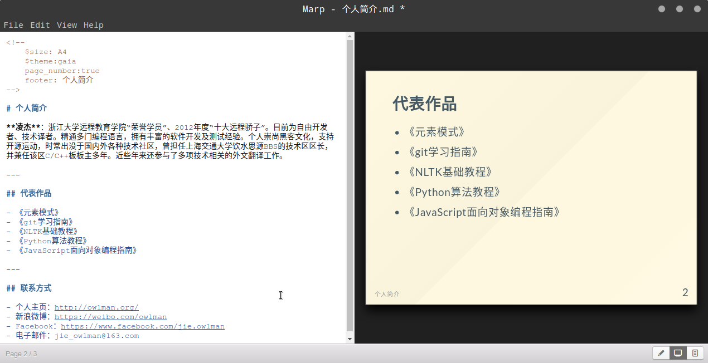

最后一页是是提供本人的联系方式：

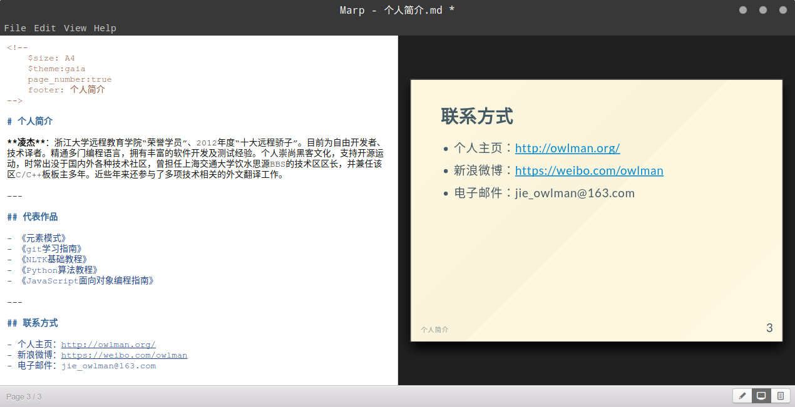

## 6.2 发布为线上电子书

古往今来，对于许多喜欢写作的人来说，出版个人文集一直是人生的一大愿望。这在以前可真不是一件容易的事，不仅累积的文章数量要能足以汇集成册，而且这些文章的主题、内容要能被市场接受，具有一定的市场价值，这样才会有出版社或书商愿意出版，当然，你有足够的声望或资金也可以说服出版社出版自己的个人文集。总而言之，写出大量符合市场需求的文章，和成为名人或富人都不是轻而易举就可以做到的。但在如今这个互联网时代，如果我们的目的不是想靠文集赚取版税，只是想把自己的文章分享给大众的话，其实是不用劳烦出版社和那些书商的，我们可以通过制作**线上电子书**或者构建**个人博客系统**的方式来发布自己的文集。关于博客系统的构建，我们会在下一节中介绍，这里先来介绍线上电子书的制作。

需要注意的是，线上电子书与我们在Kindle等设备或专用软件中使用的文件型电子书不一样，它本质上是一个静态网站，而不是一个具有特定格式，需要权威机构授权的电子文件。这意味着，制作线上电子书的成本实际上与构建静态网站是一样的，基本上只需要购置一个域名和一个能请提供`HTTP`服务的服务器即可。而我们之前也提过，`Markdown`这门标记语言的设计初衷就为了方便将人们撰写的文章转换成相应的`HTML`页面，所以它在制作线上电子书方面具有先天的优势。

在这里，我们打算为大家介绍一个基于`Markdown`来制作线上电子书的工具：gitbook。千万不要被名字迷惑了，就像`JavaScript`不是基于`Java`的脚本一样，gitbook也不是一本关于git的书，它是一个基于Node.js运行环境的、用于制作和管理电子书的命令行工具。该工具能将`Markdown`或`AscilDoc`格式的文档编译成静态网站或`PDF`、`ePub`等格式的电子书，并结合git版本控制系统来管理这些电子书及其源文件，是目前最流行的开源书籍解决方案。

### 6.2.1 gitbook的安装

要想安装gitbook，我们首先得要确认自己的计算机上安装了Node.js运行环境[^3]，具体方法就是在命令行终端中输入`node -v`命令，只要看到终端返回如下版本信息，就说明当前环境中已经安装了Node.js运行环境：


如果没有看到类似的版本信息，那就说明你需要先自己安装一下Node.js运行环境，然后才能继续接下来的学习。我们在*附录B：了解一下Node.js*中介绍了如何在Windows和Ubuntu上安装Node.js的相关内容，读者可自行参考。在确认了Node.js运行环境之后，我们就可以通过Node.js的包管理器npm来安装gitbook了，具体命令如下：

```bash
 npm install -g gitbook-cli
```

如果安装过程一切顺利（如果是MacOS或Linux系统，安装时可能还会遇到用户权限的问题，请切换至root用户或用`sudo`命令来提升权限），我们在命令行终端中输入`gitbook -V`就能看到如下版本信息了：


至此，gitbook就算是安装好了。接下来，让我们继续以之前的毕业论文为例，看看如何用gitbook将其发布为线上电子书。

### 6.2.2 gitbook的基本使用

要将之前的论文项目发布成一部线上电子书，首先需要将其初始化一个gitbook项目。下面，让我们打开命令行终端，进入到论文项目的所在目录中，并执行`gitbook init`命令：


在上述初始化过程顺利完成之后，我们就可以看到论文的项目目录下多了两个文件，这两个文件各自都有着特定的功能：

- **README.md**：这是项目的自述文件，默认情况下，该文件也会是该线上电子书的首页，我们可以将其当作封面来处理。
- **SUMMARY.md**：这是项目的目录文件，线上书籍的目录安排，章节顺序要在该文件中设置。

下面，我们就来具体设置一下这两个文件。首先是`README.md`文件，我们打算让它成为这本书的封面，所以在其中使用了一些分割线、空行和列表等语义元素来呈现这篇论文的标题和署名，具体如下：

```Markdown
------

  

**浙江大学远程教育学院 — 本科生毕业论文**

# 网上书籍销售系统的设计


- 姓名：凌杰
- 导师：王某某 教授
- 专业：计算机科学与技术
- 学号：D0000000000001[^1]
- 日期：2006年5月31日


------

[^1]:本学号纯属虚构，如有雷同概不负责。
```

设计完了封面，我们再来编辑`SUMMARY.md`文件，设置一下这本书的目录和章节顺序，具体内容如下：

```Markdown
## 目录

- [论文封面](README.md)
- [第1章：系统概述](src/01_系统概述.md)
- [第2章：系统数据库的设计](src/02_系统数据库的设计.md)
- [第3章：功能模块的划分](src/03_功能模块的划分.md)
- [第4章：开发环境与工具的选择](src/04_开发环境与工具的选择.md)
- [第5章：各功能模块的实现](src/05_各功能模块的实现.md)
- [第6章：系统程序的发布](src/06_系统程序的发布.md)
- [第7章：设计总结](src/07_设计总结.md)

```

如你所见，目录的设置就是将各章节的源文件以链接的形式表列`SUMMARY.md`文件中。在保存该文件之后，我们接下来就可以用`git build .`命令来生成组成线上电子书的`HTML`页面了：


如果一切顺利，我们就在论文项目的目录下看到一个名为`_book`的子目录，组成线上电子书的`HTML`页面都被存储在了该目录下，我们可以像发布一般静态网站一样将它们发布到服务器上。为了方便电子书制作过程中的测试，gitbook自身也提供了一个Web服务器程序，我们可以使用`gitbook serve`命令来启动该服务器：


现在，我们就可以根据上述输出中最后一行给出的`URL`来查看生成的线上电子书了。请打开Web浏览器并于地址栏中输入`http://localhost:4000/`，你就应该会看到如下页面：


我们可以通过单击左侧的目录链接跳转到论文的任意一章，以查看效果。譬如下面是第5章的内容：


### 6.2.3 gitbook的高级配置

到目前为止，我们所生成的只是一个最基本的gitbook线上电子书，所有的参数设置都是默认的。显然，默认配置当中有些东西并不适合我们，譬如，右上角“分享”按钮中的Facebook和Twitter显然对于大多数国内用户来说并没有多大意义。另外，我们还希望论文能支持数学公式和`Mermaid`图库的显示，这需要我们安装一些额外的插件。所以，我们接下来要对上面生成的线上电子书做一些个性化定制。在gitbook中，个性化的设置是通过一个叫做`book.json`配置文件。该文件需要我们自己来创建，并保存在论文项目的根目录中。在这里，先给大家看看我为该论文项目所做的配置：

```json
{
    "title": "《网上书籍销售系统的设计》",
    "description": "一篇用Markdown撰写的毕业论文",
    "author": "凌杰",

    "language": "zh-hans",

    "links": {
        "sidebar": {
            "Owlman的个人网站": "http://owlman.org/"
        }
     },

    "plugins": [
        "github",           // 添加github图标链接
        "splitter",         // 使侧边栏的宽度可被自由调整
        "-sharing",         // 卸载默认分享插件
        "sharing-plus",     // 增强型分享插件
        "-highlight",       // 卸载默认的代码高亮插件
        "prism",            // 基于Prism的代码高亮
        "katex",            // 显示数学公式
        "mermaid",          // 显示Mermaid图库的渲染效果
        "theme-comscore",   // 一款gitbook主题
        "tbfed-pagefooter", // 为页面添加页脚信息
        "sitemap"           // 生成站点地图
    ],

    "pluginsConfig": {
        "fontsettings": {
            "theme": "white",
            "family": "serif",
            "size": 12
        },  // 设置默认样式和字体

        "tbfed-pagefooter": {
            "copyright":"&copy 凌杰",
            "modify_label": "该文件修订时间：",
            "modify_format": "YYYY-MM-DD HH:mm:ss"
        },  // 设置页脚信息的显示格式

        "sharing": {
            "douban": false,
            "facebook": false,
            "google": false,
            "hatenaBookmark": false,
            "instapaper": false,
            "line": false,
            "linkedin": false,
            "messenger": false,
            "pocket": false,
            "qq": false,
            "qzone": false,
            "stumbleupon": false,
            "twitter": false,
            "viber": false,
            "vk": false,
            "weibo": false,
            "whatsapp": false,
            "all": [
                "weibo","qq","qzone","google","douban"
            ]
        },  // 设置共享插件要显示的选项

        "github": {
            "url": "https://github.com/owlman"
        },  // 设置github图标的链接

        "theme-default": {
           "showLevel": false
        },  // 设置主题

        "prism": {
            "css": [
                "prismjs/themes/prism-tomorrow.css"
            ]
        },  // 设置代码高亮的样式

        "sitemap" : {
            "hostname": "http://owlman.org/"
        }   // 生成站点地图
    }
}
```

下面，让我们来逐一介绍一下这些设置：

- **基本信息**：`title`、`description`和`author`这三个选项所设定的是线上电子书作为一个网站的基本信息，它们最终会被编译成网页头信息中的各种元数据标签，这些信息有助于被搜索引擎抓取，提高网站被相关关键字搜索到的机率。
- **语言设定**：`language`选项所设定的是这部线上电子书所使用的语言，这里我们设定的是`zh-hans`，即*简体中文*，如果你想使用港澳台地区人民比较熟悉的*繁体中文*，就将其设定为`zh-hant`。
- **链接设定**：`links`选项所设定的是左侧导航区除目录部分意外的链接，譬如我在这里添加了自己的个人网站。
- **安装插件**：`plugins`选项所设定的是要安装的插件，这里需要注意的是，gitbook自身默认就安装了一些插件，如果我们安装的插件在功能上与默认插件有冲突，就需要这些默认插件的名称前面加一个`-`符号，以示卸载。譬如在这里，我们用功能更为全面的`sharing-plus`代替了原来的`sharing`插件。至于这里安装的这些插件，我已经在上面的注释中为它们的功能做了说明。
- **插件配置**：`pluginsConfig`选项所设定的是插件的一些具体配置，我在上面的注释中对这些配置的作用已经做了具体的说明。

在设置好配置文件之后，我们就可以在命令行终端中执行`gitbook install .`命令来安装插件，并用`gitbook build .`命令来重新生成电子书了。如果一切顺利，当我们再次通过`gitbook serve`命令来启动测试服务器，并访问`http://localhost:4000/`时，就应该会看到如下页面：

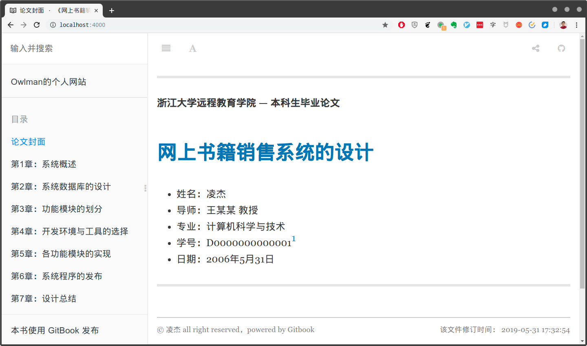

当然，gitbook的插件体系是非常庞大的，我们通过访问gitbook的官方插件列表[^4]来为自己寻找更多适合的插件。

## 6.3 架设个人博客系统

其实，相对于线上电子书这种分享文章的方式，我相信博客可能是一种更为大众所熟悉的文章发布形式。我个人用过不少各种免费的博客服务，包括CSDN、博客园、简书等。这些博客服务也都支持用`Markdown`语法来编写文章，它们用起来简单而方便，文章也比较容易被大家看到。但选择这些服务的缺点也很明显，那就是我们必须忍受服务方由于各种各样的主客观因素，对文章内容所进行的各式各样，让人无所适从的审查，一不小心就会被通知删文。除此之外，文章的周围还时常会被插入各种不相干的广告，看到我们无偿的分享却成为别人赚钱的工具，有时候也是一件让人反胃的事。

当然，我们也可以使用WordPress这样的专业博客框架来构建自己的博客系统，但这类博客框架通常需要服务器支持`PHP`、`JSP`这样的动态页面和MySQL这样的数据库服务，租用服务器的花销并不算小。想想看，我们写文章是无偿分享也就算了，结果每年还要搭出去几百块钱。或许你觉得这点小钱不叫事，但你可能忘记了，动态网站的维护本身也是个很耗费精力的事情，这意味着你还要花大把时间在一个不赚钱的网站上，除非有人想做个专门敲代码的和尚，否则怎么看这都不是一个长久之计。

幸运的是，我们还有第三种选择，那就是使用类似于gitbook这样的工具，根据我们写的文章生成静态网站，然后发布到github page这类免费的静态Web服务器上，即使不免费，也比需要数据库和动态页面服务的服务器要便宜不少，少抽一包烟或少买几件游戏装备也就有了。而且，静态网站的维护也比较简单，我们可以放心地把注意力放在自己喜欢的写作上了（当然，请务必要先安抚好老婆和孩子）。

下面，我们就来给大家介绍一款与gitbook非常类似，用于生成静态博客网站的工具：Hexo，这也是一款基于Node.js的命令行工具，值得一提的是，由于Hexo的创建者是一位台湾人，因此中文的资源相对来说是比较充裕的，大家可以直接去其官方网站`https://hexo.io/zh-cn/`查看其相关资料，本节接下来的很多内容就来自于这些资料。

### 6.3.1 构建博客

下面，我们先来架构一个基本的Hexo博客。首先，我们需要安装Hexo的命令行工具。当然，在安装该命令行工具之前，务必要记得先确认自己的计算机中是否已经安装了git和Node.js（尚未安装Node.js的朋友，可以参考*附录B：了解一下Node.js*中的相关内容自行安装该运行环境）。然后，我们就可以使用`npm`包管理器安装Hexo了，具体命令如下：

```bash
 npm install -g hexo-cli
```

如果安装过程一切顺利（如果是MacOS或Linux系统，安装时可能还会遇到用户权限的问题，请切换至root用户或用`sudo`命令来提升权限），我们在命令行终端中输入`hexo -V`就能看到如下版本信息了：

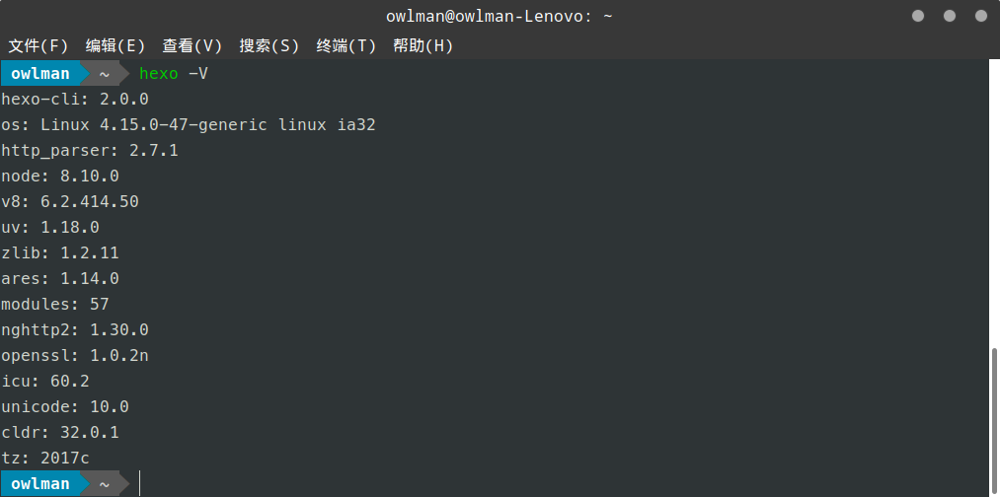

在安装好了hexo命令行工具之后，我们就可以用它来建构一个基本的博客系统了。和之前的线上电子书不同，这回我们打算从零开始构建一个博客。所以，让我们在工作目录中打开命令行终端，执行`hexo init My_blog`命令（在这里，`My_blog`是这个博客项目的名称，它可以是任何一个你喜欢的名称），然后，再进入到新生成的`My_blog`目录中，执行`npm install`命令。到这一步为止，一个基本的博客系统其实就已经构建完成了，我们可以来看看该目录下生成了哪些目录和文件：

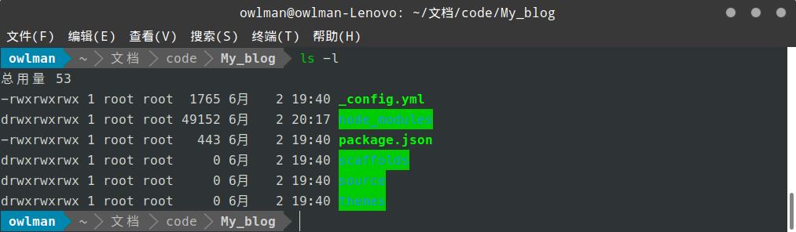

接下来，让我们逐一为大家介绍一下这些目录和文件：

- **node_modules目录**: 该目录中存放的是Hexo项目所依赖的Node.js模块包，每个基于Node.js运行环境的项目中通常都会有这个目录，包括之前的gitbook。
- **public目录**：Hexo最终生成的静态网站就存储在此目录中，在发布博客的时候只需要发布该目录中的内容即可。
- **scaffolds目录**：用于存放文章模版的目录。
- **source目录**：用于存放博客文章的目录，我们用`Markdown`撰写的博客文章就被存储在这里。
- **themes目录**：用于存放博客主题的目录。
- **package.json文件**：用于存储该博客框架的基本信息。
- **_config.yml文件**: 博客的配置文件。

现在，让我们将这个基本博客运行起来，看看它的初始状态是怎么样的。请在项目目录中打开命令行终端，执行`hexo generate`命令（或者该命令的简写形式`hexo g`）生成该博客的静态站点。然后再执行`hexo server`命令（或者该命令的简写形式`hexo s`）来启动Hexo自带的测试服务器。如果一切顺利，当我们在Web浏览器中访问`http://localhost:4000/`时，就应该会看到如下页面：

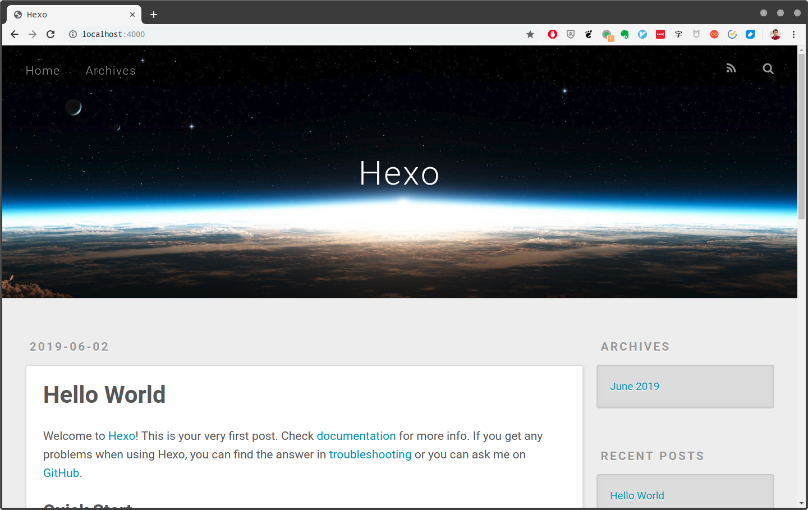

### 6.3.2 配置博客

我们在上面看到的，只是Hexo框架所建构的一个基本博客，其所有的配置都是默认的。接下来，我们会对该博客做一些个性化的配置，安装一个主题，然后添加几篇我们自己的文章，让它真正成为我们的个人博客。首先，让我们通过Hexo博客框架在默认状态下的配置文件`_config.yml`，了解一下这个博客可以配置那些内容：

```yml
# Hexo Configuration
## Docs: https://hexo.io/docs/configuration.html
## Source: https://github.com/hexojs/hexo/

# Site
title: Hexo
subtitle:
description:
keywords:
author: John Doe
language:
timezone:

# URL
## If your site is put in a subdirectory, set url as 'http://yoursite.com/child' and root as '/child/'
url: http://yoursite.com
root: /
permalink: :year/:month/:day/:title/
permalink_defaults:

# Directory
source_dir: source
public_dir: public
tag_dir: tags
archive_dir: archives
category_dir: categories
code_dir: downloads/code
i18n_dir: :lang
skip_render:

# Writing
new_post_name: :title.md # File name of new posts
default_layout: post
titlecase: false # Transform title into titlecase
external_link: true # Open external links in new tab
filename_case: 0
render_drafts: false
post_asset_folder: false
relative_link: false
future: true
highlight:
  enable: true
  line_number: true
  auto_detect: false
  tab_replace:
  
# Home page setting
# path: Root path for your blogs index page. (default = '')
# per_page: Posts displayed per page. (0 = disable pagination)
# order_by: Posts order. (Order by date descending by default)
index_generator:
  path: ''
  per_page: 10
  order_by: -date
  
# Category & Tag
default_category: uncategorized
category_map:
tag_map:

# Date / Time format
## Hexo uses Moment.js to parse and display date
## You can customize the date format as defined in
## http://momentjs.com/docs/#/displaying/format/
date_format: YYYY-MM-DD
time_format: HH:mm:ss

# Pagination
## Set per_page to 0 to disable pagination
per_page: 10
pagination_dir: page

# Extensions
## Plugins: https://hexo.io/plugins/
## Themes: https://hexo.io/themes/
theme: landscape

# Deployment
## Docs: https://hexo.io/docs/deployment.html
deploy:
  type:

```

如你所见，该配置文件被分成了若干组参数。下面，让我们来为大家介绍一些常用的参数。首先是与站点SEO工作相关的配置，它们包含了以下参数：

| 参数         | 描述                                           |
|-------------|-----------------------------------------------|
| title       | 网站的标题。                                    |
| subtitle    | 网站的副标题。                                  |
| description | 网站的自述性说明。                               |
| author      | 博客作者的名字。                                 |
| language    | 网站使用的语言。                                 |
| timezone    | 网站所使用的时区。默认值为该系统所在计算机使用的时区。 |

这部分参数的值最终会被编译成网页头信息中的各种元数据标签，这些信息有助于被搜索引擎抓取，提高网站被相关关键字搜索到的机率。接下来， 是一些站点URL参数：

| 参数         | 描述                                          |
|-------------|-----------------------------------------------|
| url         | 网站的域名。                                    |
| root        | 网站的根目录。                                   |
| permalink   | 博客文章的“永久链接”的格式。                       |
| permalink_defaults | 永久链接中各部分的默认值。                  |

在这里，我们需要把`url`设置改成自己的域名，譬如，如果我们的域名是`http://blog.owlman.org`，那么对我们在2019年06月03日创建的某篇博客文档`temp.md`，根据`permalink`的默认格式，它的永久链接就应该是`http://blog.owlman.org/2019/06/03/temp`。当然，你也可以将`permalink`设定为其他格式，下面是官方给出的示例（这里的`hello-world`就是之前博客中出现的那篇默认范文）：

| 参数                          | 结果                                          |
|------------------------------|-----------------------------------------------|
| `:year/:month/:day/:title/`  | 2013/07/14/hello-world                        |
| `:year-:month-:day-:title.html` | 2013-07-14-hello-world.html                |
| `:category/:title`           | foo/bar/hello-world                           |

再往下，对于`Directory`、`Writing`这些分组的参数，我们大多数时候不需要更改它们，保持默认值就好。在这里，我们来重点关注一下博客主题的设置。通过配置文件中的`theme`参数，我们可以知道Hexo博客的默认主题，也就是我们之前看到的那个主题叫做`landscape`。之前在介绍项目结构的时候，我们曾经提到过，主题文件都被存储在`theme`这个目录下面。所以，如果我们想更换主题，可以去Hexo官网的主题页面`https://hexo.io/themes/`中找一个自己喜欢的主题，将它下载到`theme`目录下，然后将配置文件中的`theme`参数设定为该主题的名字即可。譬如，如果我在这里想安装一款名为`Anisina`的主题，那只需要在项目目录下打开命令行终端，输入如下命令即可：

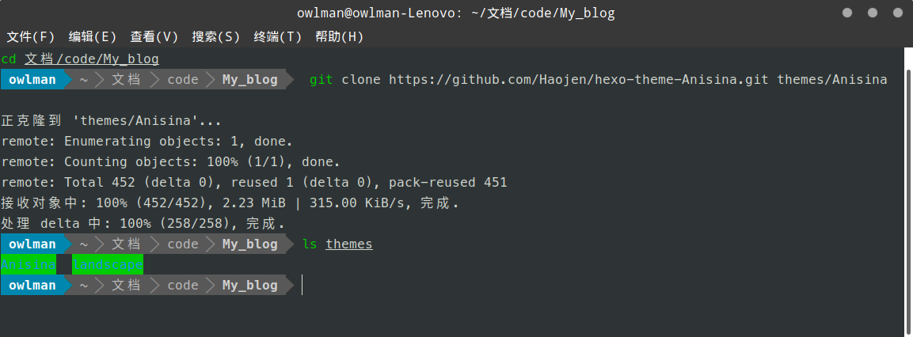

然后，再将`_config.yml`文件中的`theme`参数设置为`Anisina`即可。现在，你是不是迫不及待想看看自己的博客是什么样子了？不要着急。为了让呈现效果更好一点，我们还需在加入一篇自己的文章。在Hexo博客中，新文章可以使用`hexo new <博客标题>`命令来添加，譬如我们想添加一篇书评的话，就可以执行如下命令：

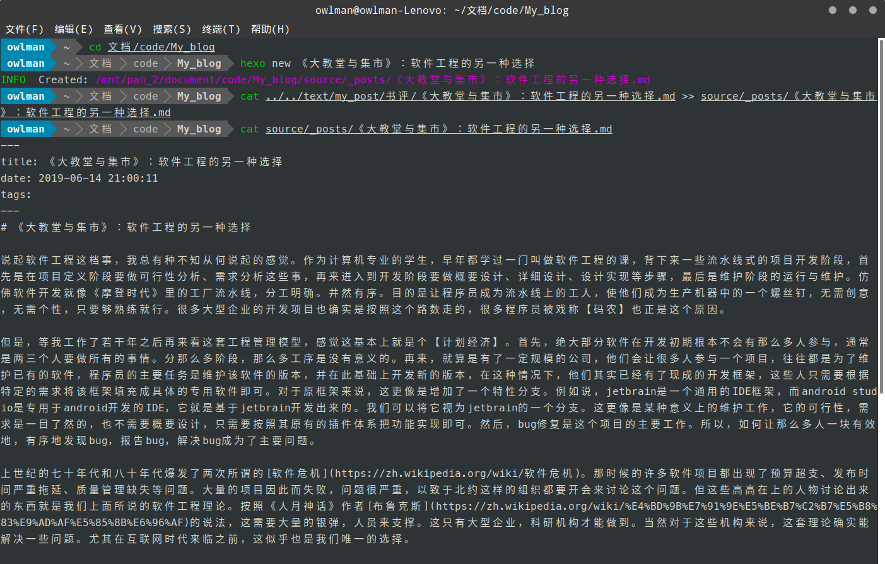

如你所见，我将之前写的一篇关于《大教堂与集市》的书评添加到了博客中。现在，我们可以再次将博客运行起来，看看个性化配置的效果了。请注意，在重新生成博客之前，最好先使用`hexo clean`命令清除一下之前生成的结果。具体来说，就是在项目目录下打开命令行终端，依次输入下面三个命令：

```bash
 hexo clean
 hexo generate
 hexo sever
```

如果一切顺利，当我们在Web浏览器中访问`http://localhost:4000/`时，就应该会看到自己安装的主题和添加的新文章了：

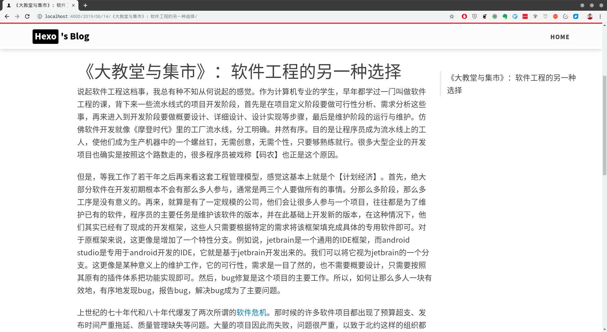

当然，我们也可以看到这个博客的主题还有些需要设置的地方（譬如导航栏，文章标题的配图等）。但这些内容需要我们根据自己所选主题的项目文档来做设置，譬如对于我在这里所选的这款主题，就要去`https://github.com/haojen/hexo-theme-Anisina`这个项目去寻找相关的设置说明，这里就不多做说明了，毕竟每个人会选择的主题都不一样。

### 6.3.3 部署博客

在配置好博客之后，我们就需要将其部署到Web服务器上。部署Hexo博客有两种方法。第一种是一般静态网站的部署方式，租用好域名和服务器之后，将项目生成的静态网站通过FTP或SSH上传到服务器上，然后做好域名解析的设置即可。这属于网站开发方面的内容了，并不是本书主要讨论的话题，这里就不多做说明了，读者可自行去查阅相关资料。但这种部署方式有个明显的缺点，那就是大部分单独的Web服务器都不是免费的，需要我们每年支付一定的费用。这对于大部分不盈利的博客来说，不是一个长久之计。

另一种方式就是使用Github Pages这样的服务，这种服务原本是让开源项目的开发者为自己的项目做一些说明性页面的，但如今也有越来越多的人将其作为静态网站的部署方式来使用，毕竟这是一个完全免费的服务。甚至，gitbook、Hexo这些工具根本就是面向这种部署方式来开发的。下面，我们就来介绍一下如何用Hexo的自动部署工具来部署博客，其具体步骤如下：

- 步骤1. 在登录到github.com上，创建一个新的代码仓库（具体方法请参考第5章中的说明）。在这里，我将该仓库命名为`Hexo_demo`。

  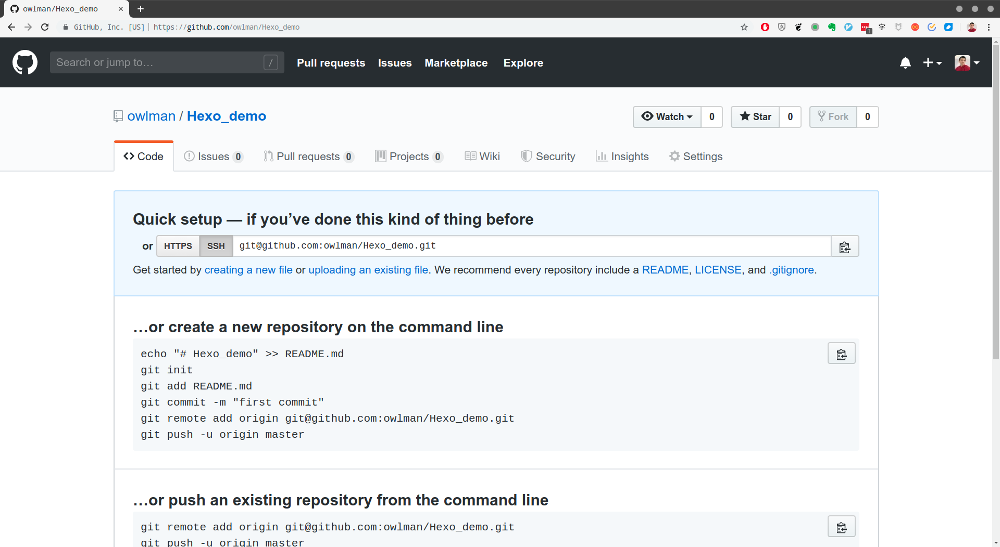

- 步骤2. 打开博客的配置文件 `_config.yml`，将文件最后名为`deploy`的一组参数修改如下：

  ```bash
  deploy:
    type: git
    repo: git@github.com:owlman/Hexo_demo.git
    branch: master
  ```

- 步骤3. 现在我们需要安装一个名为`deploy-git`的插件，这是Hexo的部署命令。请在到项目目录下打开命令行终端，执行如下命令：

  ```bash
   npm install hexo-deployer-git --save
  ```

- 步骤4. 然后依次执行下面三个命令，即可完成部署：

  ```bash
   hexo clean
   hexo generate
   hexo deploy
  ```

  如果一切顺利，当我们会到之前创建的Github仓库页面，就会看到生成的网站已经被上传到项目中了：

  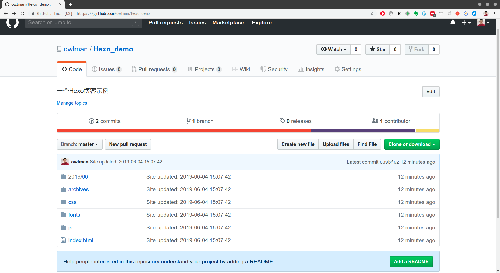

- 步骤5. 接下来。我们需要进入到该项目仓库的`Setting`页面中，将其Github Pages部分的`Source`选项设置为`master`分支：

  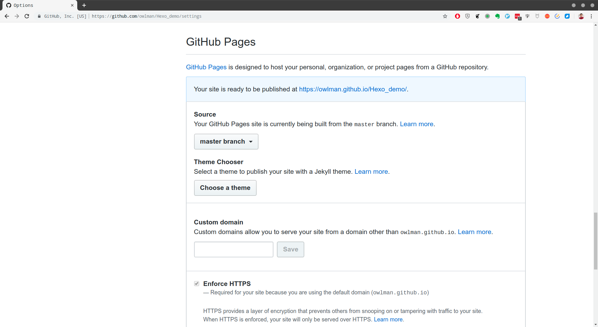

  如果一切顺利，当我们在Web浏览器中访问上面给出的页面链接`https://owlman.github.io/Hexo_demo/`时，就应该会看到之前配置好的博客。

当然，必须指出的是，我们在这里介绍的只是Hexo博客最简单的应用，要想部署一个真正堪用的博客，你还需要参照Hexo的官方文档，以及你所选主题的项目文档，做出更细致的修改，这也需要掌握一定的Web开发技术（譬如，`HTML`、`CSS`、`JavaScript`等），但这些不是本书所要讨论的话题，这里就不多做说明了。

## 本章小结

在本章，我们为大家介绍了如何用`Markdown`制作演示文稿、线上电子书以及撰写博客。初步展示了`Markdown`作为一种写作方式的广泛适用性、在我个人看来，`Markdown`已经不仅仅是一门用于写作的轻量级标记语言了，它更是一种更新型的写作方式，它将“数据与样式分离”、“数据与界面分离”等程序设计思维引入到了写作领域，使我们可以像写程序一样来撰写文章。随着这种写作方式的普及，软件开源的精神最终也会被引入到写作领域来，这将为喜欢写作的人们带来更自由的创作空间和更学术的创作氛围，我真心期待着这样的未来，这本书就是为此而作的。

<!-- 以下是注释区 -->

[^1]:注释：在作者写下这些文字的同时，新闻正在热炒Google终止向华为提供软件支持的事件。
[^2]:注释：这是一个基于JavaScript、HTML、CSS构建的跨平台的桌面应用框架。官方网站：https://electronjs.org/
[^3]:注释：Node.js是一个能够在服务器端运行JavaScript的开放源代码、跨平台JavaScript运行环境。官方网站：https://nodejs.org/
[^4]:注释：https://plugins.gitbook.com/
