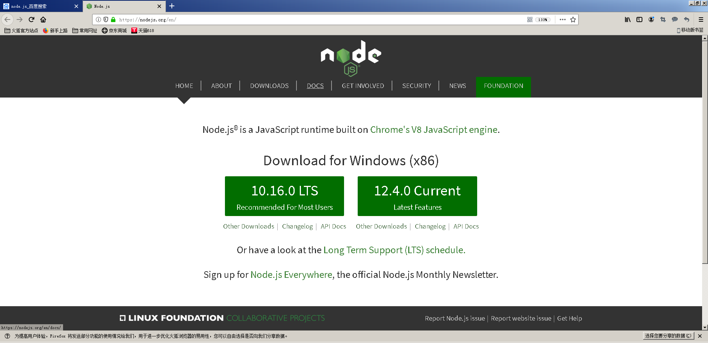
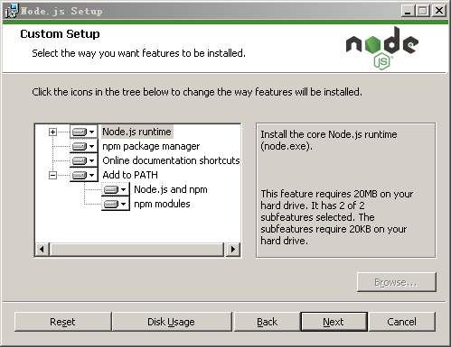

# 附录B：了解一下Node.js

考虑到本书介绍的gitbook和Hexo都要基于Node.js运行环境来部署，而这个运行环境如今已经形成了如此庞大的软件生态系统，我认为有必要在这里专门介绍一下Node.js以及它的安装和配置。换而言之，在接下来的内容中，我们首先会对Node.js做一个简单的概述，让读者了解一下这是怎样的一个运行环境，它的设计理念以及组件管理。然后，我们会具体演示Node.js在Windows、MacOS和Linux上的安装与配置。希望大家在阅读完这篇附录之后。能对Node.js运行环境有一个初步的认知，并能在自己的计算机上安装这个运行环境。

## B.1 Node.js概述

众所周知，`JavaScript`在很长一段时间内都被认为是一门只能依赖于浏览器的编程语言，这大大限制了这门优秀语言的使用范围。Node.js的出现改变了这一切，它是第一个能在服务器端运行`JavaScript`代码的、跨平台的运行环境，一举将`JavaScript`的应用领域扩展到了服务器端，使之释放出了巨大的生产力。

作为在服务器端运行的`JavaScript`环境，Node.js保留了`JavaScript`在浏览器端中所使用的大部分API，Node.js的作者Ryan Dahl并没有改变这门语言本身的任何特性，它的编程模型依旧将基于作用域和原型链这些概念，这让Node.js在服务器端上的应用具备了以下这些与众不同的特性：

- **单一线程**：`JavaScript`单一线程的特性，与它最初只作用于浏览器有关。在浏览器中，`JavaScript`的主要作用是响应用户的操作并处理DOM。这决定了它只能以单一线程的方式来执行，否则会带来很复杂的同步问题。例如，如果我们在浏览器上用`JavaScript`同时执行了两个线程，一个线程负责在指定的DOM节点上添加内容，另一个线程则负责删除这个节点，这时浏览器应该以哪个线程为准？
  
  Node.js沿用了这种单一线程的执行特性。而且在Node.js中，`JavaScript`的执行线程与其他线程之间同样也是无法共享状态的。单一线程的最大好处是不用像多线程编程那样处理很容易产生bug的同步问题，它从根本上杜绝了死锁问题，也避免了线程上下文交换所带来的性能上的开销。当然了，单一线程的执行方式也有它自身的弱点，譬如，它无法充分发挥多核处理器的性能、一个错误就会导致整个程序崩溃，以及执行大量计算时会因长期占用处理器而影响其他异步I/O的执行。

- **事件驱动**：在Web开发领域，`JavaScript`如今在浏览器端正承担了越来越重要的角色，其事件驱动的编程模型也逐渐深入人心。当然了，这种编程模型虽然具有轻量级、松耦合等优势，但在多个异步任务的场景下，由于程序中的各个事件是彼此独立的，它们之间的协作就成为了一个需要我们费心解决的问题。

- **异步编程**：在Node.js中，大部分操作都是以异步调用的方式来进行的。Node.js的开发者们在其底层构建了许多异步I/O的API，包括文件读取、网络请求等。这样一来，我们就可以很自然地在语言层面上并行地执行I/O操作，这可以使得程序中的每个调用都无须等待之前的I/O调用结束，这带来了极大的效率提升。例如，如果我们想要读取两个相互不依赖的文件，如果采用的是异步I/O，其耗费的时间只取决于读取较慢的那个文件，而如果采用同步I/O的话，其耗时就是两个文件的读取时间之和了，异步操作模型带来的优势是显而易见的。

  除此之外，Node.js对回调函数的支持也是其一大特色。回调函数是执行异步调用并接收其返回数据的最佳方式，当然了，这种方式也会导致代码的编写顺序与其具体执行顺序的不一致，对于很多习惯同步思路编程的人来说，阅读这样的代码会是一个不小的挑战。另外在流程控制方面，也会由于程序中穿插了各种异步方法和回调函数，它也远没有常规的同步方式那么一目了然，这也会给我们对程序的理解和调试带来一定的麻烦。

以上这些之所以被叫做特性，是因为它们实际上都是一些在已有技术上所做的取舍，了解它们的目的，就是为了让我们在考虑是否基于Node.js来开发相关应用时有自己的取舍。两者的取舍一致，譬如开发一些数据密集型、分布式实时应用程序，这些特性就会成为优势，但如果两者的取舍不一致，譬如开发一些需要大量计算、可靠性要求极高的程序，这些特性就会成为劣势。所以，只有了解自己手里的工具，我们才能做到事半功倍。

## B.2 Node.js的安装

Node.js的安装主要有两种方式，通常在Windows和MacOS下，我们会采用下载`.msi`和`.pkg`格式的安装包，使用安装向导来进行安装。而在Linux和FreeBSD这一类系统中，我们则往往会采用apt和yum这样的包管理器来安装。这两种方式都不复杂，下面以Windows和Ubuntu为代表，简单介绍一下这两种安装方法。

### B.2.1 使用安装包

在Windows下想要安装Node.js，首先要选择一个合适的版本。打开Node.js的官网`https://nodejs.org/`，我们会看到有LTS和Current两种版本可供下载。LTS版即受到长期支持的版本，其组件通常都经历过了充分的测试，比较稳定，适合于正式的生产开发。而Current版本则是最新的版本，通常包含了最新纳入的新特性，比较适合想对Node.js本身进行研究的朋友。



下载完`.msi`格式的安装包之后，我们就可以打开安装包启动安装向导了。在安装的开始阶段，安装向导会要求我们设置一些选项，大多数时候只需采用默认选项，直接点击「Next」即可。只是在组件选择的页面中，需要注意一下，如果你对Node.js的组件并不熟悉，最好选择安装全部组件。另外，请记得点开下图[^1]中那个「add path」选项前面的+号，这样安装程序就会主动把NodeJS和NPM这两个模块的命令路径添加到系统环境变量里，这对初学者来说是非常方便的。



待一切选项设置完成之后，我们就可以点击下面的「Install」即可完成安装。


如果一切顺利，我们在Windows中打开`cmd`终端，在其中输入`node -v`命令并回车之后，应该就会看到相关的版本信息。


### B.2.2 使用包管理器

在Ubuntu这类Linux操作系统中，我们安装软件往往都会选择使用apt这一类的包管理器，简单而方便，依次执行以下命令即可：

```bash
 sudo apt update
 sudo apt install nodejs
 # 最新的Node.js已经集成了npm，所以某些情况下是无需单独安装npm的，这具体还要取决于你使用的软件源。
 sudo apt install npm
```

除此之外，我们还能安装n管理器来管理Node.js的版本，其安装命令如下：

```bash
sudo npm install -g n
```

该工具的具体使用方式如下：

```bash
sudo n lts            # 长期支持
sudo n stable         # 稳定版
sudo n latest         # 最新版
sudo n 12.4.0         # 直接指定版本
sudo n                # 使用上下键切换已有版本
```

同样的，如果一切顺利，我们打开命令行终端，并在其中输入`node -v`命令并回车之后，应该就会看到相关的版本信息。

## B.3 请学习更多资料

需要再次强调的是，我们在这里只是对Node.js做了一个最基本的介绍，并帮助你安装了这个运行环境。但Node.js是一个非常庞大的开源软件生态系统，它的涉猎范围从Web开发，到服务器后端程序，到PC端桌面应用、移动端应用，几乎无所不包。除此之外，它也将`JavaScript`这门原本只依附于浏览器的脚本语言变成了近乎全能的编程语言，在编程领域中的意义重大，值得我们阅读更多的资料来了解它、学习它、使用它。

<!--以下是注释区-->

